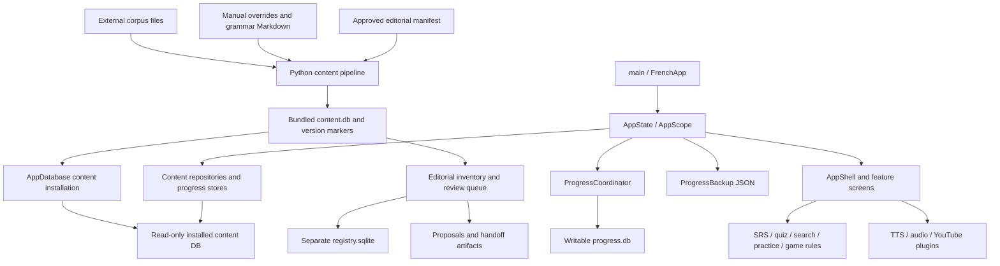
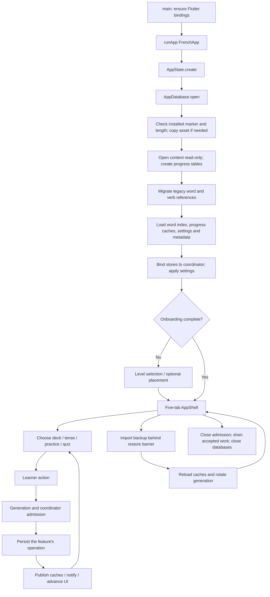
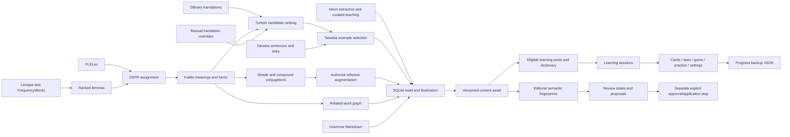

# FrenchApp — Deep Repository Analysis

Audit date: 2026-09-27. Repository: `FrenchApp`. This is a factual implementation handoff, not an architecture proposal or permission to change the project.

## Audit basis and evidence boundaries

The working directory, rather than a Git commit, is the authoritative snapshot for this report. The local `master` branch has no valid `HEAD` and no commit history. Most of the current implementation is untracked. Existing staged and unstaged changes were present before this audit.

The audit recursively inventoried the workspace, read the application and tooling source, inspected configuration, tests, documentation, checkpoint records and handoff manifests, queried SQLite databases through read-only connections, inspected APK/ZIP members without extracting them, and inspected the external pipeline stage files referenced by the code. Generated build/cache trees were inventoried as artifacts rather than treated as authored implementation. Archived source copies were used for historical context, not substituted for current files.

Only this report was created. No dependency installation, application launch, content rebuild, queue mutation, source edit, test fixture generation, APK build, or commit was performed. Python inspection used `-B` to avoid bytecode creation. The two read-only content auditors were executed successfully; their scope is described in section 12. Existing source/data/documentation/handoff/checkpoint files were included in a before/after content-hash preservation check, excluding `.git`, `build`, `.dart_tool`, and `.gradle` trees; the Git index and normalized status were checked separately.

Evidence labels used below:

- **Documented** means a local document explicitly makes the statement. It is not automatically a runtime guarantee.
- **Implementation fact** means the current source, schema, query result, or artifact supports it.
- **Inference** means a reasoned interpretation, not an independently established product requirement.
- **Historical evidence** means a stored report/log, not a test rerun in this audit.

Line references are orientation aids for the current working files. Symbols and paths are the more durable references.

## 1. Repository discovery and component roles

### 1.1 Important directories and root files

| Path | Classification | Role and evidence |
|---|---|---|
| `lib/` | Core application; 71 Dart files | Flutter bootstrap, in-process state, SQLite repositories, learning engines, screens, motion and TTS. |
| `lib/app/` | Application composition | `AppState`, `AppScope`, `ProgressSession`, five-tab shell and themes. |
| `lib/data/` | Persistence | Read-only content installation, writable progress schema, repositories, mutation coordinator, JSON backups and generated content identity constants. |
| `lib/domain/` | Models and algorithms | CEFR, words, verbs, SRS, search, journey scoring/aliases, game progression, companion growth, authored stories, sentence and writing rules, song catalogs. |
| `lib/features/` | UI and feature orchestration | Onboarding, vocabulary, verbs, grammar, practice, journey, quiz, songs, progress and motion laboratory. Screens contain meaningful orchestration, not merely presentation. |
| `lib/motion/`, `lib/ui/` | Shared interaction/presentation | Custom swipe physics, flip/transitions/celebrations, reusable game controls and companion drawing. |
| `assets/db/` | Distributed dataset | `content.db` and `content.version`. These are the only declared Flutter assets. |
| `content/tools/` | Offline production and editorial tools | 24 Python modules: numbered tools `00`–`17`, plus six shared/editorial modules. Standard-library implementation. `REVIEW_QUEUE.md` explains queue operation. |
| `content/tools/tests/` | Tool regression tests | Six Python `unittest` suites. |
| `content/grammar/` | Authored source content | 19 Markdown lessons with simple metadata front matter, imported into SQLite. |
| `content/overrides/` | Authored/approved content overlays | `manual.json`, `idioms.json`, `editorial_fa010b.json`; distinct translation, idiom-teaching and explicitly approved editorial mechanisms. |
| `content/reports/` | Generated pipeline evidence | 17 report/log/CSV/JSON files, including source probes, coverage measurements, missing translations and stage summaries. They represent earlier runs. |
| `content/review_work/fa012/` | Active editorial operational state | `registry.sqlite`, `workspace.json`, immutable source material, job exports and per-run result/status files. This is not the learner's progress database. |
| `test/` | Application regression tests | 19 `*_test.dart` files and `helpers/progress_probe.dart`. Pure domain, SQLite integration and Flutter widget coverage. |
| `android/` | Native Android host/build configuration | Gradle wrapper/settings, application module, manifests, Kotlin `MainActivity`, resources, generated registrant, local SDK configuration and signing example. 29 files excluding nested Gradle cache. |
| `.github/workflows/quality.yml` | CI | Flutter dependency resolution, fatal-info analysis, content validation and Flutter tests on Ubuntu. |
| `.checkpoints/` | Historical evidence/archived implementation | 284 files across FA-002 through FA-012 checkpoint directories. Includes before/after source snapshots, databases, validation logs and delivery evidence. Not runtime imports. |
| `.staging/` | Incoming handoff material | 21 files used for controlled review/package transfer. Not a runtime content source. |
| `deliveries/` | Outgoing handoffs | 17 files under FA-013 run directories and a handoff ZIP. Decisions, continuation instructions and integrity manifests, not application backups. |
| `build/` | Generated artifacts | 5,633 files at inventory time, including Gradle outputs, intermediate assets, debug APK and Flutter test/build artifacts. |
| `.dart_tool/` | Generated Flutter/Dart state | 155 files at inventory time, including package resolution and build/test state. |
| `.idea/`, `french_app.iml` | IDE configuration | Five IDE files plus project module definition. |
| `.git/` | Incomplete local version-control state | Index and unborn branch exist, but there is no commit history from which to reconstruct a release. |
| `pubspec.yaml`, `pubspec.lock` | Dependencies/build metadata | Application version, Dart constraint, Flutter assets, direct dependencies and resolved dependency graph. |
| `analysis_options.yaml` | Static analysis | Flutter lint configuration. |
| `.metadata`, `.flutter-plugins-dependencies` | Flutter project/generated metadata | Platform/tool revision metadata and plugin resolution; not product configuration. |
| `.gitignore` | Repository hygiene configuration | Excludes normal build/cache outputs, signing/private material and APKs, among other paths. It does not make the current untracked implementation part of a commit. |
| `README.md` | Run/product overview | Installation, features, counts and validation claims; several numbers lag the current files. |
| `PLAN.md` | Product/technical plan | Original user, priorities, phase statuses and planned behavior. Some design prose predates current schemas. |
| `DATA_PIPELINE.md` | Content design/provenance | Source selection, conversion strategy, quality constraints and licensing rationale. Source code is authoritative where procedures differ. |
| `TEST.md` | Manual device test procedure | Installation and roughly 15-minute interaction checklist; not proof it passed on the present snapshot. |
| `THIRD_PARTY_NOTICES.md` | Attribution documentation | Dataset/software/media notices. This audit describes their presence, not legal sufficiency. |
| `FrenchApp.apk` | Packaged binary | Root APK exists but its embedded content differs from today's source asset; see section 11. |
| `FA-013-run-004-handoff.zip` | Editorial transfer artifact | Three-member handoff containing decisions/continuation/integrity material. No application deployment occurs by opening it. |

The recursive inventory found no research notebooks, paper PDFs, model checkpoints/weights, Docker/container setup, Python dependency manifest, dedicated benchmark harness, backend server, or separate iOS/web/desktop application host. Checkpoint files named as snapshots are software/data preservation artifacts, not trained models.

### 1.2 External data directory

The content pipeline deliberately keeps large inputs outside the OneDrive repository. `FRENCHAPP_DATA` overrides the default `Path.home()/dev/french-data`. In this environment the variable was unset and that default directory existed, with `sources/` and `stages/`. The sources include Lexique, FLELex, FrequencyWords, Kaikki, DBnary and Tatoeba downloads. These files are necessary to understand rebuildability but are not repository-contained dependencies.

### 1.3 Active versus archived source

The current application is rooted at `lib/main.dart`; current Python tooling is in `content/tools/`. Copies under `.checkpoints/` are historical. `lib/features/prototype/prototype_screen.dart` is still reachable from Progress → motion laboratory, so it is not dead merely because its directory is named `prototype`. Earlier indexed `fake_words.dart` and prototype `word_card.dart` no longer exist in the working tree; the active learning card is `lib/features/vocab/word_card.dart`.

## 2. Project purpose and actual scope

### 2.1 Explicitly documented facts

`PLAN.md` describes an Android application for a single Turkish-native user who knows English and starts French from zero. It teaches vocabulary, idioms, verb conjugations and grammar through swipe cards. CEFR A1–C2 content is bundled offline; the user selects a level. The plan prioritizes custom motion, bilingual meaning displays, spaced repetition, device TTS and local progress without an account or cloud backend. The plan marks ongoing content review separately from implemented application phases.

`README.md`, `TEST.md` and the native host describe a Flutter/Android development and APK workflow. `DATA_PIPELINE.md` describes combining open datasets because the full six-level corpus is too large to author manually. `content/tools/REVIEW_QUEUE.md` and the FA-013 material describe a separate controlled editorial review process.

### 2.2 Reconstruction from implementation

The system has three cooperating but operationally separate parts:

1. **A learner application:** local vocabulary and conjugation SRS, dictionary lookup, grammar lessons, placement questions, journey quizzes, branching stories, sentence construction, rule-based free-writing feedback, media-assisted practice, game rewards and JSON progress backup.
2. **A content factory:** Python scripts combine corpus statistics, dictionaries, translations, examples, manual overrides and grammar into a versioned SQLite asset.
3. **An editorial evidence queue:** SQLite-backed inventory/fingerprints, immutable job snapshots, structured proposals and handoff records. Proposing an edit does not apply it to `content.db`.

**Inference:** the main software question is how to deliver a broad, responsive French-learning experience with local state and inexpensive corpus-derived content, while keeping uncertain translations outside normal learning. The code is not an empirical study of learning effectiveness. It contains no trained language model, classifier training, train/test split, parameter search, learner cohort experiment or scientific baseline comparison.

Inputs are bundled lexical/grammar records, authored Dart catalogs, touch/text/quiz actions, device time, imported progress JSON, and optional remote media. Outputs are learner-facing cards/lessons/feedback, persistent progress/rewards/flags, backups, built APKs, generated content assets and editorial reports. “Confidence,” CEFR placement, writing scores and stars are implemented heuristics, not calibrated probabilities or validated proficiency estimates.

## 3. Architecture reconstruction

### 3.1 High-level architecture



There is no network service between screens and repositories. Communication is Dart calls, futures, callbacks and `ChangeNotifier` notifications. `AppScope` is an `InheritedNotifier<AppState>`; the project does not use Riverpod despite a comment mentioning it as a possible future choice.

### 3.2 Execution flow



Startup errors go to `_StartupError` with selectable error/stack information; loading shows `ParisOpeningScreen`. `FrenchApp` currently selects `ThemeMode.dark`. The root chooses onboarding versus shell from persisted state. The shell lazily constructs five tab pages, retains them in an `IndexedStack`, and uses `TickerMode` to limit off-tab animation. Tabs are vocabulary, verbs, grammar, practice and progress; journey and songs are feature routes, not separate root tabs.

### 3.3 Data flow



The last arrow is a workflow boundary: queue completion itself never rebuilds or edits the content asset. User flags also do not automatically enter the editorial ledger or change translations.

### 3.4 Storage and lifecycle details

`AppDatabase.open` (`lib/data/app_database.dart:24–45`) gets the application-support directory, installs content, opens it read-only, opens progress with SQLite version 1 and ensures additional tables. Content installation (`_ensureContentCopied`, approximately lines 56–89) checks the stored marker and byte length against generated Dart constants. It does **not** re-hash the installed DB on every launch. Replacement uses temporary and old-file names with rollback handling. This is distinct from the Python publisher, which computes the full SHA-256.

`_migrateContentIds` (approximately lines 180–260) reads `content_aliases`, migrates word references and the verb prefix of colon-separated conjugation references, resolves colliding card rows by `updated_at`, and updates flags in a transaction. Journey compatibility has a separate explicit alias mechanism; it is not handled by generic word/verb ID migration.

`AppState.create` (`lib/app/app_state.dart:144–185`) eagerly loads words, both card-state caches, settings, recent daily statistics, flags, journey/game/practice state and metadata. Verb and grammar repositories load lazily. Content cache lifetime is essentially the `AppState` lifetime; backup restoration reloads progress, not the corpus.

`ProgressCoordinator` controls accepted operations, restoration, recovery and closure. It is not itself a transaction spanning every store. The transaction boundaries of each public action matter; section 6.1 documents them.

## 4. Meaningful entry points

### 4.1 Application and feature entry points

| Entry point | Arguments/input | Initialization and call path | Output/side effects |
|---|---|---|---|
| `lib/main.dart::main`, `FrenchApp`, `_boot` | Flutter launch | Bindings → `AppState.create` → root selection | Running UI and database handles. |
| `lib/app/app_shell.dart::AppShell` | Existing scoped state | Lazy vocabulary/verb/grammar/practice/progress pages | Navigation and shared game HUD. |
| `lib/features/onboarding/level_select_screen.dart::LevelSelectScreen` | Optional settings mode | Level/goal controls; optional `PlacementTestScreen` | Persists onboarding, level and daily goal. |
| `placement_test_screen.dart::PlacementTestScreen` | Static bank; runtime RNG | Adaptive question selection | Returns suggested `CefrLevel` to caller. |
| `vocab/deck_select_screen.dart::DeckSelectScreen` | Level/settings; theme/special-deck choices | Builds candidate lists, opens search or swipe session | Filtered learning route; special pools are rechecked for learning safety. |
| `vocab/swipe_session_screen.dart::SwipeSessionScreen` | Candidate IDs/title/session options | Eligibility → `SessionBuilder` → `CardStack` → `recordAnswer` | SRS, stats, rewards and session result. |
| `vocab/search_screen.dart::SearchScreen` | Query/language filter | Word repository search; dictionary card/detail actions | Ranked dictionary results, optional persisted actions. |
| `verbs/verb_screens.dart::VerbDeckScreen`, `VerbSessionScreen` | Level, tense, regular/reflexive filters | `_start` → actual tense refs → scheduler → selected forms | Conjugation swipe progress and rewards. |
| `verbs/verb_tables_screen.dart::VerbTablesScreen` | Selected verb | `tablesFor`/conjugation loading | Read-only conjugation tables and TTS. |
| `verbs/reflexive_arena_screen.dart::ReflexiveArenaScreen` | Active levels and safe reflexive verbs | Randomized quiz generation | Quiz/game activity, not conjugation SRS updates. |
| `grammar/grammar_screens.dart::GrammarListScreen`, `LessonScreen` | Lesson ID/selected lesson | Lazy lesson repository → Markdown; tense exercise route | Lesson display and matching conjugation practice. |
| `journey/journey_map_screen.dart::JourneyMapScreen` | Content revisions, level, stored results | `StationBuilder` → map → study or station quiz | Station navigation/unlocking. |
| `journey/station_quiz_screen.dart::StationQuizScreen` | `JourneyStation` | Fixed station pool → `QuizEngine` → station/activity writes | Stars, best paired result and game rewards. |
| `quiz/quiz_screen.dart::QuizScreen` | Current eligible SRS pools | `_build` → mixed quiz → answer handlers | Card updates and separate activity writes. |
| `practice/practice_hub_screen.dart::PracticeHubScreen` | Scoped app state | Routes to stories, sentence/writing, journey and other practice | Feature selection. |
| `practice/story_library_screen.dart::StoryLibraryScreen` | CEFR level | `storiesForLevel`; sequential chapter unlock | Story route and completion summary. |
| `practice/story_adventure_screen.dart::StoryAdventureScreen` | Authored `StoryAdventure` | Resume node → choices → final static quiz | Node progress, completion/best score, activity/rewards. |
| `practice/sentence_practice_screen.dart::SentencePracticeScreen` | Authored prompt selection and text | `SentenceEvaluator` → `recordSentenceAttempt` | Feedback, attempt/solved state and rewards. |
| `practice/free_writing_screen.dart::FreeWritingScreen` | User free text | `FreeWritingAnalyzer` | Local suggestions/corrected text/score; no persisted essay model. |
| `songs/song_library_screen.dart::SongLibraryScreen` | Song selection | Routes to popular YouTube or timed learning-song player | Media practice route. |
| `songs/popular_song_screen.dart::PopularSongScreen` | `PopularSong` | IFrame controller, position polling, focus-word actions | Remote playback and optional dictionary-card starring. |
| `songs/song_player_screen.dart::SongPlayerScreen` | `LearningSong` | `just_audio`, timed lines, vocabulary and mini-quiz | Playback, line highlighting and saved words. |
| `songs/song_quiz_screen.dart::SongQuizScreen` | Song-derived vocabulary | `SongQuizEngine` | Quiz activity/reward, no SRS answer mutation. |
| `progress/progress_screen.dart::ProgressScreen` | Cached progress | Summaries/settings; routes below | Metrics, settings changes and navigation. |
| `progress/backup_screen.dart::BackupScreen` | JSON text/clipboard | AppState-coordinated export/import/recovery | Copyable backup or overwritten/reloaded progress. |
| `progress/about_screen.dart::AboutScreen` | Content metadata | Counts/source/attribution presentation | Information only. |
| `game/companion_studio_screen.dart::CompanionStudioScreen` | Profile/unlocks/preferences | Companion/accessory/palette controls | Persisted customization. |
| `prototype/prototype_screen.dart::PrototypeScreen` | Motion controls and repeated programmatic swipes | Custom `CardStack` without learner persistence | Interactive motion/stress laboratory. |

### 4.2 Content and editorial command entry points

All paths in this table are under `content/tools/`. Numbering is historical; it is **not** a valid instruction to run every file in numerical order. For example, Turkish manual overrides precede example generation, and idiom translation follows idiom extraction despite intervening numbers.

| Script/symbol | Arguments and inputs | Work/output |
|---|---|---|
| `00_probe_sources.py::main` | Configured source URLs | Network availability probes; `source_probe.txt`, `resolved_sources.json`. |
| `01_fetch.py::main`, `download` | Optional source names; none means all; `FRENCHAPP_DATA` | Resumable corpus downloads and `fetch.log`; `.part` files become final source files. |
| `02_measure.py::main` | Existing source corpus files | Counts direct language links, lexical coverage and DBnary availability; `measurements.md`. |
| `03_measure_fallbacks.py::main` | Existing links/dictionaries | Two-hop translation coverage and bridge upper bounds; `measurements_fallback.md`. |
| `04_lemmas.py::main` | Lexique/FrequencyWords | Ranked lemma JSONL, surface map and stage report. |
| `05_levels.py::main` | Lemmas/FLELex | CEFR-enriched lemma JSONL and coverage/disagreement report. |
| `06_english.py::main` | Leveled lemmas/Kaikki | English/IPA/gender records and separate verb-form JSONL. |
| `07_turkish.py::main` | English records, DBnary, Turkish frequency | Ranked Turkish translations, missing-translation CSV and path/confidence statistics. |
| `12_manual_tr.py::main` | Stages plus `manual.json` | Replaces/adds manual translations in Turkish stage. |
| `08_examples.py::main` | Translated lemmas, surface map, attributed Tatoeba and links | Word/idiom example JSONL, coverage report. |
| `09_idioms.py::main` | Kaikki and lexical levels | Filtered/leveled idiom candidates. |
| `11_idiom_tr.py::main` | Idiom candidates and translation graph | Turkish idiom candidate stage and report. |
| `10_verbs.py::main`, `build_simple` | Retained words and Kaikki forms | Simple/compound conjugation records and coverage report. |
| `15_families.py::main` | Retained vocabulary/Kaikki relations | Bounded related-word adjacency stage. |
| `16_reflexives.py::main`, `build_tenses` | Authored reflexive inventory and base-verb stage | Reflexive conjugation stage and report. |
| `13_build_db.py::main` | Stages, overrides, grammar, previous DB aliases | Temporary SQLite build → finalized asset → content sidecar and Dart marker. Writes existing project outputs when invoked. |
| `14_validate_db.py::main` | Optional positional DB, defaults to bundled DB | Read-only structural/learning-safety audit; exit 0 success, 1 failures, 2 missing DB. |
| `17_enrich_idioms.py::main` | `--db`, optional `--source`, `--dart-output` | Applies curated idiom teaching to a retained DB; validates output-path separation; finalizes and publishes markers. Not a read-only checker. |
| `journey_revision_audit.py::main` | `--db`, optional `--json` | Read-only membership revision comparison; exit 0 match, 1 mismatch, 2 invalid input/schema. |
| `editorial_pilot.py::main`, `extract` | Required `--db`, `--output`; `--a1 30`, `--a2 20`, optional `--exclude-sample`, `--task` | Deterministic editorial sample and provenance, refuses existing output. |
| `review_queue.py::main` | Required `--work`; subcommands below | Ledger/job/evidence management; no content publication. |

Queue subcommands are `init --db`, `sync`, `import-history --package --manifest --manifest-sha256`, `status`, `report`, `exceptions`, `next --size --owner`, `resume --job --owner`, `complete --job --owner --results`, `supersede --job --owner --id`, and `spot-check --size --seed`; applicable exports accept `--output`. Default job size is 25. Even nominal status commands construct a queue whose initialization can create schema objects. This audit therefore inspected the existing ledger with read-only SQL instead of invoking the queue CLI.

`content_finalization.py`, `editorial_overrides.py` and `journey_revisions.py` are shared imported modules, not independent application servers. Test entry points are `flutter test`, individual Dart test files, and Python `unittest` discovery. CI entry points are the workflow steps in section 12. No notebook, simulation runner or long-running batch daemon was found.

## 5. Important classes, functions and data structures

### 5.1 Application state and persistence

| File and symbol | Inputs → outputs; callers | State/dependencies/side effects |
|---|---|---|
| `lib/app/app_state.dart::AppState.create` | Database/platform initialization → loaded `AppState`; called by bootstrap | Owns repositories, caches, coordinator, generation, settings and reward notifications. |
| `AppState.recordAnswer` (298–334) | Ref ID, action/type and required time → committed `AnswerResult` | Reads committed card state and writes card/daily/game state in one SQL transaction, then publishes caches. Used by word/verb swipe sessions; generation readiness is checked by the calling session, not an optional parameter on this method. |
| `AppState.recordActivity` (336–368) | Activity counters/combo and optional time → reward update | Atomic daily-stat/game transaction without a card-state mutation. Used by quizzes/practice. Explicit bonus parameters exist on the lower-level game operation, not this method. |
| `AppState.recordStation` (371–392) | Station ID and attempt → stored best result/reward | Journey and game operations are sequential separate store calls. Only new stars/first pass generate station-specific gains. |
| `AppState.completeStory`, `recordSentenceAttempt` (407–451) | Story/prompt result → completion/attempt reward | Practice, daily and game writes are separate operations; first-success bonuses depend on prior practice state. |
| `AppState.restoreProgress`, reload/recovery/close | JSON or reload request → new cache generation | Restore barrier, overwrite import, prepare reload, publish and generation rotation. Failed post-import reload leaves recovery required. |
| `lib/app/app_scope.dart::AppScope.of` | Build context → app state | Inherited notifier dependency, causes dependents to rebuild on notification. |
| `lib/app/progress_session.dart::ProgressSession` | App at first dependency resolution → captured generation | `progressReady` requires mounted/current generation; prevents an old session writing into newly restored progress. |
| `lib/data/progress_coordinator.dart::ProgressCoordinator` | Async bodies and optional generation tokens → queued futures | FIFO tail, closing/restoring/recovery gates, scoped nested-store lease, failure isolation and drain-on-close. |
| `lib/data/app_database.dart::AppDatabase` | Asset/support directory → content/progress handles | Content installation, ten-table progress schema, legacy content-ID migration and closing. |
| `lib/data/backup.dart::ProgressBackup.export/import` | SQLite DB / JSON → JSON / `ImportReport` | Transactional export; validates all rows before delete-and-replace import; format 1; ten known tables. |

### 5.2 Repository layer (`lib/data/repositories.dart`)

This file contains both content access and writable progress stores; its size and mixed responsibilities are facts, not a recommendation to split it.

| Symbol/region | Purpose and important behavior |
|---|---|
| `WordRepository`, `LearningWordRepository` (16–64) | Content interface plus explicit safe-learning access. `learningWordById` rejects missing or `needsReview` records. |
| `SqliteWordRepository.load` (83 onward) | Eager word load, `LEFT JOIN examples` restricted to `ordinal=0`, frequency ordering, relation loading; caches words/by-ID/themes/relations. |
| `search`, `relativesOf`, `candidateIds` (160–234) | Lazy normalized search index; safe related words; memoized candidate lists keyed by filter combination. Exact CEFR filter, optional theme/idiom, function/review exclusion defaults. |
| `distractorsFor` (238 onward) | Deterministic first-three distinct Turkish meanings using same-level/POS, same-level, other-level tiers; excludes unsafe/source/same-meaning records. |
| `VerbRepository.all/byLevels/tablesFor/conjugationsFor` (287–369) | Lazy frequency-ordered verbs, safe level pools, grouped conjugation tables and per-verb form cache. |
| `conjugationRefIdsForTense`, `_tenseRows`, `conjugationsForTense` (371–449) | Actual available person refs, SQL batches of 400 verb IDs, selected-tense fetch after scheduling. Avoids truncating a verb pool before SRS choice. |
| `LessonRepository.all` (451 onward) | Lazy grammar load ordered by `sort_order`. |
| `SqliteCardStateStore` (492–615) | Per-type card cache, default fresh state, immutable snapshots, transactional read/write/publish split, reset, box histogram, starred/leech/quiz pools. `save` persists before cache publication. |
| `SettingsStore` (616–656) | Key/value cache and queued updates; booleans represented as strings. Persists before cache update. |
| `DailyStatsStore` (657–777) | Last 400 days cached; `writeAdd` reads and increments stored row inside supplied executor. Streak and recent-card summaries use local date keys. |
| `FlagStore` (778–831) | Toggle local content flags. Cache is keyed by reference ID and is changed before awaited SQL. No outbound submission. |
| `JourneyStore` (832–944) | Loads aliases into canonical in-memory results; selects paired best attempt. Existing raw legacy rows are retained on load. `record` updates cache before SQL. |
| `GameStore` (945–1252) | Singleton profile, daily quest creation, achievements and reward math. `writeRecord` supports a caller's transaction; `publish` updates caches after success. |
| `PracticeStore` (1253 onward) | Story node/completion/best pair and sentence attempts/solved/best score. Changes cache before awaited SQL; returns first-completion/first-solve information. |

### 5.3 Domain and engine inventory

| File/symbol | Inputs/outputs and role |
|---|---|
| `domain/level.dart::CefrLevel` | Six ordered levels, parsing/codes/world presentation; used by filters, catalogs and progression. |
| `domain/word.dart::Word` | SQLite lexical row plus displayed example/provenance → immutable application word model; display combines article/lemma. |
| `domain/verb.dart` | `Verb`, `Conjugation`, `VerbTense`, person definitions → tense labels/CEFR/ref IDs and table rows. Conjugation ref identity is verb ID + tense + person. |
| `domain/lesson.dart::GrammarLesson` | Stored title/level/tense/Markdown → lesson model and exercise linkage. |
| `domain/srs/srs_card.dart::SrsCard`, enums | Type/ref, box/status/star/dates/counters → due and quiz eligibility. No-card state is synthesized as fresh. |
| `domain/srs/box_scheduler.dart::BoxScheduler` | Card + answer + time → next immutable card; details section 6.2. |
| `domain/srs/session_builder.dart::SessionBuilder` | Candidate refs + states + size/time → ordered session; helper `reinsert` is distinct from screen insertion behavior. |
| `features/quiz/quiz_engine.dart::QuizEngine` | Word/verb pools, repositories, count/RNG → multiple-choice questions. |
| `features/journey/station_builder.dart::StationBuilder` | Safe pools and revision strings → deterministic station definitions and verb refs. |
| `domain/journey.dart::JourneyStation`, `StationResult` | Question counts/pass ratio; stars and best-attempt selection. |
| `domain/journey_aliases.dart` | Explicit old→new B2 station IDs → canonical results across one known revision change. |
| `domain/word_search.dart::WordSearchEngine`, `WordSearchIndex` | Folded multilingual query/documents → ranked results with language and score. Full scan of cached normalized documents. |
| `domain/game.dart::GameProfile`, quest/achievement/reward models | Persisted counters → level/progress and UI rewards; store performs mutation arithmetic. |
| `domain/companion.dart` | Character/accessory/palette definitions and growth calculations → display/unlock state. |
| `domain/adventure.dart`, `adventure_expansion.dart` | Authored `StoryAdventure` node/choice/quiz graphs and `storiesForLevel` → 12 chapters, two per CEFR. No generated narrative. |
| `domain/sentence_practice.dart::SentenceEvaluator` | User text and one of 18 authored prompts → score, correctness, missing/order feedback. |
| `domain/free_writing.dart::FreeWritingAnalyzer` | Arbitrary user text → ordered rule issues, suggested text, strengths and bounded score. No remote model call. |
| `domain/song.dart::PopularSong`, `LearningSong`, `SongQuizEngine` | Static media metadata, timed lines and vocabulary → player input and deterministic quizzes; 13 popular entries and three learning songs. |
| `features/vocab/highlighted_sentence.dart::HighlightedSentence` | Lemma and sentence → first heuristic stem match highlighted while preserving original text. |
| `services/tts_service.dart::TtsService` | Text/rate → platform speech request; singleton initialization, French availability selection, serialized initialization future and stop-before-speak. |

### 5.4 UI/motion helpers with meaningful behavior

`motion/card_stack.dart::CardStack` owns drag offset, flying/pending state, visible stack depth and programmatic command handling. Its asynchronous acceptance callback connects animation completion to persistence. `motion/flip_card.dart` owns perspective/face rotation. `motion/motion_tokens.dart::MotionTokens` centralizes many durations and speed/reduced-motion factors; some feature animations still use local durations. `motion/transitions.dart`, `celebration.dart`, `swipe_badge.dart` and `swipe_direction.dart` provide shared transitions, particle/feedback rendering and direction presentation.

`ui/game_ui.dart`, `ui/game_companion.dart`, `features/game/game_hud.dart` and the companion studio turn stored game state into controls, custom painting, messages, unlocks and reward feedback. They are not additional independent learning models. `journey_map_screen.dart` draws a sinusoidally positioned sequence of station nodes and cubic connecting paths, with a moving traveler and route-opening behavior. `activity_heatmap.dart` derives the last-30-day display from `DailyStatsStore`; it is implemented despite an outdated `ProgressScreen` header comment saying otherwise.

## 6. Algorithms, models and decision rules

### 6.1 Progress admission, transactions, restoration and backup

**Location:** `ProgressCoordinator`, `AppState`, writable repositories, `ProgressSession`, `ProgressBackup`.

Admission is synchronous: closing, restoration, recovery-required or stale-generation conditions reject new work before it joins the FIFO future tail. Accepted bodies run sequentially. A failed body fails its caller but is absorbed for tail continuity so subsequent accepted work can proceed. A scoped Zone lease allows nested store calls to join the active operation; it expires when the owning body finishes, preventing later asynchronous work from silently inheriting an old lease.

Restoration raises its admission barrier immediately, waits behind already accepted work, imports the backup, prepares replacement caches, and publishes them with a new generation. After an import commits, failure to reload is materially different from invalid JSON rejected before import: the former leaves recovery required and blocks normal progress writes until recovery succeeds. Existing session widgets retain their original generation and must not write into the restored progress. Closing stops admission, drains accepted work and closes databases; it is memoized.

For a swipe, `AppState.recordAnswer` reads the **committed** prior card inside one transaction, applies SRS, writes the card, daily stats and game/quest/achievement changes, commits, and only then publishes the prepared caches and notifies. `new_learned` increments only for a word whose previous `timesSeen` was zero and whose resulting box is 1. Therefore it is not simply the number of distinct currently-known words. The screen advances only after the accepted mutation succeeds.

Not every feature uses that same atomic operation:

| Path | Current write boundary |
|---|---|
| Word/verb swipe | Card + daily + game in one transaction, publication after commit. |
| `recordActivity` | Daily + game in one transaction, no card. |
| Free quiz answer | Card-store `save` and `recordActivity` are separate unawaited calls after local UI selection. |
| Station completion | Journey result, station reward, then separate activity accounting. |
| Story completion / sentence attempt | Practice store, daily stats and game calls are sequential, not one shared transaction. |
| Flags, journey, practice stores | Their implementations update cache before their awaited SQL write. |

These are observable call-path differences. This audit did not induce device failures to establish their user-visible consequences.

Backup format 1 exports ten tables in a read transaction, with `format` and `exported_at`. Missing optional tables export as empty; actual read failures propagate. Import validates the object/version, requires `card_state`, `daily_stats`, `app_settings`, checks table-list/row shapes, rejects unknown columns, checks INTEGER/TEXT types and selected nonnegative/range constraints, then deletes/reinserts all recognized tables in one transaction using replace conflict handling. Missing optional arrays become empty. It **overwrites**, not merges. Validation is not a comprehensive semantic proof: for example, paired count relationships are not all constrained by `_validateValues`. Content and media are not backed up. The UI uses text/clipboard rather than an OS file-sharing dependency.

### 6.2 Box-based SRS

**Location:** `domain/srs/box_scheduler.dart::BoxScheduler.apply`, `applyQuizResult`; `srs_card.dart`.

The six box intervals are:

\[
I=[0,1,3,7,16,35]\text{ days},\qquad b\in\{0,1,2,3,4,5\}.
\]

Fresh/learning/known/mastered correspond to box 0 / boxes 1–2 / boxes 3–4 / box 5. An archive status is separate.

| Answer | Box/status | Counters and scheduling |
|---|---|---|
| Know/right | `min(b+1,5)`; status from box | `times_seen+1`, `times_right+1`; next due at now + new-box interval, halved if starred. |
| Don't know/left | Box 0 | `times_seen+1`, `lapses+1`, due now. |
| Hard/up | Same box, starred | `times_seen+1`; no right/lapse increment; half interval for the current box. |
| Skip/down | Box 5, archived | `times_seen+1`; due null; excluded from normal review/quiz. |

Halving uses integer microseconds. `last_seen_at`/`updated_at` are updated. `applyQuizResult` maps correct/incorrect to know/don't-know, but leaves archived cards unchanged. A nonarchived card is due when due time is null or not later than now; quiz eligibility requires box ≥1 and not archived. This is a fixed-box scheduler, not SM-2, FSRS or a learned forgetting model.

### 6.3 Session composition and same-session repetition

**Location:** `SessionBuilder.build` (`session_builder.dart:15`), word and verb session screens.

Candidate IDs preserve the content pool's order. Missing state or `timesSeen==0` is fresh. Other nonarchived candidates enter review only if due, unless `includeNotDue` is requested. Review ordering puts starred cards first and then earlier due dates, with null due dates first. For requested size \(N\), the initial review target is `round(0.7*N)`, with the remainder fresh; shortages transfer capacity to the other pool. Selected fresh/review cards are interleaved using step \((R+F)/F\), placing fresh cards at successive thresholds beginning at `step-1`; the no-fresh case avoids division.

Incorrect swipe handlers insert the just-answered ID at `min(currentIndex+10, deck.length)` in their current deck. They retain the already-consumed occurrence; repeated incorrect answers can extend a session. The separate `SessionBuilder.reinsert` helper removes an existing occurrence before insertion and should not be confused with the screens' actual code. Production selections are not randomized by this scheduler.

### 6.4 Safe learning pools and actual conjugation availability

**Location:** `LearningWordRepository`, `candidateIds`, `VerbRepository`, deck/quiz/song routes.

Normal word candidates exclude `needs_review=1` and function words by default; idioms are controlled by optional filters. Dictionary search intentionally sees the broader content collection. “Reviewed” and “eligible” are different fields: a non-manually-reviewed row can be eligible if its content rules permit it. Historical SRS/starred/leech refs are checked against current content safety before learning. Missing/unsafe saved references do not justify substituting an unrelated fallback word.

Verb pools first filter safe verbs by selected levels and regular/reflexive options. The selected tense must be allowed for the user's level. The repository queries **existing** `(verb,tense,person)` rows, in batches of 400 verb IDs, before session selection. It then fetches forms for selected verbs/tense rather than materializing every conjugation. This supports sparse person sets and candidates beyond earlier pool caps. Tense availability and `mixLowerLevels` are separate controls: permissible tenses use selected CEFR, while the verb pool can include lower levels.

### 6.5 Quiz generation

**Location:** `QuizEngine.build`, `SqliteWordRepository.distractorsFor`, `QuizScreen._build/_answer`.

Word question kinds are French→Turkish, Turkish→French and cloze. Cloze is available only when the example contains the lemma literally, case-insensitively; replacement is the first escaped-regex occurrence, not morphological or token-aware matching. Distractors are chosen from safe distinct Turkish meanings, prioritizing same CEFR+POS, then same CEFR, then other levels. Insufficient three distinct distractors suppresses the question. The word loop stops after enough candidates for the requested count.

Verb questions parse the reference into verb/tense/person, require a safe valid verb/form, and collect distinct nonempty alternatives from other persons in the same tense, then the same person in other tenses. They require three distractors. Generated word and verb questions are shuffled together, then truncated to the requested count. A `Random` can be supplied; UI callers normally use unseeded randomness.

Free quiz uses SRS-eligible words and a shuffled conjugation pool limited to six refs, with requested total 12. It is not identical to station quizzes, which use station pools regardless of individual SRS exposure. Selection updates local answer feedback and schedules continuation (normally 900 ms scaled); its card/activity persistence is separate as described above.

### 6.6 Journey generation, unlocking, scoring and compatibility

**Location:** `StationBuilder`, `JourneyStation`, `StationResult`, `JourneyStore`, `journey_aliases.dart`, map screen.

Per level, normal word stations take consecutive complete groups of 14 from eligible ordered content, at most eight groups, asking eight questions. A verb station is inserted after the third word station. An idiom station requires at least six idioms and uses up to 14, asking at most eight. A boss requires at least 40 pool words, samples across the pool using a stride based on `floor(poolLength/24)`, takes up to 24 and asks 12. Verb station refs use the first eight safe exact-level verbs, applicable tenses ordered from higher CEFR downward with enum tie order, the first available tense per verb, known persons and a roughly 24-ref stopping condition.

Station IDs include level, station-kind/group identity and that level's content revision. Python revision generation hashes sorted safe word and verb IDs, joined by newlines, into the first 12 SHA-256 hex characters. Membership includes safe function-word IDs even though default learning pools exclude them. Rank, translations, example text and station-generation constants are **not** part of this fingerprint.

Stars for correct \(c\), total \(n\), threshold \(p\) are:

\[
s=\begin{cases}
0&n\leq0\text{ or }c/n<p\\
3&c=n\\
2&c/n\geq0.85\\
1&\text{otherwise.}
\end{cases}
\]

Ordinary threshold is 0.70; boss threshold is 0.80. Best result compares stars first, then ratios by cross multiplication, preserving correct/total from the **same attempt**; exact ties retain the prior result. A station is passed when its stored result has stars. New reward stars are `clamp(newStars-oldStars,0,3)` and a pass counter increments only on first pass.

The map unlocks global station 0, the first station of the currently selected CEFR level, or a station whose immediate predecessor passed. Thus the selected level can begin without completing all lower levels; the implementation is more specific than “every level always starts unlocked.” Story chapter unlocking is separate.

Eleven explicit B2 aliases map revision `4e9395bf7fb2` to `34914142868b`. Loading canonicalizes in memory, prefers canonical rows on equal attempts and retains legacy physical rows. This is a bounded known compatibility mapping, not a general proof that all future station revisions preserve progress.

### 6.7 Adaptive placement

**Location:** `features/onboarding/placement_test_screen.dart`.

A static bank has 30 questions, five per CEFR. A placement session asks 20, starts at A2, moves up after three consecutive correct answers and down after two consecutive incorrect answers, clamps at A1/C2, never repeats a question, and falls back to the nearest level with remaining questions. Final recommendation is the highest level with at least three asked questions and accuracy ≥0.60, otherwise A1. Runtime randomness is not persisted as an experiment seed. The recommendation is passed back to level selection; there is no externally validated psychometric calibration in the repository.

### 6.8 Dictionary search and highlighting

**Location:** `WordSearchEngine` (`word_search.dart:49–212`).

Index construction folds French/Turkish accents and ligatures, normalizes curly apostrophes, handles Turkish dotted-I combining marks, removes other punctuation and collapses whitespace. It stores normalized lemma/display/Turkish/full and split Turkish senses/English. Queries shorter than two folded characters and nonpositive limits return empty.

French exact base score is 0. Exact Turkish full meaning or individual comma/semicolon/slash/parenthesis-separated sense is 1; other Turkish field scoring starts at 2. English, used only in “all” mode, starts at 40. Field match additions are exact 0, phrase prefix +5, whole phrase within boundaries +7, token/prefix partial +11, arbitrary substring +18. The best language score wins for each word. All documents are scanned before sorting by ascending score, frequency rank, then lemma; default result limit is 80. This is ranked substring search, not edit distance, stemming or embedding retrieval.

Sentence highlighting uses the last lemma word, a short heuristic stem (long words drop the last two characters, minimum four), and the first normalized sentence token starting with that stem, minimum match length three. Original sentence text is preserved. It is not a French morphological parser.

### 6.9 Authored stories and sentence practice

Stories are static node graphs with choices, vocabulary/help and final multiple-choice questions. Twelve chapters cover six levels. The first chapter per level is open; later chapters require the preceding chapter completed. Stored node IDs are resumed only when valid and the story is not completed. Final completion is recorded regardless of passing a score threshold; best correct/total retains the better paired ratio. First completion adds 40 XP and 8 coins in addition to normal quiz rewards.

`SentenceEvaluator` normalizes case, accents, apostrophes and spacing while retaining letters/digits/apostrophes/hyphens. Empty text scores zero. Exact normalized accepted answers score 100 and correct. Otherwise, each requirement is satisfied by any accepted boundary-matched phrase alternative. Order anchors use their earliest substring positions; absent anchors are omitted, and remaining positions must strictly increase. For \(R\) requirements, \(m\) satisfied requirements, and ordered flag \(o\in\{0,1\}\):

\[
\text{score}=\operatorname{round}\left(100\frac{m+o}{R+1}\right),\quad
\text{correct}=(m=R)\land(o=1).
\]

Feedback lists missing requirements/order problems; when no such problem exists it can still suggest comparing the model sentence. Eighteen authored prompts define accepted strings, requirement alternatives and anchors. `PracticeStore` increments attempts, ORs solved state and retains maximum score. First correct solution adds 15 XP and 3 coins. These are template checks, not unrestricted grammatical equivalence.

### 6.10 Free-writing feedback

**Location:** `domain/free_writing.dart::FreeWritingAnalyzer`.

The analyzer runs ordered regex/literal rules over text, collecting issues and evolving a proposed corrected string. Rules cover common conjugations, a small noun-gender lexicon, accent substitutions, elision, prepositions, agreement and negation. Additional rules check initial capitalization, incomplete negation by sentence, repeated `très`, sentences over 28 words and terminal punctuation. Word/sentence counts are regex-derived. Some suggestions do not imply the original is grammatically invalid.

With error count \(E\) and suggestion count \(S\), the displayed nonempty-text score is:

\[
\operatorname{clamp}(100-11E-4S,0,100).
\]

Empty input returns zero. “Strengths” derive from observed features and absence of issue categories. Rule ordering affects corrected text and potentially later matches. The screen keeps text/results locally; it does not send essays to an API, persist a learner language model, or award practice progress.

### 6.11 Reflexive arena and song quizzes

The reflexive arena shuffles safe active-level reflexive verbs, examines up to 24, requires tables with at least four persons, chooses a person, and constructs four unique displayed-form options, producing up to 12 questions. Three-person imperative tables cannot satisfy that minimum. Answers record quiz activity, verb activity and combo; they do not advance a conjugation SRS card.

`SongQuizEngine` extracts unique lowercased lemma entries with meaningful translations, takes up to five, collects up to three distinct alternative meanings by deterministic circular traversal, and inserts the correct answer at `questionIndex % (alternatives+1)`. It is deterministic, unlike the main quiz RNG. The song quiz records total correct as its combo input at completion, rather than a computed longest consecutive streak. This matters when interpreting global `best_combo`.

### 6.12 Game rewards and companion growth

**Location:** `GameStore.writeRecord`, `domain/game.dart`, `domain/companion.dart`.

For cards \(C\), newly learned words \(N\), correct answers \(Q_c\), total answers \(Q_t\), verb activity \(V\), newly earned stars \(S\), and explicit bonuses:

\[
\Delta XP=B_x+4C+8N+12Q_c+2\operatorname{clamp}(Q_t-Q_c,0,Q_t)+3V+20S
\]
\[
\Delta coins=B_c+2N+Q_c+8S.
\]

Daily quests are cards 12 → 80 XP/8 coins, quiz answers 8 → 100/10, verbs 6 → 90/9. Progress accumulates beyond the target; rewards auto-claim once per daily quest. Achievements correspond to first card, 100 cards, 50 verbs, combo 10, five passed stations and 2,500 XP. Achievement IDs and timestamps are persisted. `writeRecord` has a no-activity early return; combo alone is not treated as a reward-bearing activity.

For nonnegative XP, level is mathematically \(\lfloor\sqrt{XP/100}\rfloor+1\), implemented by threshold iteration. Level \(l\) spans XP \([100(l-1)^2,100l^2)\); normalized progress uses that interval and clamps. Companion growth uses XP boundaries 0, 250, 900 and 2,500, with interpolation within a stage and full progress at the last stage. Accessory unlocks include none/beret at level 1, headphones at 2 and crown at 4. Character/palette options are finite enums, not generated agents or pets with learned behavior.

### 6.13 Swipe physics, animation acceptance and media timing

`CardStack` uses dominant displacement axis (`abs(dx)>=abs(dy)` chooses horizontal), a small intent threshold, and release acceptance based on horizontal displacement ≥0.28 card width, vertical ≥0.18 height, or axis speed >800 with displacement magnitude >24. Direction follows displacement rather than velocity sign. Rejected drags return using a spring with mass 1, stiffness 500 and damping 30; initial normalized velocity projects release velocity onto displacement. Accepted cards fly outward by approximately 1.35 times the maximum layout dimension.

For persistent sessions, after fly-out the stack enters pending state and awaits `onSwipeAccepted`; it advances only on true, and input is ignored while persistence is pending. The laboratory path supports queued programmatic swipes without learner persistence. Three cards are drawn with depth scale `[1,.95,.9]`, vertical offsets `[0,12,24]`, opacity `[1,.8,.55]`; maximum drag rotation is 16 degrees. Flip perspective is 0.0012.

Motion duration conversion rounds microseconds from base milliseconds multiplied by `(reducedMotion ? .25 : 1)/speedScale`. Typical bases are fly 280 ms, settle 350 ms, flip 450 ms, page 300 ms and quiz advance 900 ms. Reduced motion also suppresses selected repeating/particle effects. Local hard-coded animations mean not every duration necessarily obeys the same multiplier.

Learning-song active line is the last line whose start time is not after current playback, defaulting to the first line. Popular-song focus vocabulary rotates in eight-second slots with progress `(positionMs % 8000)/8000`; it is not aligned by lyric recognition. Position updates use a 300 ms token. TTS initializes once, selects French, uses pitch 1 and a default rate around 0.45, clamps requested rates to 0.1–1.0, and stops previous speech before speaking. Story slow/normal rates are 0.32/0.48. Device language/engine availability remains external.

### 6.14 Corpus ranking and CEFR assignment

**Location:** `04_lemmas.py`, `05_levels.py`.

Lexique entries are filtered to lemmas (`islem`), supported POS, alphabetic/apostrophe/hyphen forms of sufficient length, without digits/proper-name capitalization, and with positive film/book frequency. A lemma-keyed map collapses homographs, with verb priority in conflicts; surface→lemma mapping uses first observed entries. FrequencyWords surface counts aggregate to lemmas.

Spoken ordering uses aggregated surface count then film frequency; written ordering uses book frequency. With zero-based spoken/written ranks:

\[
R_{blend}=0.6R_{spoken}+0.4R_{written}.
\]

Sorting this yields one-based `freq_rank`. Stored log frequency is rounded `ln(1+filmFrequency+bookFrequency)`.

For FLELex's six level frequencies, let \(M\) be their maximum. If positive, select the first level whose frequency is at least \(\max(0.5,0.10M)\). Exact lemma/POS lookup is preferred; lemma-only fallback selects the lowest compatible level. Missing coverage uses rank bands ≤600 A1, ≤1,600 A2, ≤3,600 B1, ≤7,000 B2, ≤12,000 C1, otherwise C2. A disagreement flag is set for non-frequency assignments differing by **at least two** level steps from the frequency estimate. Comments suggesting a different strictness should not override that condition.

### 6.15 English and Turkish lexical enrichment

`06_english.py` streams Kaikki JSONL, matches retained lemma/POS where known, skips form-of senses, retains up to two cleaned English glosses of at most 160 characters, extracts register labels, IPA, gender and plural/form information. Competing entries prefer more usable glosses; records without English meaning are dropped. Verb forms are saved for conjugation generation.

`07_turkish.py` parses DBnary compressed Turtle using line-oriented patterns rather than a general RDF engine. It collects direct French→Turkish, reverse Turkish→French and French→English→Turkish routes, with Turkish→English as independent pivot support. Unknown POS can pass; known POS must match the expected class for relevant routes. Kaikki short English glosses (up to three words) can augment pivots.

Candidate accumulation includes +3 per direct hit, +2 per reverse hit, and bridge weights 2 for pivots in the DBnary/Kaikki English intersection versus 1 for pivots in the remaining union, divided by `log2(2 + pivot translation-pair count)` to reduce broad-pivot weight. Candidates track route set, pivot set, hit counts and independent verification. Fold-identical French/Turkish candidates are removed. Weak bridge-only candidates without sufficient pivots/hits or Turkish-frequency support are filtered; known Turkish POS further constrains bridge-only choices.

Final ordering is lexicographic, not just a sum: route quality (direct > reverse > bridge), number of routes, common Turkish-token support, independent verification, number of pivots, hits, accumulated score, then frequency. Confidence bases are direct .95, reverse .85, verified bridge .75, supported bridge .55, weak bridge .40; multiple routes add .08 capped at .98. These numbers are authored ranking heuristics. Missing Turkish records are excluded from the resulting word stage and listed in CSV. `12_manual_tr.py` can replace existing translations and inject retained English-stage records using manual content.

### 6.16 Example selection, idioms, conjugations and word families

**Examples (`08_examples.py`):** read attributed French/English/Turkish detailed Tatoeba files; reject absent authors. Link maps keep the first matching translation for a left sentence ID. English is required; Turkish is direct if available, otherwise via English. Tokenization handles elision/hyphens; examples have 4–12 tokens. Surface mapping supplies known lexical levels; unknown tokens are ignored when computing maximum level. Candidate collection caps are 400 per word and 60 per idiom. Select up to two examples, first preferring Turkish-bearing candidates while relaxing allowed level offset 0, 1, then 2, then no-Turkish candidates within offset 2. Only the already-selected pair is sorted for direct Turkish, Turkish presence, preferred length 7–10 and closeness. Source order and caps therefore affect output. This is weaker than a blanket “every word in the example is at or below target level” claim.

**Idioms (`09_idioms.py`, `11_idiom_tr.py`, overrides):** extract phrase/idiom-like multiword Kaikki entries, length ≤60, up to two short glosses. Require known component count ≥`max(1,tokenCount-1)` and assign `min(C2,maxKnownComponentLevel+1)`. Automatically generated candidates start needing review. Direct translations use strongest occurrence support; bridge pivots with more than eight Turkish alternatives are rejected, identical folded strings removed, independently verified candidates preferred, otherwise repeated support required. Confidence is .95 direct, .75 verified bridge, .55 supported bridge. Authored `idioms.json` removal/patch/add/teaching layers determine retained reviewed idioms and examples; automatic literal translation is not treated as approved teaching content.

**Conjugations (`10_verbs.py`):** select the first Kaikki form matching required and forbidden tags for each tense/person; reject empty/dash placeholders. Six simple paradigms are present, imperfect, future, conditional, subjunctive and imperative. Imperative has tu/nous/vous; normal paradigms require six persons. A verb requires a complete present paradigm. Past participle plus authored avoir/être auxiliary tables generates passé composé and plus-que-parfait; a fixed `ETRE_VERBS` set selects être and a simplified plural suffix is applied. This is not a general agreement engine. Tense CEFR assignment is A1 for present/passé composé/imperfect/imperative, A2 for future/conditional/pluperfect, B1 for subjunctive.

**Reflexives (`16_reflexives.py::build_tenses`):** authored entries specify infinitive, base, Turkish meaning, reflexive kind, agreement and note. Missing base verbs are skipped. Existing pronouns are stripped, reflexive pronouns prepended with elision rules (including an authored `heurter` exception), compound tenses use être and optional agreement notation, imperative uses suffix pronouns with explicit overrides, and `s'agir` is restricted to il. English meaning is inherited from the base rather than independently translated for every reflexive sense. The final builder refuses fewer than 100 reflexive records.

**Families (`15_families.py`):** direct Kaikki `derived`/`related` edges between retained lemmas become an undirected adjacency graph. There is no transitive family closure. Neighbors are frequency ordered and capped at ten per word; after independent caps, stored adjacency need not remain symmetric. Reported mean degree uses the uncapped graph, which differs from stored links.

### 6.17 Content assembly, IDs, confidence and publication

**Location:** `13_build_db.py`, `content_finalization.py`, `editorial_overrides.py`, `17_enrich_idioms.py`.

Stable IDs use kind-prefixed truncated SHA-256 of unit-separator-delimited normalized semantic identity parts. Word identity uses lemma/POS, idiom identity phrase, verb identity infinitive; prefixes distinguish ordinary words/idioms/verbs/reflexives. Manual example language IDs are negative integers derived from the first 15 hash hex characters of language and NFC text; row IDs use their own key. Old aliases are reconstructed by matching prior content identities to current IDs.

The builder derives noun articles from gender/vowel/elision rules with a finite aspirated-h exception set, verb groups from `aller`, `-er`, and selected `-ir` forms, and themes from maximum keyword-regex hits with deterministic tie order and general fallback.

For an ordinary automatically enriched word, before clamping/rounding:

\[
C=.55T+.15E+.10P+(.15\text{ if FLELex else }.05)
 +(.10\text{ if first example has TR else }.05\text{ if example exists else }0)
 -.10G-.05L.
\]

Here \(T\) is translation confidence, \(E\) English availability, \(P\) IPA availability, \(G\) gender conflict, and \(L\) level-review flag. Clamp to [0,1], round to three decimals. Reviewed manual content forces confidence 1, manual route and no review flag. Otherwise low confidence (<.6), weak/supported/reverse translation routes or level/gender uncertainty can force review. The result controls learning visibility, not merely an informational badge.

The builder consumes stage files, overrides and grammar; creates a temporary DB, inserts relations/aliases/meta, requires at least 100 reflexives, calls `finalize_content`, commits, VACUUMs/closes, atomically replaces the asset, then writes markers. `finalize_content` applies the approved editorial overlay and updates journey revisions. The marker publisher verifies SQLite integrity and computes uppercase SHA-256 plus `:` plus byte length; it writes the sidecar and requested Dart constants only when needed. DB replacement and marker publication are sequential filesystem steps, not one multi-file transaction.

`validate_output_paths` rejects resolved-path, symlink and hard-link collisions among DB, sidecar, Dart marker and optional source before mutation. It is a path-safety check, not a filesystem race-proof publication protocol.

The editorial overlay validates an explicit ID-scoped manifest and context, permits a narrow field allowlist, requires unambiguous ordinal-zero examples, accepts expected initial or already-final values, plans all changes before writing, uses a savepoint, and is idempotent. Changed example languages receive new local IDs/authors; unchanged languages retain original attribution. Edited Turkish text has `tr_direct=0`. It does not apply arbitrary pending queue proposals.

`17_enrich_idioms.py` optionally copies an explicitly supplied source DB, checks the reflexive guard, detects whether curated lessons are already current, still runs shared finalization on the current fast path, otherwise replaces curator examples/reorders retained examples, updates counts, checks integrity/VACUUMs and writes markers. It can change an existing DB and must not be mistaken for a validator.

### 6.18 Editorial selection, fingerprints and queue state machine

**Location:** `editorial_pilot.py`, `review_queue.py`, `content/tools/REVIEW_QUEUE.md`.

Pilot extraction independently selects A1/A2 candidates, default quotas 30/20, excluding function/review-needed rows. It sorts by frequency then binary ID; exclusions from an earlier sample are applied **before** quotas. It exports precisely the example the UI uses (`ordinal=0`), rejects multiple such examples, records shared sentence references, input hash and no-external-verification/no-human-review flags. It reads no learner progress and is not an SRS session.

The queue uses algorithm label `word-review-v1` and a scope covering meaning, example translation and visible usage fields. A semantic fingerprint hashes canonical sorted-key UTF-8 JSON for visible word fields and all ordinal-zero example/provenance records in canonical order. It excludes physical example row IDs/order, frequency rank, CEFR, review flags and metadata. Duplicate visible examples remain represented, so ambiguous duplication changes the fingerprint. Missing/duplicate ordinal-zero examples are structural signals; missing translations/attribution and repeated text are additional review signals. The fingerprint defines editorial equivalence, not byte equality or complete app-behavior equivalence.

`ReviewQueue` maintains inventory, source packages, events, review states, jobs/items and conflicts. Mutations use `BEGIN IMMEDIATE`, a 15-second SQLite timeout and an invariant allowing one open job. `next` returns/resumes the owner's existing job or selects up to the requested size (1–100), default 25. Eligible statuses are unreviewed/stale. Priority favors A1/A2, structurally usable records, normal learning eligibility, CEFR and rank/ID ordering; the sort's null-rank handling is explicit rather than assumed from SQL. Review-needed/ineligible records can still be queued after higher-priority records.

A state is stale when its recorded semantic fingerprint differs from current inventory. Completion validates job membership, snapshot/current fingerprint, algorithm/scope and structured review evidence. Proposed keep/proposal records require declared source-body evidence fields, but the queue does not itself visit those URLs or certify linguistic truth. Human approval is not inferred. Identical completed-result replay is accepted; changed replay is a conflict. Valid records can persist while other records in the submitted batch fail. Completed jobs are retained, not recycled.

History import validates package membership, sizes, hashes, manifest integrity and record partitions before mutation. Approved/applied states are distinct; “applied” requires approved final semantic fields to match current content. The allowed ongoing result statuses include proposed keep, proposal, blocked source and blocked structure. Superseding concerns unfinished changed/removed items. Spot checks use `Random(seed).sample` over ID-sorted current proposed-keep records, default size five; sampling is not approval. There is no background worker, automatic publication, or implicit successor job when a job completes.

## 7. Configuration and behavior parameters

Bold parameter names have broad effects on content or learner behavior. Values are current source defaults, not recommendations.

| Parameter | Location | Current/default value | Purpose | Used by |
|---|---|---|---|---|
| **Application version** | `pubspec.yaml` | `0.1.0+1` | Package version/build | Flutter/Android build |
| Dart declared constraint | `pubspec.yaml` | `>=3.4.0 <4.0.0` | Dependency eligibility | Pub |
| CI Flutter/JDK | `quality.yml` | 3.44.9 / 17 | CI toolchain | Analysis/tests |
| **Content identity** | `content.version`, `content_version.dart` | SHA-256 + length; 24,387,584 bytes | Content installation/update detection | `AppDatabase` |
| Content schema metadata | Builder/meta | `2` | Content schema validation | Auditors |
| Progress SQLite version | `AppDatabase.open` | 1, extra tables ensured separately | Progress initialization | App startup |
| Backup format | `ProgressBackup.formatVersion` | 1 | Import compatibility | Backup UI |
| **Selected CEFR** | Settings/AppState | A1 | Content and tense access | Decks/practice/journey |
| Mix lower levels | AppState | true | Broaden selected lexical pool | Word/verb decks |
| **Daily goal** | AppState | 20, clamp 5–100 | Session size/progress target | Onboarding/decks/progress |
| Sentence on front | AppState | true | Card display | Word card |
| Onboarding complete | AppState | false | Root routing | Main |
| Animation speed | AppState/MotionTokens | index 1; scales .75,1,1.25 | Duration scaling | UI/motion |
| Reduced motion | AppState | false; duration multiplier .25 | Motion accessibility | Tokens/effects |
| Theme | `main.dart` | dark | Current root theme | MaterialApp |
| Companion preferences | AppState | lumi / beret / indigo | Default customization | Companion UI |
| **SRS intervals** | `BoxScheduler` | 0,1,3,7,16,35 days | Review schedule | Swipe/quiz |
| Star interval factor | `BoxScheduler` | .5 | More frequent starred review | Scheduler |
| **Review fraction** | `SessionBuilder` | .70 rounded | Review/new composition | Word/verb sessions |
| Repetition distance | Session handlers/helper | 10 positions | Same-session retry | Incorrect swipes |
| Leech threshold | Card store | lapses ≥6 | Difficult-word pool | Decks/progress |
| Quiz eligibility | `SrsCard` | box ≥1, not archived | Free quiz pool | QuizScreen |
| Quiz count / verb cap | QuizScreen | 12 / 6 refs | Session composition | Free quiz |
| Station sizes | StationBuilder | 14 words, 8 questions, max 8 word stations | Journey density | Map/quizzes |
| Boss settings | StationBuilder/JourneyStation | pool ≥40, sample ≤24, 12 questions, pass .80 | Level challenge | Journey |
| Station pass / two-star | Journey | .70 / .85 | Result grading | StationResult |
| **Placement rules** | Placement screen | 20 questions; +level after 3 right; −level after 2 wrong; min 3 per level, ≥.60 | Suggested CEFR | Onboarding |
| Verb SQL batch | VerbRepository | 400 IDs | Bound query parameter count | Tense queries |
| Search minimum/limit | WordSearchEngine | 2 characters / 80 | Search behavior | Dictionary |
| Daily cache / heatmap | DailyStatsStore/ActivityHeatmap | 400 days / 30 days | Memory/read horizon/display | Progress |
| Story first bonus | AppState | 40 XP, 8 coins | First completion | Stories |
| Sentence first bonus | AppState | 15 XP, 3 coins | First correct solve | Sentence practice |
| **Reward weights** | GameStore | 4/card,8/new,12/right,2/wrong,3/verb,20/star XP | Gamification | Activity writes |
| Quests | GameStore | 12 cards,8 quiz answers,6 verbs | Daily rewards | Profile |
| Companion growth | Companion model | 0,250,900,2500 XP | Evolution display | Companion UI |
| Free-writing penalties | FreeWritingAnalyzer | 11/error,4/suggestion | Feedback score | Writing UI |
| Swipe thresholds | CardStack | .28 width/.18 height; speed >800 and distance >24 | Acceptance | Gesture release |
| Spring | CardStack | mass 1, stiffness 500, damping 30 | Return animation | Rejected swipe |
| Media update/focus slot | MotionTokens/popular player | 300 ms / 8 seconds | UI timing | Song screens |
| TTS rate | TtsService | default .45; clamp .1–1 | Speech speed | Cards/stories |
| **Data root** | Pipeline | `FRENCHAPP_DATA` or `~/dev/french-data` | Sources/intermediates location | Python tools |
| Download chunk/timeouts | `01_fetch.py` | 1 MiB; probe 30 s, download 120 s | Network transfer | Fetch |
| **Frequency blend** | `04_lemmas.py` | spoken .6, written .4 | Word rank | Content pipeline |
| **FLELex onset** | `05_levels.py` | max(.5,.10 × peak) | CEFR assignment | Leveling |
| Fallback bands | `05_levels.py` | 600/1600/3600/7000/12000 | CEFR without FLELex | Leveling |
| Example limits | `08_examples.py` | 4–12 tokens,2 examples;400/60 candidates | Example choice | Content pipeline |
| **Content confidence cutoff** | Builder | .60 plus route/flag exclusions | Learning safety | `needs_review` |
| Family cap | `15_families.py` | 10 neighbors | Stored relations | Word relatives |
| **Reflexive build guard** | Builder/enrichment | minimum 100 | Preserve expected base coverage | Content publication |
| Journey fingerprint | `journey_revisions.py` | sorted eligible IDs; SHA-256 prefix 12 | Station ID namespace | Build/app |
| Pilot quotas | `editorial_pilot.py` | A1 30, A2 20 | Deterministic review selection | Editorial exports |
| Queue batch | `review_queue.py` | 25, allowed 1–100 | Review job size | `next` |
| Queue DB timeout | ReviewQueue | 15 s | Writer contention | Ledger |
| Queue spot check | ReviewQueue | size 5, explicit seed | Repeatable subset | Review evidence |

There is no central YAML/JSON runtime configuration for these rules. Most are Dart/Python constants, constructor defaults or persisted string settings. Randomized quiz/placement/arena paths generally use runtime randomness without a saved seed; queue spot checks explicitly take a seed. No ML hyperparameter configuration exists.

## 8. Data and dataset handling

### 8.1 Included content snapshot

Read-only queries of `assets/db/content.db` produced:

| Table/data | Current count | Interpretation |
|---|---:|---|
| `words` | 15,423 | Includes 128 idioms and function/uncertain records. Not all normal-learning candidates. |
| `examples` | 17,858 | Multiple examples may belong to a word; app card load uses ordinal zero. |
| Examples with Turkish | 14,551 | Presence count, not translation correctness. |
| `verbs` | 2,698 | 132 reflexives; 1,057 safe and 1,641 needing review. |
| `conjugations` | 121,354 | Verb/tense/person forms. |
| `grammar_lessons` | 19 | Imported authored Markdown. |
| `word_relations` | 7,560 | Directed stored adjacency records after capping. |
| `content_aliases` | 18,075 | Legacy content reference mappings. |
| `meta` | 14 | Schema/count/source/build/revision metadata. |
| `sqlite_sequence` | 2 rows | SQLite internal autoincrement bookkeeping, not domain content. |

There are 10,259 words with `needs_review=1`; 5,164 pass that flag alone, and **5,149** also pass the default non-function-word filter across all levels. `reviewed=1` totals 998. Those sets must not be conflated with total corpus size.

| CEFR | All words | Reviewed | Needs review | Function words | Idioms |
|---|---:|---:|---:|---:|---:|
| A1 | 2,043 | 737 | 1,106 | 18 | 30 |
| A2 | 1,362 | 231 | 943 | 8 | 39 |
| B1 | 1,877 | 18 | 1,401 | 0 | 25 |
| B2 | 1,372 | 9 | 925 | 0 | 18 |
| C1 | 2,534 | 3 | 1,676 | 2 | 7 |
| C2 | 6,235 | 0 | 4,208 | 4 | 9 |

Translation-route counts are direct 2,076, reverse 2,964, verified bridge 3,064, supported bridge 1,157, weak bridge 5,164 and manual 998. There are 5,628 words without an ordinal-zero example and no duplicate ordinal-zero groups in this snapshot. Missing displayed examples are therefore a real data condition that UI/queue logic must handle, not an impossible branch.

The DB metadata's `built_at` is `2026-08-15 21:59`; it is not a reliable last-editorial-modification timestamp. Current asset SHA-256 is `6cb13e39aa05fc372033b204a1b68d41776018d519b6813ecdbf04b6581c7417`, byte length 24,387,584. Sidecar and Dart marker agree with it.

### 8.2 Content schema and consumers

| Table | Important fields | Producer → consumer |
|---|---|---|
| `words` | `id`, `lemma_fr`, article/POS/gender/plural/IPA, meanings, `level`, rank/frequency, theme/register/note, idiom/function/review flags, confidence/translation route | Builder/approved overlays → WordRepository/search/learning/editorial inventory. |
| `examples` | Row/word ID, FR/EN/TR text, ordinal, `tr_direct`, `max_level`, independent sentence IDs/authors for each language | Tatoeba selection/manual/editorial examples → card's ordinal-zero example and attribution/review tooling. |
| `verbs` | ID/infinitive, meanings, CEFR/rank/group, auxiliary/reflexive properties/review flag | Verb/reflexive stages → verb decks/tables/quizzes. |
| `conjugations` | Verb ID, tense, person, form | Conjugation generators → actual-ref scheduling, tables and quiz distractors. |
| `grammar_lessons` | ID/slug/title/level/tense/order/Markdown | `content/grammar/*.md` → grammar screens and linked tense practice. |
| `word_relations` | Word ID, related-word ID | Family graph → safe related-word display. |
| `content_aliases` | Kind, legacy ID, canonical ID | Previous→new identity reconciliation → progress migration. |
| `meta` | String key/value | Builder/finalizer → counts/about UI/revision namespace/auditors. |

`WordRepository.load` retains only ordinal-zero example data in the main word object; additional SQLite examples are not automatically cycled in normal cards. Source provenance is per language, so editing Turkish must not silently inherit the original Turkish author's identity.

### 8.3 Progress schema and persistence

The runtime creates `progress.db` in application support storage. There was no authoritative root-level learner `progress.db` to audit; test/checkpoint DBs do not establish real user progress.

| Table | Key and important values | Lifecycle |
|---|---|---|
| `card_state` | Composite `(card_type,ref_id)`; box/status/star, due/seen/update times, seen/right/lapses | Created on learning/save; migrated by aliases; backed up/restored. |
| `daily_stats` | Local day key; cards/new learned/quiz total/correct | Incremented by activity; recent cache drives streak/heatmap. |
| `app_settings` | Key/value strings | Onboarding/level/goal/motion/display/companion preferences. |
| `flagged_cards` | Autoincrement ID; type/ref/lemma/reason/created time | Local user flags, no server submission. |
| `journey_progress` | Station ID; stars/best correct/total/update time | Best paired attempt, alias-aware cache. |
| `game_profile` | Singleton ID 1; XP/coins/combo/card/verb/answer/station totals | Accumulated reward state. |
| `daily_quests` | `(day,quest_id)`; kind/target/progress/rewards/claimed | Seeded per day; auto-claimed once. |
| `achievements` | Achievement ID/time | Persistent unlock set. |
| `story_progress` | Story ID; node/completed/best correct/total/update time | Resume and first-completion tracking. |
| `sentence_progress` | Prompt ID; attempts/solved/best score/update time | Attempt history summary, not full submitted text. |

These are local SQLite records, not a synchronization protocol. `PLAN.md`'s general statement about every row having UUID/update time does not literally describe every current table.

### 8.4 External stage files and current rebuild inputs

All JSONL stage rows inspected parsed successfully. Current row counts in the external default data directory are:

| Stage | Rows | Purpose |
|---|---:|---|
| `s1_lemmas` | 43,076 | Filtered/ranked lemmas. |
| `s2_levels` | 43,076 | CEFR assignment/source/review signal. |
| `s3_english` | 33,152 | English/IPA/gender enrichment. |
| `s3_verb_forms` | 4,727 | Raw retained Kaikki form collections. |
| `s4_turkish` | 15,295 | Turkish-bearing retained lexical records. |
| `s5_examples` | 15,295 | Word records with selected example lists. |
| `s5_idiom_examples` | 84 | Idiom/example association records. |
| `s6_idioms` | 526 | Candidate idioms. |
| `s6_idioms_tr` | 60 | Automatically translated idioms before overlays. |
| `s7_verbs` | 2,566 | Ordinary verb records and paradigms. |
| `s8_families` | 4,921 | Words with stored related-word lists. |
| `s9_reflexives` | **86** | Current external reflexive stage, unlike packaged 132. |

Names above identify the stage stem; scripts specify their `.jsonl` filenames and associated maps. The 86-row reflexive stage is below the builder's 100-record publication guard. **Inference directly from current inputs and guard:** a full build consuming that unchanged stage would stop at that guard. No rebuild was attempted. Historical `stage9_reflexives.md` reports 132, illustrating why reports cannot substitute for current input inspection.

Source formats include TSV/CSV (Lexique/FLELex), whitespace frequency lists, Kaikki JSONL, bzip2 Turtle (DBnary), tar+bzip2 or per-language bzip2 TSV (Tatoeba), JSON overrides and Markdown grammar. The fetcher's mutable `latest`/branch URLs and size-based skip/resume behavior do not alone establish byte-pinned reproducibility. Existing downloads are skipped if remote size is unknown or equal, and Range support controls append versus restart. No training normalization/split lifecycle exists; these are deterministic/heuristic content transformations plus human-authored overlays.

### 8.5 Editorial ledger snapshot

Read-only inspection of `content/review_work/fa012/registry.sqlite` found 15,423 inventory records and a content snapshot hash matching the current bundled DB. There are five completed 25-item jobs (125 job items), no open job and no recorded conflicts. Stored review-state categories total 275 records: applied 36, approved pending 49, blocked structure 3, proposal 67, proposed keep 56, retained 64. These are ledger states, not 275 newly published corrections. Job number and FA-013 run number are not interchangeable identities.

The remaining inventory is predominantly not yet represented by a review state. State validity additionally depends on fingerprints; merely subtracting state count from inventory is not a complete semantic coverage audit. No new job or review result was created here.

### 8.6 Contamination, duplication and provenance boundaries

There is no train/test split to contaminate in the ML sense. Relevant review questions instead concern reuse of the same Tatoeba sentence across words, first-link selection, duplicate semantic entries, manual versus corpus provenance, and whether tests that use the production asset cover linguistic correctness or only consistency. The pilot explicitly reports shared French sentence links. Alias rows and checkpoint copies are intentional duplication with different purposes. Editorial source URLs/claims are evidence records; this audit did not re-visit external dictionary pages.

## 9. Experiment and evaluation pipelines

### 9.1 Content feasibility and coverage measurements

The repository's closest equivalent to experiments is source-coverage measurement:

```text
Source URL table / local downloads
  → 00_probe_sources.py / 01_fetch.py
  → raw corpora outside repository
  → 02_measure.py / 03_measure_fallbacks.py
  → language-link / lexical-coverage counts
  → content/reports/measurements*.md
```

The manipulated strategy is direct French→Turkish versus English-bridged translation coverage, and exact lexical-resource overlap versus frequency fallback. There are no repeated randomized trials, confidence intervals or learner outcome baselines. Reports contain counts/proportions, not measured translation accuracy.

Historical `measurements.md` records 13,537,806 total sentences, including 723,290 French, 2,033,133 English and 748,577 Turkish; 28,361,472 links; 12,245 French sentences with direct Turkish links (1.7%); 375,094 with English links; 8,284 with both (1.1%). `measurements_fallback.md` records 247,133 additional French sentences reachable through English, total 259,378 (35.9%), about 21.2 times direct coverage. Those are corpus-snapshot measurements from August, not newly re-derived full-source counts in this audit.

### 9.2 Production pipeline

```text
Lexical sources → 04 lemmas → 05 levels → 06 English/forms
                                      → 07 Turkish → 12 manual → 08 examples
Kaikki + levels → 09 idioms → 11 idiom TR ────────────────────────┐
Word/form stages → 10 verbs → 16 reflexives                      │
Retained words + Kaikki → 15 families                           │
Grammar + overrides + previous aliases ─────────────────────────┤
                     13 build → shared editorial finalization/revisions
                              → content.db → version/Dart markers
                              → 14 validator + journey revision audit
                              → Flutter build → APK
```

The pipeline writes stage reports at each transformation. `17_enrich_idioms.py` is an incremental alternative for curated idiom teaching on a retained DB, not a substitute for all source stages. There is no single fully locked end-to-end orchestrator that establishes the current asset from the current external inputs. Stage drift is concrete, as documented above.

### 9.3 Software regression/fault scenarios

Test scenarios manipulate answer direction, SRS age/star/archive state, unsafe/missing content, available conjugation rows, SQL failures/delays, overlapping queued operations, restore timing, alias collisions, small displays/large text and content-output path aliases. Baselines are explicit expected states and invariants, not competing learning algorithms. The progress probe uses actual SQLite transactions with controlled gates/failures. Checkpoint reports record targeted/full tests and builds for earlier work packages.

### 9.4 Editorial evaluation workflow

```text
Current content snapshot
  → deterministic sample or queue sync/fingerprints
  → owned immutable job snapshot
  → external-source-supported structured review records
  → complete / blocked / conflict classification
  → coverage and exception reports / seeded spot check
  → handoff decisions
  → separately authorized approval/application
```

There is no automatic linguistic judge or precision/recall computation for editorial decisions. “Source supported,” “human reviewed,” “approved” and “applied” are deliberately distinct concepts.

## 10. Metrics and their exact interpretation

| Metric | Implementation/input | Computation/aggregation | Interpretation/limits |
|---|---|---|---|
| `times_seen`, `times_right`, `lapses` | BoxScheduler/card row | Increment per answer rule, not unique sessions | Exposure/right/incorrect counts; hard/skip have distinct treatment. |
| Due state | SrsCard | Nonarchived and null/expired due | Scheduling condition, not recall probability. |
| New learned | `recordAnswer` | Word previously seen zero times and resulting box 1 | First successful initial exposure under this rule; not all first eventual successes. |
| Seen summary | ProgressScreen | Number of word card-state rows | Can include stored/starred/archived state; not strictly distinct answered words. |
| Known/mastered | ProgressScreen | Count statuses known/mastered; mastered separately | Status-derived counts, no proficiency measurement. |
| Box histogram | Card store | Counts by box, archived excluded | Current SRS distribution. |
| Leeches | Card store | Nonarchived cards with lapses ≥6 | Heuristic difficult pool. |
| Daily cards/new/quiz | DailyStatsStore | Add supplied counters to local date row | Includes whichever activities callers report; not a universal event log. |
| Streak | DailyStatsStore | Consecutive days with cards_swiped>0; skip inactive today; stop at prior gap, up to cached horizon | Quiz-only activity does not maintain this streak. |
| 30-day total/active days | ActivityHeatmap | Sum cards, count days with cards>0 | Last 30 local calendar days. |
| Heatmap shade | ActivityHeatmap | Nonzero alpha `.25+.65*clamp(cards/goal,0,1)` | Continuous shading, despite a comment describing four steps. Layout uses ten cells/row despite a seven-day comment. |
| Daily goal fraction | Progress UI | Today cards / goal, clamped for indicator | Card target completion. |
| Swipe-session completion | SwipeSessionScreen | `clamp(completed/currentDeckLength,0,1)`, zero for empty deck | Incorrect-answer reinsertion can increase the denominator during the session. |
| Per-level known fraction | ProgressScreen | Known/mastered among default candidate IDs / candidate count | Uses safe non-function pool, unlike overall raw word count. |
| Quiz result | Quiz screens | Correct count / actual generated question count | Session correctness, not held-out model accuracy. |
| Station stars/pass | StationResult | Threshold piecewise rule in 6.6 | Journey progression. |
| Best station/story attempt | Journey/Practice stores | Preserve paired correct/total from better attempt | Not independent maxima of numerator/denominator. |
| Journey completion | Map header | Passed current map stations / total; star sum | Depends on current station namespace and aliases. |
| Placement result | Placement screen | Highest sufficiently sampled level with ≥60% | Heuristic suggestion. |
| Sentence score/solved | SentenceEvaluator/PracticeStore | Requirement/order fraction; max score, attempts, solved OR | Template matching, not open-ended semantic quality. |
| Writing score | FreeWritingAnalyzer | clamp(100−11 errors−4 suggestions,0,100) | Rule feedback score; false negatives/positives not measured. |
| XP/coins | GameStore | Weighted deltas + once-only quest bonuses | Product rewards, not a learning-outcome metric. |
| Quest completion fraction | `DailyQuest.ratio` | Target zero → 1; otherwise `clamp(progress/target,0,1)` | Stored progress can exceed target while the display is capped. |
| Best combo | GameStore | Maximum supplied combo | Caller semantics differ; song path supplies total correct. |
| Player level/progress | GameProfile | Quadratic XP thresholds | Gamification distinct from CEFR. |
| Companion stage/progress | Companion model | XP threshold interval | Cosmetic growth. |
| Story completion fraction | StoryLibraryScreen | Completed chapters / chapters in selected level | Completion can occur regardless of quiz pass. |
| Translation/path coverage | Python stage reports | Retained/matched counts, proportions by path | Availability, not verified translation precision. |
| FLELex coverage | `05_levels.py`/reports | Matched exact/lemma-only / ranked lemmas | Extent of resource-based leveling. |
| Level disagreement | `05_levels.py` | Count gap≥2 versus frequency assignment | A review signal, not demonstrated wrong level. |
| Content confidence | Builder | Formula in 6.17 | Authored composite heuristic used for filtering. |
| Example coverage | `08_examples.py` | Words with examples/TR examples / retained words; direct counts | Row availability under selection rules. |
| Family degree/links | `15_families.py` | Graph degree averages and capped output counts | Average can refer to uncapped graph. |
| Structural audit failures | `14_validate_db.py` | Counts for expected-zero SQL invariants and metadata/revision comparisons | Mechanical consistency, not linguistic correctness. |
| Journey revision match | Revision auditor | Recomputed ID membership hash equals stored | Membership consistency only. |
| Editorial coverage/status | ReviewQueue | Counts by current/effective status, eligibility, job completion and conflicts | Semantic-fingerprint scoped coverage, no automatic approval. |
| Artifact identity | Finalizer/handoffs | SHA-256 and bytes | Byte identity, not runtime correctness. |

No implementation of precision, recall, F1, ROC/AUC, model loss, trust scoring, detector latency, throughput benchmark, CPU/GPU resource study or statistical significance test was found. Motion performance is a manual profiling concern in documentation; no current measured frame-time distribution is established here.

## 11. Outputs and generated artifacts

| Output | Generated by | Content | Consumed by |
|---|---|---|---|
| External `sources/*`, `.part` | Fetch tool | Raw/downloading corpora | Measurement and transformation scripts. |
| External `stages/*.jsonl` and maps | Numbered content stages | Enriched lexical/forms/examples/relations | Later stages and builder. |
| `content/reports/source_probe.txt`, `resolved_sources.json`, `fetch.log` | Probe/fetch | Availability/resolution/download evidence | Maintainer. |
| `measurements*.md`, `stage*.md` | Measurement/stage scripts | Counts, proportions, samples, timestamps | Maintainer/review. |
| `missing_tr.csv` | Turkish stage | Untranslated lemma/rank/level | Manual curation. |
| `assets/db/content.db` | Builder/incremental finalizer | Eight domain tables plus SQLite bookkeeping | Flutter bundle/editorial tools. |
| `assets/db/content.version` | Shared publisher | Hash:length text | App install/version validation. |
| `lib/data/content_version.dart` | Shared publisher | Generated hash/length constants | AppDatabase/tests. |
| Installed support-directory content/marker/temp/old files | AppDatabase | Runtime content copy/update state | App repositories. |
| Support-directory `progress.db` | App/store operations | Ten learner-state tables | UI/SRS/backup. |
| Backup JSON | ProgressBackup/BackupScreen | Format/time and table arrays | Clipboard/import on same/other installation. |
| Queue `registry.sqlite`, `workspace.json` | ReviewQueue | Inventory, ownership, decisions/events/conflicts | Editorial CLI and handoffs. |
| Queue sample/job/result/report JSON | Pilot/queue/operator workflow | Structured content and review evidence | Review continuation/approval process. |
| `deliveries/*`, root handoff ZIP | Delivery workflow | Decisions/continuation/integrity manifests | User/technical lead transfer. |
| `.checkpoints/*` | Prior controlled work | Preserved source/data and validation evidence | Audit/recovery/history. |
| `build/app/outputs/flutter-apk/app-debug.apk` | Flutter/Gradle | Debug application bundle | Emulator/device installation. |
| Root `FrenchApp.apk` | Prior packaging/copy | Standalone application bundle | Manual installation; not proven current. |
| `build/`, `.dart_tool/`, Android caches | Flutter/Dart/Gradle | Compiled/intermediate/test/cache files | Development tools. |

### 11.1 Artifact snapshot mismatch

ZIP member inspection established:

| Artifact | Bytes | Embedded `content.db` |
|---|---:|---|
| Current source asset | 24,387,584 | SHA-256 `6cb13e39aa05fc372033b204a1b68d41776018d519b6813ecdbf04b6581c7417` |
| `FrenchApp.apk` | 58,588,588 | SHA-256 `61d4aeeb994cabf29e7ee24c25a4cb9bfeadcad28ffe4d6dd729225f86af42d0`, different from source |
| `build/app/outputs/flutter-apk/app-debug.apk` | 204,349,125 | Embedded content hash matches current source asset |

Root APK SHA-256 is `992e68c5f7860c3d5cd6953abd56fa364cd89ba58ccbeff5b02d6c7de7fa8099`; debug APK SHA-256 is `9804959f311e41c29bc615f7b51c05855b1e68d215ab45d5f61ddda56d08eeae`. Matching embedded content does not prove the debug APK's executable code corresponds exactly to current Dart/native source. Neither APK was installed or executed during this audit.

## 12. Tests and validation

### 12.1 Application suites

| Test file under `test/` | Main coverage |
|---|---|
| `app_smoke_test.dart` | Real-content app initialization, navigation/features, constrained display/text scenarios, persisted routes/restoration. |
| `backup_validation_test.dart` | Required tables, invalid types and overwrite validation. |
| `box_scheduler_test.dart` | Direction transitions, due intervals, starring/archive and session composition. |
| `companion_growth_test.dart` | XP stages/progress. |
| `content_version_test.dart` | Bundled marker/declared content consistency. |
| `critical_regressions_test.dart` | Placement minimum sampling, paired best attempt, aspirated h and queued prototype interaction. |
| `editorial_content_test.dart` | Approved text/provenance and its use in card/quiz paths. |
| `game_progression_test.dart` | Level thresholds, daily quest once-only behavior and persistence. |
| `grammar_verb_tense_test.dart` | Grammar-linked tense routing and state; avoids unrelated fallback exercises. |
| `highlight_test.dart` | Text preservation and intended highlight/no-highlight cases. |
| `journey_alias_test.dart` | Explicit aliases, canonical/legacy ties and raw-row preservation. |
| `journey_revision_compatibility_test.dart` | Real asset revisions, old B2 results/backups and first-pass reward behavior. |
| `learning_filter_test.dart` | Unsafe/missing refs in old quiz/special decks/song-save paths; no fabricated fallback learning content. |
| `opening_screen_test.dart` | Opening layout/reduced motion. |
| `practice_engine_test.dart` | Story graph structure, sentence accepted/accents/feedback, writing and practice persistence. |
| `progress_consistency_test.dart` | Real SQLite failures/rollback, FIFO, restore/recovery/close/export, stale generations, cache publication and UI persistence paths. |
| `song_feature_test.dart` | Catalog/URL structure, timed ordering, UI/search behavior; not live media reachability. |
| `verb_pool_test.dart` | Full candidate pools, batches beyond one SQL chunk, existing person refs and in-flight captured settings. |
| `word_search_test.dart` | Turkish/French folding, full-pool ranking and cached-index equivalence. |

Some suites generate cases in loops; counting literal `test(...)` strings is not a reliable executed test count. `helpers/progress_probe.dart` wraps a real SQLite database with dispatch gates and failure injection while retaining actual transaction semantics. Widget fixtures use `sqflite_common_ffi`, temporary copies of the content asset and mocked path-provider platform responses. They exercise Flutter widgets/local database behavior, not physical Android plugin acceptance.

### 12.2 Python suites

`content/tools/tests/test_content_finalization.py` covers shared finalization/publication consistency; `test_editorial_overrides.py` covers ID-scoped/context-checked, atomic/idempotent approved overlays and attribution; `test_editorial_pilot.py` covers deterministic selection/exclusions/review validation; `test_journey_revision_audit.py` covers read-only mismatch/schema/CLI behavior; `test_output_paths.py` covers DB/marker/Dart/source collisions, symlink/hard-link cases and output isolation; `test_review_queue.py` covers fingerprints, ownership/resumption/completion/replay/conflicts/history and queue invariants. Some tests invoke subprocesses and create temporary files. `FA003C_SCENARIO_REPORT` optionally directs a scenario report output.

Intended commands include:

```text
flutter pub get
flutter analyze --fatal-infos
flutter test
python -B -m unittest discover -s content/tools/tests -p "test_*.py"
python -B content/tools/14_validate_db.py
python -B content/tools/journey_revision_audit.py --db assets/db/content.db --json
```

The first four are reproduction commands, **not commands run during this audit**. Flutter/build tests would write caches/artifacts; Python tests create fixtures. The user's single-new-file boundary was respected.

### 12.3 Live read-only validation performed

- `python -B content/tools/14_validate_db.py`: exit 0, structural and learning-safety checks passed.
- `python -B content/tools/journey_revision_audit.py --db assets/db/content.db --json`: exit 0, all six stored membership revisions matched.
- Direct read-only `PRAGMA integrity_check`: `ok`.
- Direct schema/count/eligibility/ordinal-zero/provenance-oriented queries, content marker/hash comparisons and APK embedded-content comparisons.
- Existing external JSONL parsing/count inspection; no transformation stage rerun.

`14_validate_db.py` checks required tables, metadata counts/schema version, journey revisions, foreign-key violations, selected required text/attribution conditions, CEFR values, ID patterns, idiom shape, duplicate conjugations, verb groups/review flags, dangling aliases and exposure of specified weak translation routes. Its SQL checks are finite invariants; passing them does not certify every nullable edge case, French/Turkish correctness, licensing completeness or user acceptance.

Current revision evidence:

| Level | Safe word IDs | Safe verb IDs | Recorded/recomputed revision |
|---|---:|---:|---|
| A1 | 937 | 340 | `baae3aab002a` |
| A2 | 419 | 158 | `2f642eb6a31b` |
| B1 | 476 | 134 | `edb71326d5a4` |
| B2 | 447 | 93 | `34914142868b` |
| C1 | 858 | 120 | `c282dfc81ced` |
| C2 | 2,027 | 212 | `af2f9bd1240a` |

### 12.4 CI, historical evidence and manual validation

CI uses checkout, Temurin 17, Flutter 3.44.9, `flutter pub get`, `flutter analyze --fatal-infos`, the Python content validator and `flutter test`. The six Python unittest suites are not listed in this workflow. APK building/signing is also not a CI step.

Historical checkpoints record successful tests/builds for earlier work packages: FA-002 reports 98 tests, FA-004 116 and FA-005 125, with associated analysis/debug-build evidence. These changing counts document development, not a current rerun. Some FA-006 records contain null/running fields alongside completed targeted checks; a stored “running” value is not evidence of an active process now. Later fault/restore work has its own delivery/log evidence. The repository should not be described as currently passing every suite solely from those files.

`TEST.md` covers real-device installation, gestures, decks, dictionary, verbs, grammar, stories, journey, quiz, songs, progress/backup/reopening and flags. Documentation also calls for motion profiling on a device. Physical TTS/audio/WebView/media availability, visual quality and present APK acceptance remain unverified in this audit.

## 13. Dependencies and environment

### 13.1 Technology stack

| Layer | Dependencies/constraints |
|---|---|
| App | Dart + Flutter; Material UI, custom painters/animation/gestures. |
| SQLite | `sqflite ^2.3.3`; `path ^1.9.0`; `path_provider ^2.1.4`. |
| Speech | `flutter_tts ^4.2.0`; Android/device French engine. |
| Audio | `just_audio ^0.10.6`; remote learning-song media. |
| Video | `youtube_player_iframe ^6.0.2`; WebView/IFrame network playback. |
| Grammar rendering | `flutter_markdown ^0.7.4`. |
| Tests/lints | Flutter test SDK, `flutter_lints ^4.0.0`, `sqflite_common_ffi ^2.3.3`. |
| Content tools | Python standard library: SQLite, JSON/CSV, hashes, regex, compression/archive, urllib, pathlib, unittest. No pip manifest. |
| Android build | Gradle wrapper 9.1.0, Android Gradle plugin 9.0.1, Kotlin plugin 2.3.20, Java/JVM 17. |

`pubspec.lock` constrains the resolved graph to newer SDK requirements (Dart ≥3.12 and Flutter ≥3.44) than the broad manifest lower bound alone suggests. CI/docs pin Flutter 3.44.9. Documentation names Android SDK 36, while module compile/min/target/NDK values are obtained through Flutter's Gradle extension rather than all being hard-coded there.

Application/namespace is `com.ardahf.french_app`. The Kotlin host extends `FlutterActivity`; Android is the configured native platform. Manifest includes Internet access, launcher/exported main activity, hardware acceleration and single-top behavior. Media/network features coexist with offline lexical learning; the whole app is not universally network-independent.

### 13.2 Installation and reproduction assumptions

The intended development flow is install matching Flutter/JDK/Android SDK, resolve Pub dependencies, analyze/test, then `flutter run` or an APK build. `android/local.properties` contains machine-specific SDK locations. Release tasks require private `android/key.properties`/keystore configuration; the repository includes an example, not an established portable signing identity. The release configuration rejects missing signing material rather than silently using an arbitrary production key.

Corpus production assumes local raw downloads/stages or network access to the configured sources, writable external data storage and the documented overlays. A clean clone would additionally need the presently untracked source/assets incorporated into an actual versioned snapshot. Current external stage drift prevents assuming a clean complete rebuild from the available files without further decisions.

No GPU, CUDA, model service, authentication service, cloud database, paid translation API or own web server is required by the implementation. TTS voice installation and media-provider behavior are external runtime assumptions. Python version is not project-pinned; this inspection used the available Python 3.12 installation. The repository has no containerized environment definition or dependency lock for corpus snapshot bytes.

## 14. Legacy, duplicate, generated and uncertain components

| Evidence | Classification | Explanation |
|---|---|---|
| `.checkpoints/*` source/database copies | Clearly archival | Preserve earlier work; not imported by main runtime. Do not substitute for current files. |
| `build/`, `.dart_tool/`, `.gradle`, plugin metadata | Clearly generated | Compiler/package/test artifacts and caches. |
| Root APK versus debug APK versus source asset | Distinct snapshots | Embedded content mismatch is established; intended release authority is not. |
| `prototype_screen.dart` | Likely active, experimental purpose | Reachable motion laboratory from Progress settings. It is a product-visible diagnostic route. |
| Indexed absent `prototype/fake_words.dart`, `prototype/word_card.dart` | Removed working-tree prototype files | Git index retains early staged history without commits; current card implementation is elsewhere. |
| `SessionBuilder.reinsert` | Supporting/possibly superseded production helper | Its remove-then-insert semantics differ from actual screen insertions; don't infer session behavior from it alone. |
| `ProgressScreen` comment “30-day chart not yet present” | Stale comment | Actual screen constructs `ActivityHeatmap`. |
| Heatmap comments about seven cells/four shades | Stale explanatory comments | Code uses ten cells per row and continuous opacity. |
| `pubspec.yaml` phase-0.5 zero-dependency prose | Historical comment | Current manifest has database/media/TTS dependencies. |
| AppScope mention of future Riverpod | Planning note | No installed/used Riverpod state layer. |
| `PLAN.md` universal UUID/update-time/sync-ready prose | Not literal current schema | Several tables have other keys/fields; no cloud sync implementation. |
| README/PLAN content/test counts | Historical documentation | Current examples 17,858 and reviewed 998 differ from older quoted counts; tests evolved. |
| Stage build/reflexive reports | Historical generated evidence | `stage10_build` reports 2,652 verbs/119,284 forms, unlike current 2,698/121,354; reflexive report 132 differs from external stage 86. |
| Old all-language Tatoeba downloads versus per-language files | Overlapping source artifacts | Measurement and later generation use different input forms; existence alone does not prove all remain necessary. |
| Automatic idiom stage versus curated idiom overlay | Both active for different roles | Candidate generation is not equivalent to reviewed teaching publication. |
| Free quiz versus station/song/reflexive quizzes | Multiple active paths | Different pool eligibility, scoring/reward and persistence semantics; not simply duplicate dead implementations. |
| Flags in learner DB versus editorial ledger | Disconnected operational systems | No automated ingest bridge found. |

No blanket claim that every unreferenced-looking helper is dead is justified. Source searches found few explicit TODO/FIXME markers; absence of markers does not imply completed product or validated algorithms. The main unfinished work is visible in state/coverage and workflow boundaries rather than a large stub directory.

## 15. Git history and repository evolution

Local Git has an unborn `master` branch and no commits; `git log` reports that no commits exist. The index contains 17 early paths, largely docs, bootstrap/theme and motion prototype. Initial status contained 12 `AM`, three `A`, two `AD` and 633 untracked entries. The `AD` paths correspond to staged prototype files absent from disk. There is no meaningful commit ancestry, release tag or branch comparison available.

Evolution can only be reconstructed cautiously from current source plus `.checkpoints/` and reports:

- Early indexed files emphasize the hand-built swipe/flip prototype.
- The working tree contains the much broader SQLite/content/learning application.
- FA-002–FA-005 evidence concerns content safety, publication/output paths, journey compatibility and broader regression coverage.
- FA-006/FA-007 material records progress consistency, serialization, transaction/restore and stale-session work.
- FA-010A/B and FA-011A record controlled editorial sampling/approval/application and follow-on review.
- FA-012 and FA-013 material records persistent editorial inventory/jobs and review handoffs.

This ordering is checkpoint-based historical evidence, not an exhaustive or cryptographically commit-linked change history. Filesystem timestamps and reports alone do not identify which APK is an approved release.

## 16. Current repository state

**Main implementation:** the current 71-file Dart application and 24-module Python toolset, with a large bundled content DB and separate persisted editorial workspace. `AppState`/repositories/coordinator form the current runtime state system; custom `CardStack` is the active swipe interaction, not a third-party card-stack package.

**Implemented and connected, based on source:** startup/onboarding, level and goal settings, local content installation, SRS word/verb sessions, dictionary, grammar/tense exercises, journey and free quizzes, stories, sentence/writing practice, media routes, TTS, game/companion state, progress display, clipboard backup/restore, content finalization and editorial queue. This means code paths exist and are tested to varying degrees, not that physical/device acceptance is established.

**Ongoing/partial:** semantic content review; most corpus rows are not manually reviewed, 10,259 are intentionally excluded by `needs_review`. Five review jobs are complete and no next job is open. The queue records proposals/approvals separately from publication. Release provenance and clean reproduction are not fully reconstructible from Git. Some multi-store feature writes have weaker atomic boundaries than swipe answers. Media quality/availability depends on external services and platform behavior.

**Experimental/supporting:** the reachable motion laboratory; hand-authored heuristic placement/writing/sentence checks; source-coverage measurement scripts; archived fault-characterization checkpoints. The heuristics are active features, not scientific models validated by experiments in this repository.

**Disconnected from primary runtime:** raw corpus downloads, Python builders/editorial tools, `.staging`, `.checkpoints`, delivery ZIPs and reports. The app consumes the packaged result and its own progress store, not those work directories. No automatic runtime content refresh, cloud sync, notification scheduler or editorial publisher was found.

## 17. Areas That Deserve Technical Review Later

These are review targets, not authorized fixes or architecture recommendations.

1. **Cross-feature persistence boundaries.** Compare `AppState.recordAnswer` with free quiz, station, story and sentence paths. The former has one commit/publication boundary; several others use separate operations, and some stores publish before SQL. Their behavior under partial failure merits exact scenario review.
2. **Restore and stale-session lifecycle.** `ProgressCoordinator`, generation-bound stores, `ProgressSession`, post-import recovery and async callbacks interact across many screens. Existing tests are substantial; remaining guarantees must be stated per path, not assumed globally.
3. **Rebuild provenance.** Current external reflexive stage has 86 records while the guard requires 100 and asset/report contain 132. This is a concrete snapshot mismatch requiring explanation before claiming end-to-end reproducibility.
4. **Artifact authority.** Root APK embeds older content; debug APK matches content but executable-source correspondence is not established. There is no commit/tag authority to resolve the intended distributable.
5. **Translation and confidence semantics.** DBnary line parsing, lexical pivot ambiguity, path ranking, manually chosen weights and review exclusions determine a large proportion of content visibility. Coverage statistics do not measure semantic correctness.
6. **Example selection and attribution.** First-link choice, source-order caps, level relaxation, ignored unknown tokens and shared sentences affect teaching examples. Edited per-language provenance needs to remain distinct from corpus attribution.
7. **CEFR and placement validity.** Frequency fallback, FLELex onset and adaptive placement are deterministic/authored heuristics. The repository provides no learner calibration or evidence that all assigned levels are pedagogically equivalent.
8. **Conjugation/reflexive linguistic coverage.** First matching forms, fixed auxiliary sets, simplified agreement, inherited base English meanings and sparse-person handling deserve language-specific review. Structural row completeness alone does not resolve correctness.
9. **Journey fingerprint scope.** Membership-only hashes ignore rank/order/text and station constants even though station grouping can depend on them. The explicit B2 alias set solves a known case, not all possible future changes.
10. **Metric semantics across callers.** Seen rows versus actual exposure, quiz-only streak exclusion, first-exposure `new_learned`, arena verb activity and song total-correct-as-combo are different operational definitions. Product claims should be assessed against these definitions.
11. **Question/distractor adequacy.** Deterministic meaning tiers, literal cloze replacement, sparse verb forms and question suppression affect actual quiz size and difficulty. No empirical distractor-quality evaluation is stored.
12. **Rule-based writing/sentence limits.** Ordered regex corrections, small lexicons, substring anchors and accent-insensitive acceptance can accept/reject unexpected language. Existing tests demonstrate selected cases, not general French competence.
13. **Content publication sequencing.** DB replacement, version sidecar and Dart marker update are separate steps. Path collision tests are strong evidence for one class of protection, but interrupted multi-file publication is a separate lifecycle concern.
14. **Backup semantic validation.** Shape/type/range checks and transaction rollback exist; cross-field relationships, ID applicability and optional-table overwrite semantics deserve explicit compatibility review.
15. **Editorial evidence versus truth.** Fingerprints intentionally omit some app-relevant fields; source-body declarations are validated structurally rather than fetched. Queue completion/spot-checking must not be confused with approval or verified correctness.
16. **Test integration and current validation.** Python unit suites are outside the current CI workflow; historical full-suite counts differ. Device TTS/audio/WebView, actual APK execution and performance remain separate from FFI/widget tests.
17. **Documentation/comment drift.** Counts, heatmap comments, old phase prose and schema claims can mislead future maintenance. Source-backed interpretation is necessary until a lead decides what documentation changes are in scope.
18. **Local operational scale.** Eager lexical load, full normalized-document search, growing progress/history/queue data and large generated trees have clear implementation costs but no current benchmark establishes a bottleneck. Performance claims require measurements rather than inference.

## 18. Questions the Repository Alone Cannot Answer

- Which APK/source/data snapshot is the intended approved release, and what device currently runs it?
- Which present tests pass under the intended clean toolchain, beyond the read-only checks performed here and historical logs?
- What exact sequence/source snapshot produced the 132-reflexive packaged corpus when the current external stage contains 86?
- Are all external raw inputs the originally approved bytes, and which mutable upstream snapshot should a future rebuild use?
- Which pending editorial proposals will the technical lead approve, reject or retain? Queue state is not a decision mandate.
- What linguistic acceptance criteria distinguish enough evidence for source support from enough evidence for publication?
- Are the current CEFR distribution, placement rules, SRS intervals and reward weights deliberate final product choices or provisional defaults?
- What real learner outcomes, recall retention or usability measurements exist outside this workspace?
- Which physical Android devices/OS versions, French voices and media providers have been validated on the current build?
- Are copyright/attribution obligations and current remote-media availability verified outside the repository notices?
- Should flags eventually feed the editorial workflow, or are they intentionally manual-only?
- Is release signing material maintained elsewhere, and who controls the release identity?
- What is the intended Git/backup authority for the currently untracked implementation?
- Which planned features, such as notifications or synchronization, remain desired? Their mention in planning prose does not authorize implementation.

## 19. Most important files for the technical lead

### Tier 1 — Essential

1. `lib/app/app_state.dart` — ownership, initialization, activity orchestration, transaction/publication boundaries, restoration and settings.
2. `lib/data/progress_coordinator.dart` and `lib/app/progress_session.dart` — serialization, lifecycle gates and stale-generation rules.
3. `lib/data/repositories.dart` — actual content eligibility/querying and every progress-store implementation.
4. `lib/data/app_database.dart` and `lib/data/backup.dart` — content installation, schemas, identity migration and import/export guarantees.
5. `lib/domain/srs/box_scheduler.dart`, `srs_card.dart`, `session_builder.dart` — core learning schedule and pool selection.
6. `lib/features/vocab/swipe_session_screen.dart`, `lib/features/verbs/verb_screens.dart`, `lib/motion/card_stack.dart` — real answer→persistence→animation path, retry insertion and verb pool assembly.
7. `lib/main.dart`, `lib/app/app_shell.dart`, `lib/app/app_scope.dart` — application bootstrap/composition/navigation.
8. `content/tools/13_build_db.py`, `content_finalization.py`, `editorial_overrides.py` — content identity, eligibility, approved overlays and publication.
9. `assets/db/content.db`, `assets/db/content.version`, `lib/data/content_version.dart` — actual shipped-source content and identity, rather than historical counts.
10. `content/tools/review_queue.py` and `content/tools/REVIEW_QUEUE.md` — separate editorial state machine and approval/publication boundary.

### Tier 2 — Important

1. `lib/features/quiz/quiz_engine.dart`, `quiz_screen.dart` — question generation and separate free-quiz persistence.
2. `lib/features/journey/station_builder.dart`, `station_quiz_screen.dart`, `lib/domain/journey.dart`, `journey_aliases.dart` — station content, grading, identity and compatibility.
3. `lib/domain/sentence_practice.dart`, `free_writing.dart`, `adventure.dart`, `adventure_expansion.dart` — authored practice data and heuristic evaluators.
4. `lib/domain/game.dart`, `companion.dart`, `lib/features/progress/progress_screen.dart` — reward/level metrics and what the learner actually sees.
5. `content/tools/04_lemmas.py` through `08_examples.py`, plus `10_verbs.py`, `16_reflexives.py` — corpus ranking, translation/example selection and conjugation construction.
6. `content/tools/journey_revisions.py`, `journey_revision_audit.py`, `14_validate_db.py` — membership fingerprint definition and current mechanical validation limits.
7. `test/progress_consistency_test.dart`, `test/helpers/progress_probe.dart` — failure/restore/FIFO test evidence and real-transaction instrumentation.
8. `test/learning_filter_test.dart`, `verb_pool_test.dart`, `journey_revision_compatibility_test.dart` — content safety, actual-form selection and migration regressions.
9. `content/tools/tests/` — editorial/finalization/path-safety regressions not presently listed in CI.
10. `content/review_work/fa012/registry.sqlite` and latest FA-013 delivery JSON — current editorial operational state; inspect read-only when merely analyzing.

### Tier 3 — Supporting

1. `README.md`, `PLAN.md`, `DATA_PIPELINE.md`, `TEST.md` — intended product/workflow and historical claims, cross-checked against code.
2. `THIRD_PARTY_NOTICES.md`, `lib/features/progress/about_screen.dart` — attribution presentation/documentation.
3. `content/tools/00_probe_sources.py`, `01_fetch.py`, `02_measure.py`, `03_measure_fallbacks.py`, `content/reports/` — source acquisition and feasibility history.
4. `content/tools/09_idioms.py`, `11_idiom_tr.py`, `12_manual_tr.py`, `15_families.py`, `17_enrich_idioms.py` — specialized enrichment and incremental update paths.
5. `content/tools/editorial_pilot.py`, `content/overrides/`, `content/grammar/` — deterministic review selection and authored content sources.
6. `lib/domain/word_search.dart`, `lib/features/vocab/highlighted_sentence.dart` — retrieval ranking and display matching.
7. `lib/domain/song.dart`, `lib/features/songs/`, `lib/services/tts_service.dart` — authored media catalogs and platform-dependent behavior.
8. `lib/motion/`, `lib/ui/`, `lib/features/prototype/prototype_screen.dart` — custom interaction/rendering and active motion laboratory.
9. `pubspec.yaml`, `pubspec.lock`, `.github/workflows/quality.yml`, `android/` build files — actual toolchain/dependency/build assumptions.
10. `.checkpoints/`, `.staging/`, `deliveries/`, root handoff ZIP — controlled-work provenance, not substitutes for the live implementation.

## 20. Final system summary

FrenchApp is a Turkish-facing Android French-learning application with a substantial offline content-production and editorial-review toolchain. Flutter initializes a read-only bundled-content database and a separate writable progress database, exposes them through `AppState`/repositories, and routes learner actions through SRS, quizzes, grammar, stories, sentence/writing rules, songs and game progression. The principal algorithms are fixed-box spaced repetition with 70/30 review/new session composition, tiered distractor generation, deterministic journey construction and paired-attempt scoring, heuristic adaptive placement, ranked multilingual substring search, template/regex language feedback and weighted reward/quest progression. They are authored algorithms, not trained models.

The corpus pipeline ranks Lexique/FrequencyWords lemmas, assigns FLELex/frequency CEFR levels, enriches Kaikki/DBnary meanings and forms, selects attributed Tatoeba examples, applies manual/approved overlays and generates stable IDs, review flags, aliases and content-version markers. The current asset has 15,423 words, 17,858 examples, 2,698 verbs and 121,354 conjugations; normal default word eligibility is 5,149 because uncertainty/function filters matter. User output is local card/stat/game/practice state and JSON backups. Maintainer output is versioned SQLite, reports, APKs and editorial evidence packages.

Evaluation consists of corpus coverage measurements, structural validators, domain/SQLite/widget regressions, controlled failure/restore scenarios and manual device procedures. There is no learning-effectiveness study or ML evaluation pipeline. This audit freshly passed the read-only content and journey-revision checks, not the entire application test/build/device workflow.

The next technical review is best grounded in `AppState`, `ProgressCoordinator`, repositories, session/quiz handlers and content finalization, with particular attention to differing persistence boundaries, current corpus/build/APK snapshot drift, content-quality heuristics and editorial approval boundaries. The current external reflexive stage and root APK do not match the packaged-source snapshot, and Git supplies no committed release authority. Those facts constrain what can be claimed reproducible or validated without further explicit decisions.
