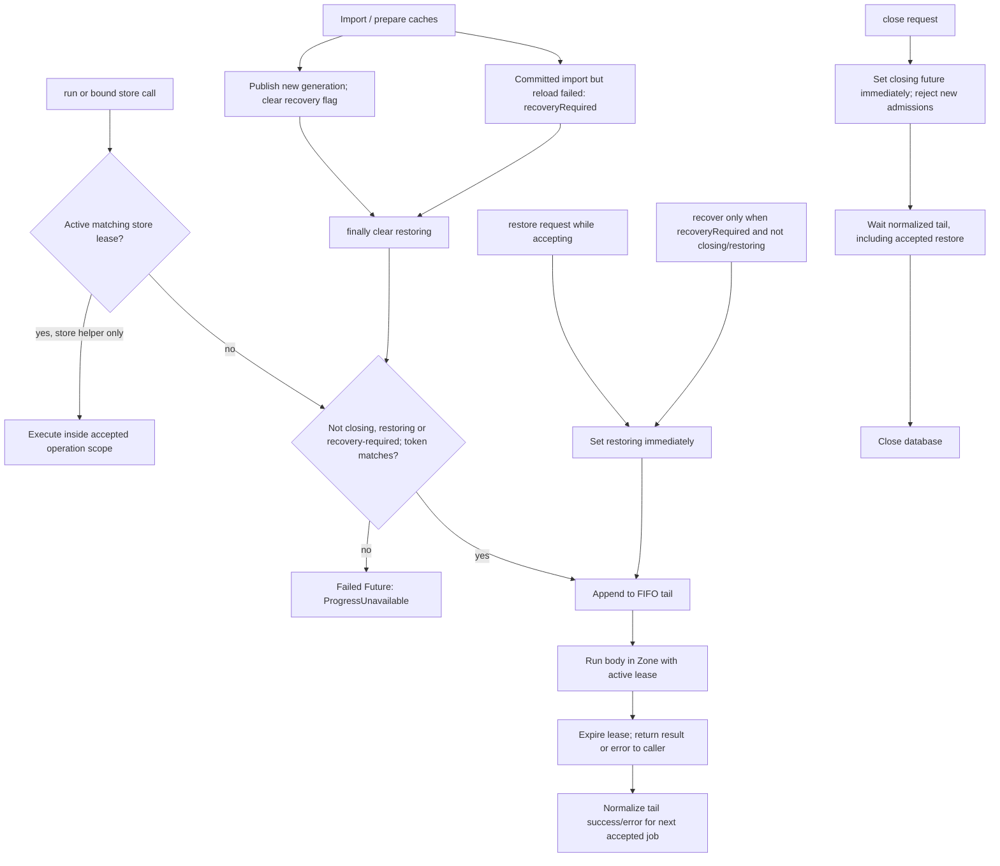

# Critical runtime integrity audit — FrenchApp

Date: 2026-09-27. Scope: current validation and progress persistence, transaction boundaries, cache publication, asynchronous sequencing, restore/recovery, stale sessions and closing. This is an audit, not a repair. The broader repository description is in `00_REPOSITORY_DEEP_ANALYSIS.md` in this directory.

## 1. Outcome and evidence standard

The canonical word/verb swipe operation has a coherent transaction and commit-before-publication design, with substantial existing failure-injection coverage using real SQLite. That guarantee does **not** extend automatically to every progress feature. Free quiz separates card and activity commits; journey/story/sentence completion spans multiple commits; flags, journey and practice mutate caches before SQL succeeds. These differences have specific failure consequences documented below.

Evidence is distinguished as follows:

- **Current execution:** a command/test run during this task, not a historical checkpoint.
- **Source proof:** a consequence directly determined by current control flow given a specified failure. This establishes conditional incorrect behavior, not the frequency of that failure on a device.
- **Asymmetry:** a demonstrable design difference without an established incorrect consequence by itself.
- **Risk:** a schedule or external condition still requiring a focused failure test.

No application source, existing tests, dependencies, content, editorial decisions or APKs were intentionally changed. No new permanent or temporary failure tests were authored. Existing tests, their actual SQLite triggers/gates and source-level failure traces supplied the evidence. Temporary command logs and preservation manifests are in the OS temporary directory. The only intentional persistent changes are this report and the authorized byte-preserving move of the previous report.

## 2. Current validation baseline

### 2.1 Environment and command policy

The existing Flutter launcher is `C:/Users/arda.hacifevzioglu/dev/flutter/bin/flutter.bat`; Python is the existing Python 3.12 installation. Existing `.dart_tool/package_config.json` and Pub cache were used. Flutter commands were given `--no-pub` to suppress automatic dependency resolution. No `pub get`, upgrade, dependency installation, Gradle build, APK replacement or content corpus rebuild was run. `pubspec.lock` is covered by the preservation hashes.

The first restricted Flutter analyzer attempt remained in the Windows launcher's SDK-cache lock acquisition path, with no analyzer output or Dart process. It was stopped after 81.21 seconds, wrapper exit −1. The launcher source (`flutter/bin/internal/shared.bat`, `:acquire_lock`) explains its retry behavior. This was an environment/startup interruption, not an analyzer result. The retry with access to the existing external SDK cache ran Dart and completed. No SDK source changes were made by the agent.

### 2.2 Command results

| Exact command | Exit/result | Count | Duration | Warnings and artifact scope |
|---|---|---|---|---|
| `flutter analyze --fatal-infos --no-pub` — restricted initial attempt | Interrupted; wrapper −1 | No analysis result | 81.21 s | No output; SDK-cache launcher lock retry. Not counted as a pass. |
| `flutter analyze --fatal-infos --no-pub` — cache-access retry | **0, PASS** | No issues found | 97.93 s wall; tool reported 95.0 s | Existing SDK/cache access; no dependency resolution. |
| `flutter test --no-pub` | **0, PASS** | **177 passed**, no reported failures/skips | **327.40 s wall**; runner elapsed 05:21 | Existing suites only; generated Flutter test/build artifacts and OS-temp SQLite fixtures. Non-fatal TTS plugin and SQLite-factory diagnostics described below. |
| `python -B -m unittest discover -s content/tools/tests -p "test_*.py"` | **0, PASS with skips** | 86 reported; 10 skipped, therefore 76 non-skipped | 73.02 s wall; unittest 72.557 s | Ten symbolic-link cases skipped. Expected negative-path output includes an output-plan collision diagnostic. |
| `python -B content/tools/14_validate_db.py` | **0, PASS** | Structural/learning-safety invariants; not a test-case count | 0.419 s | 15,423 words; 17,858 examples; 2,698 verbs; 121,354 forms; 19 lessons; 10,259 review-needed words; 18,075 aliases. Read-only asset access. |
| `python -B content/tools/journey_revision_audit.py --db assets/db/content.db --json` | **0, PASS** | Six matching CEFR revisions | 0.124 s | A1 `baae3aab002a`, A2 `2f642eb6a31b`, B1 `edb71326d5a4`, B2 `34914142868b`, C1 `c282dfc81ced`, C2 `af2f9bd1240a`. Read-only. |
| `python -B -m unittest discover -s content/tools/tests -p "test_output_paths.py" -v` | **0, PASS with skips** | 35 reported; 10 skipped | 14.72 s wall; unittest 14.403 s | Focused follow-up solely to identify the initial suite's skip reasons; not an additional 35 distinct tests. |

The ten skips are the writer and CLI variants of five symbolic-link collision cases: Dart→DB, Dart→marker, Dart→source, marker→DB and marker→source. Each reported `OSError`, `errno=22`, `winerror=1314`, “A required privilege is not held by the client.” Hard-link variants passed. These skipped protections were **not** executed successfully on this Windows account.

The Flutter run printed two handled TTS initialization diagnostics, `MissingPluginException` for `getLanguages` on `flutter_tts`, and a sqflite warning block about changing the default database factory during test teardown. The suite still exited zero with `All tests passed!`. The TTS diagnostics reinforce that this host-widget run is not physical speech-engine validation; the factory warning is retained here rather than hidden. No test failures or flaky reruns were observed. The analyzer retry addressed launcher access, not a failing analysis assertion.

PowerShell rendered normal Python unittest stderr as `NativeCommandError`/`RemoteException` text in redirected logs. The Python process exit was zero and unittest printed `OK (skipped=10)`; that wrapper formatting is not an additional failed Python test. Full temporary logs are `frenchapp-runtime-analyze.log`, `frenchapp-runtime-analyze-retry.log`, `frenchapp-runtime-flutter-tests.log`, `frenchapp-runtime-python-tests.log` and `frenchapp-runtime-python-paths.log` under the OS temp directory. This report records the durable conclusions; those logs are not permanent repository deliverables.

Generated-file writes were not individually hooked at every subprocess call. Flutter was allowed to update build/test/tool caches; Python suites create disposable directories and copied databases. The final inventory and hashes distinguish those artifacts from protected project files. No success here implies physical Android, media/TTS, device power-loss or production-filesystem durability validation.

## 3. Canonical swipe trace

### 3.1 Actual call chain

Primary references:

- `lib/features/vocab/swipe_session_screen.dart:85–131`, `_SwipeSessionScreenState._onSwiped`.
- `lib/features/verbs/verb_screens.dart:508–544`, `_VerbSessionScreenState._onSwiped`.
- `lib/app/progress_session.dart:8–29`, `ProgressSession` / `allowProgress`.
- `lib/app/app_state.dart:298–334`, `AppState.recordAnswer`; `:395–400`, `_publishReward`; `:517–521`, admission/notification.
- `lib/data/progress_coordinator.dart:12–103`.
- `lib/data/repositories.dart:531–570`, card transaction helpers; `:731–757`, daily helpers; `:1020–1224`, game transaction/snapshot/reward helpers.
- `lib/domain/srs/box_scheduler.dart:42–110`.
- `lib/motion/card_stack.dart:137–178`, `_onTick` / `_finishFlyOut`; input guards around `:235–298`.

```mermaid
sequenceDiagram
  participant UI as SwipeSession / VerbSession
  participant Stack as CardStack
  participant App as AppState
  participant Queue as ProgressCoordinator
  participant DB as SQLite transaction
  Stack->>UI: onSwipeAccepted(index, direction)
  UI->>UI: progressReady; reject duplicate _saving
  UI->>App: recordAnswer(type, ref, action, captured now)
  App->>Queue: run(operation), synchronous admission
  Queue->>DB: begin after earlier accepted work
  DB->>DB: read committed card, calculate SRS
  DB->>DB: write card + daily row
  DB->>DB: game profile, quests, achievements, snapshot
  alt any SQL/body failure before commit
    DB-->>App: rollback / error
    App-->>UI: failed future
    UI-->>Stack: false; retry snackbar
    Stack->>Stack: clear pending; retain current card
  else commit succeeds
    DB-->>App: prepared answer, daily row, game snapshot
    App->>App: publish all caches; reward; notifyListeners
    App-->>UI: AnswerResult
    UI->>UI: counters and optional incorrect-answer reinsertion
    UI-->>Stack: true
    Stack->>Stack: advance top index
  end
```

### 3.2 What happens before the transaction

The widget checks its captured generation and `mounted` through `progressReady`, checks `_saving`, captures the deck ref, maps direction to `SwipeAction`, and captures `DateTime.now()`. `recordAnswer` converts that time to local time **before** enqueueing. The coordinator synchronously accepts or rejects the operation, then executes it in FIFO order. No next SRS state or reward is calculated from an earlier widget cache in this path.

At execution, `recordAnswer` selects the appropriate current word/conjugation store. `game.transaction` delegates to SQLite's real transaction. `store.readState(txn, refId)` reads the committed previous row inside that transaction. Queued answers to the same ref therefore use the preceding committed answer rather than an optimistic earlier cache snapshot.

### 3.3 Exactly what is inside the SQL transaction

1. Read the prior card row or synthesize a fresh card.
2. Calculate `BoxScheduler.apply(before, action, now: at)`.
3. Derive `newLearned` only for a word with previous `timesSeen==0` and resulting box 1.
4. Upsert the entire card row with the captured event time.
5. Read/update the relevant local-date `daily_stats` row: one swipe and optional newly learned word.
6. Read game state, seed required daily quests, calculate card/new-word/verb rewards, update quest progress/claimed state, insert newly reached achievements, update the singleton profile.
7. Read the resulting game snapshot **using the transaction executor before commit**.
8. Return prepared `AnswerResult`, daily row and `GameUpdate` to the transaction caller.

Quest seeds, claim rewards and achievements are in the same rollback boundary, not subsequent writes. `GameStore.transaction` by itself is just an SQL helper; the enclosing `AppState` operation supplies coordinator admission. It is not universally generation-guarded as an independently callable public method.

### 3.4 Publication and UI order

Only after successful transaction completion does `recordAnswer` call `store.publish`, `stats.publish`, `game.publish`, then `_publishReward`. These are prepared values: no awaited reload or database read occurs between commit and publication. `_publishReward` updates nonempty reward state/serial and notifies unless disposed. Listeners see the application caches after all three components have been published.

The widget increments completed/right/direction counters and reinserts an incorrect card only after the future succeeds. `_finishFlyOut` holds `_pending=true` while awaiting acceptance, clears it in `finally`, and advances `_topIndex` only if still mounted and acceptance returned true. An unmounted widget allows an already accepted answer to finish but does not call `setState` on it.

### 3.5 Precise answers to the reference-path questions

| Question | Answer and boundary |
|---|---|
| Can SQL failure advance the card? | Ordinary card/daily/profile/quest/achievement exceptions propagate to `_onSwiped`, which catches, shows a retry message and returns false. `CardStack` retains its top index. Current widget/SQL tests directly exercise this. |
| Can card/daily/game diverge under an injected pre-commit SQL error? | Not through this operation's normal path: the shared transaction rolls all of them back and cache publication is skipped. The tested trigger points include late profile/achievement/quest failures. |
| Can an earlier unrelated commit be rolled back by this failure? | No. Atomicity applies to this transaction, not previously completed actions. |
| What if failure occurs before SQL dispatch? | No durable writes or publication yet. A rejected generation/admission returns false through the widget path; a gated transaction keeps the card pending. |
| Is duplicate acceptance prevented? | `CardStack` disables pending input, ignores additional programmatic persistent swipes while flying/pending, and clears `_flying` before awaiting. The screen adds `_saving`. Existing tests send extra controls while gated and observe one answer. |
| Is the operation globally idempotent? | No action ID/deduplication token exists. Two deliberate API calls are two answers; FIFO makes them accumulate correctly. UI duplicate prevention is not an exactly-once distributed protocol. |
| Can an old screen answer restored progress? | Existing word/verb session mixins capture a generation once, not on rebuild; acceptance after restore fails readiness. A swipe already accepted before restore is drained before overwrite. Both cases are tested. |
| Does `AppState.recordAnswer` itself accept a generation? | No. It uses `progress.run` without a token. The production widget's synchronous readiness check immediately before admission is part of the guarantee. A caller retaining the `AppState` and bypassing that check can submit a new action after restore. |
| Can closing cancel an accepted answer? | No orderly-close cancellation. Admission closes, accepted queue work drains, notifications are suppressed after disposal, DB closes afterward. Actual OS process termination is outside this drain guarantee. |
| What about failure after SQL commit? | No ordinary awaited failure point remains in cache publication. Tests reject post-commit database reads and still pass the operation. Catastrophic process termination or an unexpected synchronous publication failure is not simulated; a process restart reloads committed DB state. |

`BoxScheduler` is pure with respect to IO. Its increments/box/due values are calculated inside the transaction for canonical swipes. It does not save state itself. The distinct `SqliteCardStateStore.save(SrsCard)` API saves a **caller-prepared full row**, an important difference for free quiz and song starring.

## 4. Consistency patterns and cross-feature comparison

### 4.1 Pattern definitions

- **A — Commit then publish:** prepare/persist an operation, then publish cache. For a single upsert/delete, SQLite's statement commit can be the durable boundary; for an aggregate it must be the actual transaction.
- **B — Cache before persistence:** mutate an in-memory map/set before awaiting SQL. B alone does not establish a user-visible defect; a failed SQL operation followed by observing/reusing that cache establishes one.
- **C — Multiple separately committed operations:** one learner action spans several commits. Coordinator serialization prevents interleaving with other accepted jobs inside that body, but does not add SQL rollback across those commits.
- **D — UI ahead of persistence / detached result:** local answer/completion state changes or timers advance independently of a returned persistence future. D can coexist with A/B/C. Local answer highlighting before save is not inherently incorrect; claiming completion or preventing recovery after failure is a separate question.

### 4.2 Feature table

| Feature and exact symbols | Persistent writes | Transaction boundary | Cache publication timing | Awaited by caller? | UI advances when? | Partial-failure risk / pattern |
|---|---|---|---|---|---|---|
| Word/verb `_onSwiped` → `AppState.recordAnswer` | Card, daily, profile, quests, achievements | One transaction | All after commit | Yes, including `CardStack` acceptance | After successful answer; failure retains card | A; tested rollback and pending state. |
| `QuizScreen._answer` (`quiz_screen.dart:92–135`) | Card `save`; separate `recordActivity` | One card statement, then daily/game transaction as another queue job | Each persistence API publishes after its own success; local answer counters change first | **Neither returned future is awaited** | Timer advances after reveal duration, regardless of saves | A per piece + C + D; either half can fail while the other commits. |
| `StationQuizScreen._answer` delayed completion (`station_quiz_screen.dart:106–141`) → `recordStation` then `recordActivity` | Journey result; star/first-pass game reward; separate quiz daily/game activity | Journey statement; game transaction; later activity transaction | Journey cache before SQL; game/activity after respective commits | Each call awaited inside a detached delayed future; no outer catch | Result UI only after both calls return; local answer feedback before them | B+C+D; failed game can leave durable station advancement without star reward; closing/restore can reject/suppress later activity. |
| `StoryAdventureScreen._continueChoice` (`story_adventure_screen.dart:63–75`) → `saveStoryNode` | Story node | One statement | Practice cache first | Yes internally; callback future not caught | Node UI advances only after save succeeds, mounted-only postcheck | B; failed save leaves cache ahead of displayed node/DB. No pending guard for repeated continuation clicks. |
| `StoryAdventureScreen._nextQuiz` (`:96–127`) → `completeStory` | Practice completion/best pair; daily quiz counts; game/quest/achievement/reward | Three commits inside one coordinator body | Practice cache first; stats/game after each own commit | Yes; `finally` resets completion busy state, but no catch | Result only after full success; first-completion latch set only then | B+C; retry after later failure can lose first bonus and duplicate already committed stats. |
| `SentencePracticeScreen._check` (`sentence_practice_screen.dart:48–77`) → `recordSentenceAttempt` | Attempts/solved/best; daily; game/reward | Three commits inside one coordinator body | Practice cache first; local evaluation/counters first; stats/game after own commits | Yes internally, no catch/finally | Evaluation shown immediately; `_saving=false` only on success | B+C+D; failed practice insert can inflate later attempt count; later failure can lose first bonus; error latches saving. |
| `ReflexiveArenaScreen._answer` (`reflexive_arena_screen.dart:96–127`) → `recordActivity` | Daily quiz count; game quiz/verb counters and rewards | One daily/game transaction | App cache after commit; local answer before it | Yes internally, no catch | After persistence then reveal delay | A+D; no cross-store durable partial activity, but failed save leaves selected answer locked. |
| `SongQuizScreen._next` (`song_quiz_screen.dart:37–60`) → `recordActivity` | Aggregate quiz daily/game activity | One daily/game transaction | App cache after commit; recording flag before | Yes internally, no catch/finally | `_finished=true` only after successful activity | A+D; failed save leaves `_recording=true`. No SRS write. |
| `FlagStore.toggle` (`repositories.dart:799–823`) via `AppState.toggleFlag:564–571` | Flag insert/delete | Single statement | Set add/remove **before** SQL | App awaits store; swipe `onFlag` discards App future | Immediate local rebuild requested; App notify only on success | B+D; failed insert/delete leaves cache contrary to DB. |
| `JourneyStore.record` (`repositories.dart:892–925`) | Canonical best paired result | Single replace statement | `_results[id]=next` before SQL | Awaited by `recordStation` | Parent controls screen | B; failed insert poisons subsequent best-result/reward-delta input until reload. |
| `PracticeStore.saveStoryNode`, `completeStory`, `recordSentence` (`repositories.dart:1297–1390`) | Story node/completion/best; sentence attempts/solved/best | Each independent replace statement | `_stories`/`_sentences` assignment before SQL | Awaited by App operation | Parent controls screen | B; all three mutate before durable success, no rollback of map on exception. |
| Song vocabulary save callbacks (`popular_song_screen.dart:389–459`, `song_player_screen.dart:545–640`) | Full word `SrsCard` replacement with starred true | One card statement | Card store publishes after SQL | Awaited internally; no catch or in-flight button latch | “Saved” after successful notify/rebuild | A; stale prepared row under overlapping work is a separate risk, not a transaction rollback problem. |
| Settings setters (`app_state.dart:208–292`) | One setting key | One statement per setter | Settings cache then App fields, after SQL | UI switches/taps generally discard futures | Reflected through successful notify | A per key; failures leave durable/cache aligned but can be silent. |
| `LevelSelectScreen._confirm` (`level_select_screen.dart:54–68`) | Level, goal, optionally onboarding | Separately admitted setter operations | Each after its SQL | Awaited, finally resets `_saving`, no error catch | Pop/onboarding after sequence succeeds | C; earlier setting can persist if later setting fails/rejects. |
| `ProgressBackup.import` via restore | All recognized backup tables | One overwrite transaction, followed by separate reload/migration/seed work | Existing caches retained until all replacement stores prepared | Awaited and UI catches | Success only after reload/publication | A for overwrite; controlled post-commit recovery gap, not one transaction covering all reload work. |

### 4.3 Feature-specific accounting and normal success

**Free quiz:** determines `before=store.stateFor(ref)` and applies SRS outside its eventual queued `save`; then submits `recordActivity(quizTotal:1, quizCorrect:right?1:0, combo:_bestCombo)`. Both submissions occur synchronously in the same `_answer` call, so an ordinary external restore event cannot slip between them without an asynchronous boundary. They are nonetheless **two** accepted queue jobs. A first-job failure does not prevent the second, by coordinator design. The 900 ms scaled timer is independent of either result. `dispose` cancels that timer. It checks mounted, not generation, when advancing local index; later durable answers are generation-checked.

**Journey:** local stars are calculated from this attempt. `recordStation` obtains old canonical result, awaits `journey.record`, then rewards only newly added stars and a first pass. It notifies only after the game operation succeeds. The screen then rechecks `progressReady` before admitting quiz activity, correctly preventing an old attempt from writing into imported state, but also defining a break between the station action and its general quiz statistics. A result-screen navigation is available only once `_saved` is populated; failure leaves the last picked question rather than fabricating a success screen.

**Stories:** node continuation writes before changing `_nodeId`. Completion records `completed=true`, keeps correct/total from the better paired ratio, then writes daily quiz totals, then game reward with an additional 40 XP/8 coins if practice returned first completion. `_savingCompletion` prevents simultaneous completion submissions and resets in `finally`. `_completionSaved` only becomes true after all writes. It does not record which earlier components committed when a later one fails.

**Sentences:** evaluation/correct/combo counters and `_saving` update before persistence. Practice increments attempts, ORs solved and retains maximum score; first correct solve yields 15 XP/3 coins in the later game operation. The screen does not reset `_saving` on an exception. `_retry` and `_next` are local transitions; their buttons use `_saving`, so failure can leave the route unable to proceed normally.

**Reflexive arena:** each answer passes `quizTotal=1`, `quizCorrect`, `verbSwiped=1`, and best consecutive combo. It does not pass `swiped=1`; thus it adds verb activity/game reward and quiz statistics but not a swipe count. No conjugation SRS card is updated. Daily/game rollback is atomic for this call. A failed future prevents delay/index advancement but leaves `_picked` and local correct/combo values set.

**Song quiz:** intermediate answers change only widget state. At final `_next`, one aggregate activity call records total questions, total correct and `combo=_correct`. That combo is total correct, not longest consecutive run; this is a confirmed metric asymmetry, not classified as a persistence defect. Finalization is guarded against duplicate clicks by `_recording`; failure never clears it.

**Flags:** failure after `_flagged.add` or `_flagged.remove` has no compensating action. No content/editing/remote submission occurs. A successful later unrelated notification can expose the changed flag cache even if this operation never notified. The next toggle also consults the cache, so the consequence is more than a transient repaint.

## 5. Focused async and unawaited inventory

Literal `unawaited` is not sufficient to locate detached persistence. Several critical calls discard a future without using that function. Conversely, audio playback, TTS, animations, search debounce and haptics are not learner-state durability defects merely because their futures are ignored.

| Location/callback | Lifetime/admission behavior | Failure handling and visible effect |
|---|---|---|
| `QuizScreen._answer:114–126` | Submits card and activity futures, starts timer immediately; session checks once before both | Returned coordinated futures are ignored. `_tail` already attaches an error handler for queue continuity, so there need not be an unhandled-error log; UI has no save failure branch. |
| `QuizScreen` timer `:128–135` | Canceled on dispose; mounted check only | Can advance stale local quiz after restore or while save failed/pending. It writes no DB itself; next answer checks generation. |
| `StationQuizScreen._answer:106–141` | Detached `Future.delayed` with async body; checks generation at start and before second public App action | Errors from awaited station/activity escape into the discarded delayed future; no UI catch/retry state. Later activity is not part of the first admission. |
| Story `_continueChoice:63–75` | Async button handler; readiness before write, mounted after | Save exception propagates through handler without local catch. Node UI stays old, practice cache can already be new. Repeated clicks while waiting are not disabled by a saving flag. |
| Story `_nextQuiz:96–127` | Async handler with busy latch and first-completion latch | `finally` clears busy; exception still escapes. Retry can replay already committed daily work. Local quiz selections themselves are not generation-gated, but completion is. |
| Sentence `_check:48–77` | Async handler; readiness before aggregate action | No catch/finally; failed await leaves `_saving=true` and precomputed feedback/counters. Error escapes into UI callback future. |
| Arena `_answer:96–127` | Async handler; readiness before activity, delay after success, mounted after delay | Failed activity leaves `_picked`; no catch/reset. Post-delay local advancement can occur after restore, but no new DB call follows it. |
| Song `_next:37–60` | Async handler; readiness before aggregate final activity | Failure escapes and `_recording` remains true. Mounted postcheck does not revalidate generation for display, but does not persist again. |
| Swipe `onFlag:210–218` | Checks captured `ProgressSession`, calls `toggleFlag`, discards future, immediate `setState` | App future failure not converted to message; coordinator's tail handler preserves queue. Flag cache can diverge under SQL failure. |
| Popular/learning song save callbacks | Capture generation when modal opens; check it immediately before `app.cards.save`; then await | Failure propagates out of async button, no local error message; no false “saved” cache update from card store. No pending guard; captured full-row staleness merits testing. |
| Deck `onChanged: app.setMixLowerLevels`; Progress speed/motion/sentence-front callbacks; companion selection taps | Invoke current App setters without captured session generation | Each write commits before publication, but ignored errors have no explicit UI handling. They act as current settings controls after restore. |
| `LevelSelectScreen._confirm:54–68` | Three potential admissions separated by awaits; no ProgressSession | Finally resets saving, but error propagates. Navigation waits for success. An old settings screen may retain old local selection; it is not globally invalidated by restore. |
| `BackupScreen._export:49–87` | Coordinated DB snapshot, then directory/file/clipboard awaits; may continue after widget unmount | Catches errors into UI message if mounted, finally clears busy. File is written/flushed before clipboard; clipboard failure may report export failure although a backup file exists. No DB mutation from export. |
| `BackupScreen._import:90–139`, recovery callback near `:222` | Confirmation precedes restore admission; accepted restore continues after unmount | Format/general errors displayed; busy reset in finally. Recovery is reload-only. |
| `AppState.dispose:529–535` | `unawaited(_closeFuture)`; `close()` returns same future | Accepted operations drain. A DB-close failure is observable when `close()` is awaited; the dispose-only path has no explicit error reporter. No failure injected here. |
| `CardStack._onTick` → `_finishFlyOut` | Animation listener does not await helper; helper awaits acceptance and clears pending in finally | Canonical screen catches persistence errors and returns false. Arbitrary acceptance callbacks that throw are not translated to a CardStack message, but canonical SQL failures are handled. |

The distinction between **internally awaited** and **caught by UI** matters. Flutter button callback types do not automatically await and display errors from a returned `Future<void>`. Queue error handling protects later jobs; it is neither user notification nor transaction recovery for a failed earlier job.

## 6. ProgressCoordinator state model

Source: `lib/data/progress_coordinator.dart`, particularly `accepting/isCurrent:21–22`, `run:24–30`, `store:32–38`, `_append:40–52`, `restore:54–65`, `recover:67–80`, `close:82–84`, and the bound-store mixin `:94–106`.



The diagram is a control-flow model; flags can overlap (for example restoring plus closing). The source is not a single exclusive enum state machine.

| Condition/event | Exact enforced behavior |
|---|---|
| Normal admission | `run` synchronously evaluates gate/token and returns an appended future. Accepted execution is FIFO. |
| One operation throws | Its returned future fails. `_tail=next.then(...,onError:...)` makes the tail usable, so later accepted work still executes. This intentionally allows the second half of detached free quiz to proceed if the first half fails. |
| Restore requested behind accepted A1/A2 | Sets `restoring=true` immediately, then queues restore behind both. Previously accepted operations are not re-rejected when they start. |
| New operation during restore | Rejected immediately, even while restore is waiting for earlier accepted work. A second restore also rejects. |
| Store helper inside an accepted body | Zone lease must be active and the store's bound generation equal current generation. It runs directly through `Future.sync`, bypassing new admission gates, so accepted work can finish during a later restore/close request. |
| Nested transaction participation | Lease membership is **operation scope**, not SQL transaction enlistment. The caller must pass `txn` explicitly or call a transaction-owning store method. Practice/journey separate statements remain separate commits. |
| Lease expires | `finally` deactivates it at body completion. A delayed store callback then goes through normal token/gate admission. The expired-lease test exercises restore invalidation. |
| Post-import reload fails | App sets `recoveryRequired=true` after import commit; ordinary `run`, store writes and export reject. Old cache may remain readable. |
| Recovery | Only allowed with recovery required, no restore and no close. Queues guarded reload; clears recovery flag only after body success, always clears restoring. |
| Close | `_closing ??= _tail.then(closeDatabase)` is memoized and immediately makes admission false. It drains already accepted work and normalized failures; it does not cancel bodies or wait for arbitrary UI futures never admitted. |
| Stale store reference | Store captured its generation on `bindProgress`; after restore the old store rejects even if a caller bypasses widget checks. Fresh stores are rebound through AppState setters after generation increments. |
| Stale AppState reference | AppState remains the same object; public methods generally submit without a token. Caller-side `ProgressSession`/`allowProgress` is therefore essential. |
| Bypass paths | Public low-level `writeState`, `publish`, `transaction`, raw `db.progress`, and standalone unbound stores do not provide all coordinator guarantees independently. Current canonical call sites use them deliberately under the coordinator/transaction. No global SQLite access interceptor exists. |

No production nested `AppState` admission was found that relies on recursively joining a current `run`; only bound **store** helpers join. A future developer calling `progress.run` and awaiting another AppState `run` inside it would enqueue behind itself; that hypothetical misuse is outside this audit's confirmed defects.

## 7. Restore, backup and stale widgets

### 7.1 Restore chain and failure boundaries

`BackupScreen._import` captures pasted text, asks for overwrite confirmation, then awaits `AppState.restoreProgress`. Cancel/empty/unmounted-before-confirmation starts no import. `restoreProgress` raises the coordinator barrier, waits accepted work, calls `ProgressBackup.import`, marks recovery required after that commit, and calls `_prepareProgress`.

`ProgressBackup.import` (`lib/data/backup.dart:70–154`) decodes/version-checks, requires original three tables, validates row shapes/known columns/types/selected values before deletion, then deletes/reinserts the ten supported progress tables in **one** transaction. Missing optional tables are empty on import; unknown columns fail. It is overwrite, not merge.

`_prepareProgress` (`app_state.dart:489–515`) performs content-ID migration, loads new word/conjugation/settings/daily/flags/journey/game/practice stores, then increments generation and assigns all stores with no further awaits, applies settings, clears last reward and notifies. Store property setters bind each replacement to the new generation. `GameStore.load` can insert/ignore the profile and seed today's quests; migration can commit too. Thus the post-import preparation phase is not entirely read-only and not inside the import transaction.

| Failure point | Durable DB | In-memory state / generation | Gate/UI outcome |
|---|---|---|---|
| JSON/version/table/type/value failure before overwrite | Existing state retained, including earlier accepted work that restore drained | Existing caches and generation retained | Restore finally clears barrier; no recovery required. UI error, no success. |
| SQL failure during overwrite delete/insert | Entire overwrite transaction rolls back | Existing caches/generation retained | Admission reopens; UI catches SQL error. Actual trigger tests exist. |
| Import commit succeeds, later migration/load/seed fails | Imported state is durable, possibly with completed migration/default-seed work | Old active stores remain if failure occurs during preparation; no final replacement publication | Recovery required remains true; ordinary mutations and export blocked. UI explicitly says DB was written but memory could not load and offers reload. |
| Recovery fails again | Imported/current DB retained; any successful preparatory writes can remain | Old published caches remain | Recovery flag stays; further normal writes remain blocked. |
| Recovery succeeds | Current imported/migrated state | All replacement stores/new generation published; last reward empty | Admission reopens after barrier clears. Old bound stores reject. |
| Close during accepted restore | Restore drains/finishes first; then DB closes | Notifications suppressed once disposed; accepted work can still update caches | Reopen reads imported DB. Existing test covers unmounted BackupScreen and orderly close. |

Recovery prevents mutation through the coordinated public/store paths, **not reading or displaying old caches** and not arbitrary direct SQL calls. `BackupScreen`'s error/recovery UI makes the mismatch explicit. This deliberate gated mismatch after committed import is not classified as uncontrolled cache corruption.

Export is coordinated and reads all tables inside one transaction. Later accepted writes wait until export completes. File creation and clipboard publication happen afterward and do not extend the DB snapshot transaction. The UI also writes `frenchapp-<timestamp>.json` with `flush:true` to external app storage (fallback support storage), then copies to clipboard. This corrects a simplification in the previous report's clipboard-only description; that prior report was moved unchanged as requested.

### 7.2 Which old routes are protected, and which may still change locally

| Old object/route after successful restore | Durable operation behavior | Local/navigation behavior |
|---|---|---|
| Word/verb swipe session | `progressReady` at acceptance rejects; in-flight pre-restore accepted answer drained before import | Old card may remain visible; snackbar asks to reopen. Existing tests cover animation started before restore. |
| Free quiz | `_answer` generation check rejects any later answer. Its two already submitted jobs drain before restore | Existing reveal timer can advance local index because it only checks mounted; subsequent writes still reject. |
| Station quiz | Readiness at answer and delayed callback; another check before separate activity | Local selected answer/load result can exist, but delayed durable completion rejects if stale. `_saved` may still update after an already successful activity if restore follows; that is display state, not a new write. |
| Story | Continue node and `_nextQuiz` completion check readiness | Choosing an option, entering quiz and selecting an answer can alter local state without saving. Mounted-only post-await updates can reflect a pre-restore action, but next durable operation rejects. |
| Sentence | `_check` readiness blocks attempts | `_retry`/`_next` can alter local view; already accepted attempt may publish feedback after restore timing. No later persistence in those local handlers. |
| Reflexive arena | `_answer` readiness blocks new activity | Successful pre-restore answer's later delay can advance local index, mounted-only. |
| Song quiz | Final/intermediate `_next` checks readiness before completion | `_answer` itself changes selection/correct count locally; final save still rejects. |
| Existing song-word sheet | Captured generation checked before starring; stale bound stores also reject | Existing sheet may still display old/captured word data. |
| New sheet opened from an old media page | Captures current generation when opened | This is a new current-generation action, not retroactive acceptance of an old pending save. |
| Word-card flag callback | Parent swipe session checks generation before `toggleFlag` | Old flag cache display may remain, but stale callback cannot toggle via that route. |
| Old store variables | Bound-generation check rejects supported mutations, including all PracticeStore methods | Reads may return old cache; tests do not promise old objects become unreadable. |
| Settings/companion/level selection | Generally no captured generation; current AppState methods accept fresh calls once restore completes | May submit current user settings choices or values retained in an older settings screen. This is not the same guarantee as a learning session. |
| Direct retained AppState API caller | No automatic origin-generation token | Can submit new calls after restore if accepting. All-screen safety cannot be inferred from coordinator alone. |

Readiness and admission are consecutive synchronous code for the canonical handlers, without an await in between. In a single Dart isolate, restore cannot be externally interleaved between that check and the immediate enqueue. After awaits, mounted and generation are separate properties; checking one is not a substitute for the other.

## 8. Existing failure-injection coverage matrix

Unless otherwise noted, references below are to `test/progress_consistency_test.dart`. These tests initialize real `sqflite_common_ffi` databases in OS-temp directories, call production AppState/stores, and often production Flutter widgets. Most use a small synthetic content DB supplied through the asset channel; the FA007 shell scenario switches to the real content asset. They do not replace transaction logic with an in-memory repository fake.

`test/helpers/progress_probe.dart::OperationGate` delays before SQL dispatch with completers; it is not a time-based sleep. `ProbeDatabase.transaction` delegates to a real database transaction, returning the real transaction executor unless a read-observing wrapper is needed. `ReadProbeTransaction` executes a missing-table query on that transaction to cause a genuine SQL error. SQLite `RAISE(ABORT,...)` triggers inject insert/update/delete failures. Gates are released in teardown and fixtures cleaned. These facts establish meaningful rollback evidence, while synthetic data/platform mocks limit device claims.

| Guarantee / failure scenario | Existing test? Name/location | What it proves | What it does NOT prove |
|---|---|---|---|
| Animated verb success and reopen | Yes, `A successful animated verb answer persists card activity and reward`, :324–395 | Real stack acceptance, card/daily/profile/quest/achievement values and reopen alignment | All other feature write paths. |
| Card insert failure retains UI card | Yes, `B card insert rollback leaves current card and shows retry error`, :397–429 | Actual animation plus SQL abort; unchanged snapshot and retry message | Every conceivable post-commit/UI exception. |
| Late profile failure atomic rollback/retry | Yes, `C game failure rolls back the whole answer and retry succeeds`, :431–465 | Card/daily rollback when profile update fails; retry counts once and reopens | Separate story/journey transactions. |
| Daily activity rollback | Yes, `C2 daily failure preserves cache and next successful write counts once`, :467–502 | `recordActivity` daily/game atomicity and successful retry | Arena/song callback recovery UI. |
| Export waits accepted answer | Yes, `D export waits accepted answer and imports a complete snapshot`, :504–556 | FIFO + exporter + import into separate real DB | Export file/clipboard failure in the same test. |
| Restore drains already accepted A1/A2 | Yes, `E restore drains A1 and A2 before importing B and publishing caches`, :558–658 | Old work finishes before overwrite; replacement cache publication | Every stale feature widget. |
| Cancel/invalid import | Yes, `E control canceled and invalid restore start no import writes`, :660–698; invalid-backup test :1529 | No import writes; earlier accepted answer preserved; generation not rotated by invalid input | Arbitrarily malformed semantically related backup fields. |
| Close waits activity/card write | Yes, `F close waits queued activity...`, :700; `F2 close waits accepted standalone card save...`, :733 | Before-dispatch gates and orderly close sequencing | OS kill/power loss. |
| Card/daily/profile/quest seed/quest update/achievement failures | Yes, parameterized `atomic answer rollback and recovery at ...`, :771–809 | Six genuine SQL trigger points through `recordAnswer`; full snapshot rollback and next jobs work | Pattern-B stores. |
| Partial new-day quest seed rollback | Yes, :812–840 | Second seed failure rolls back first seed within answer transaction | Startup/recovery `GameStore.load` seed sequence as a whole. |
| Standalone card/daily commit-before-cache | Yes, :842–858 | Insert abort does not publish standalone card/daily cache | Full-row snapshot freshness before enqueue. |
| Earlier card commit survives later activity rollback | Yes, `recordActivity profile rollback does not undo an earlier independent card commit`, :860–875 | Two operations are not one transaction; real persisted asymmetry | It calls APIs directly, not `QuizScreen._answer`/its timer, so not a full free-quiz widget reproduction. |
| Quest bonus/achievement once after retry | Yes, :877–919 | Late answer rollback removes claims, retry rewards once | First story/sentence/station bonus after partial commit. |
| All actions, queued same ref, shared event time | Yes, :921–981 | Canonical queued answers use committed card and captured event time across daily/quest writes | Caller-prepared `save` paths or midnight split practice calls. |
| Pending/duplicate inputs/rollback/retry/reopen, word and verb | Yes, parameterized `real ... animation pending rollback retry and reopen`, :992–1062 | Extra swipes during pending ignored, last card not completed on failure, one retry persists | Simultaneous independent routes/actions on same ref. |
| Unmount does not cancel accepted answer | Yes, parameterized :1064–1082 | Committed result despite route disposal, no widget exception | Full process termination. |
| Incorrect-card reinsertion once | Yes, :1085–1102 | One left swipe inserts one retry, next answer uses persisted card | Every deck/gesture timing permutation. |
| No post-commit reads | Yes, :1104–1120 | Probe rejects Database.query after commit; answer/activity still publish | Unexpected synchronous allocation failure, or arbitrary rawQuery not covered by the probe hook. |
| Close accepted atomic answer | Yes, :1122–1138 | No post-dispose notification failure; reopened durable state | Close failure itself. |
| Stale bound stores and close rejection | Yes, :1150–1200 | Eleven supported old-store writes reject; fresh answer succeeds; new close-time writes reject | Arbitrary raw DB/writeState/transaction bypass or tokenless retained AppState usage. |
| Double restore and close drain | Yes, :1202–1230 | Immediate barrier, new jobs reject, accepted restore completes before close | UI semantics for two different open settings pages. |
| Import delete/insert rollback | Yes, two variants :1232–1256 | Real overwrite transaction rollback, same old store/cache and reopened admission | Every optional-table semantic constraint. |
| Post-import load failure and recover/reopen | Yes, two variants :1258–1291 | Durable imported XP 28 versus old cache XP 7; writes/export blocked; recover or reopen reads imported DB | All possible migration/late seed failure positions. |
| Export snapshot cannot interleave later job | Yes, :1294–1330 | Transaction held after first table read; later activity waits; imported export internally consistent | External writers bypassing coordinator on independent handles. |
| Export read failure / queue continuity | Yes, :1331–1360 | Actual missing-table error propagates; later answer/export/close works | UI message for every OS file error. |
| Old word/verb animation after restore | Yes, two variants :1361–1379 | Stale acceptance blocked and imported state untouched | Free quiz, station, story, sentence, arena, song or flag stale widget paths individually. |
| Backup export file and failed read UI | Yes, :1380–1399 | Flushed real temporary JSON, success/error distinction, failed snapshot creates no replacement file | Android external storage/clipboard failure. |
| Backup import SQL error UI | Yes, :1400–1415 | No false success message, old game state | Practice completion error UI. |
| Unmounted backup/close | Yes, :1416–1442 | Accepted restore finishes without mounted widget, then closes/reopens | OS kill while importing. |
| All stores drain before export/close | Yes, :1444–1486 | Successful writes for card/settings/stats/flags/journey/game/practice all included before close | SQL failure inside flags/journey/practice; this is a success/drain test. |
| Expired lease cannot bypass generation | Yes, :1488–1503 | Delayed old store call rejects after restore | Arbitrary non-awaited work already executing inside an active lease. |
| Recovery button without reimport | Yes, :1504–1528 | Backup UI exposes reload and can restore cache from committed import | Automatic background recovery. |
| Integrated real shell and reentry/reopen | Yes, `FA007 real shell learning backup restore reentry and reopen`, :1556–1769; real verb B continuation :1771 onward | Actual routes, real bundled learning data, backup/restore and new-session continuation | All non-swipe feature fault paths or physical Android. |
| Backup structural/type validation | Yes, `test/backup_validation_test.dart:55,63,86` | Incomplete/wrong-type rejection and full overwrite on real fixture DB | Comprehensive semantic validation or arbitrary corrupt disk recovery. |
| Journey alias paired best and first rewards | Yes, `journey_alias_test.dart`, `journey_revision_compatibility_test.dart:205–433` | Canonicalization, best paired attempts, old/new compatibility, normal first-pass behavior | SQL failure after journey result but before reward. |
| Practice persistence/first bonus normally once | Yes, `practice_engine_test.dart:106` | Normal story/sentence persistence and no repeated first reward | Any injected failure between practice/daily/game. |
| Unsafe/missing content and song saved words | Yes, `learning_filter_test.dart:178–471` | Eligibility across old saved refs/decks/quiz/media saving | Concurrent full-card overwrite or failed flags. |
| Verb selection/in-flight start | Yes, `verb_pool_test.dart:196–497` | Actual refs, batch coverage, captured tense and duplicate start guard | Every progress failure for unrelated features. |

A successful complete suite validates its assertions, including the assertion that an earlier independent card commit survives later activity rollback. Passing tests therefore does not mean the suite asserts global action-level atomicity for every feature.

## 9. Confirmed correctness defects

The following are conditional defects supported by direct source traces; they are not reports of observed real-user data loss. No new fault test was added. Where an existing test only verifies a lower-level mechanism, that limit is stated.

### D1 — Failed Pattern-B SQL leaves authoritative cache changed

**Location:** `FlagStore.toggle:799–823`, `JourneyStore.record:892–925`, `PracticeStore.saveStoryNode:1297–1315`, `completeStory:1318–1343`, `recordSentence:1358–1390`, all in `lib/data/repositories.dart`.

**Source proof:** each method assigns/removes/adds its cached entry before awaited insert/delete, with no catch restoring the prior entry. Inject an SQL abort at that statement: SQLite retains the old row while the cached value is already the new value. The coordinator catches only to keep its tail alive; it does not roll back Dart collections.

**Concrete consequences:**

- Failed flag insert: DB unflagged, cache flagged. The next toggle takes the remove branch, deletes zero DB rows and returns success, so the user's retry does not save the original flag intent. Failed delete is the inverse.
- Failed journey insert: cache can mark a station passed/three-star while DB has no result. A later retry uses that cached result as “old,” potentially calculating zero new stars/first-pass reward even when the retry is the first successful DB insert.
- Failed sentence insert: cache has attempts 1/solved true while DB is absent. Same-process retry constructs attempts 2 and `firstSolve=false`; a successful retry can persist a phantom attempt and suppress the one-time bonus.
- Failed story completion insert: cache completed true while DB absent; same-process retry returns first=false. Reload before retry changes that behavior, showing that cached failure state affects outcomes.

**User visibility:** not all parents notify after failure, so immediate repaint is not guaranteed. Reopening a route, another App notification or the next operation can observe the changed cache. Practice/journey UI and bonus decisions use it.

**Severity:** P1 for lost completion rewards/incorrect attempts; P2 for a local flag toggle alone. Small likely direction for lead evaluation: prepare a next value, publish only after successful statement/transaction. This alone would not solve D2's already committed cross-store partial actions.

### D2 — Completion can commit without its first-time reward; retry may duplicate stats

**Location:** `AppState.recordStation:371–392`, `completeStory:407–428`, `recordSentenceAttempt:430–451` and the corresponding stores.

**Station source proof:** start with no station result. `journey.record` successfully commits three stars. Abort `game_profile` update in the subsequent game transaction. The station remains durable; game transaction rolls back. Retry/reopen then retry: old stars=3, new stars=3, first pass=false. The station reward operation receives no new stars/pass and cannot recover the lost 60 XP/24 coins/first-pass counter. This remains true across process reopening because the completion itself committed.

**Story source proof:** start with an incomplete story; complete a 1/1 quiz. Practice commits completed=true and daily quiz totals commit 1/1. Abort the later profile update. Game XP/coins remain old. Retry after removing failure: first=false, daily totals become 2/2, and game gets normal quiz reward but **not** the missing 40 XP/8 coin first-completion bonus. The same pattern applies to sentence attempts and its 15 XP/3 coin first-solve bonus. If failure is at the daily write instead, practice still commits but daily/game do not; first bonus is still lost on retry.

**Evidence:** exact production source sequence and SQL transaction boundaries; normal repeat/first-bonus tests exist, but no focused partial-completion failure test was found. The existing independent-card/activity test demonstrates the general non-rollback-across-commits mechanism, not these specific widgets.

**User impact/severity:** P1, completion/unlock can persist without corresponding rewards/statistics, and retry can overcount quiz totals or attempts. Likely direction: one transactional existing-operation boundary with prepared cache publication, or an explicitly recoverable/idempotent completion scheme; choosing the design is for the technical lead.

### D3 — Free quiz can advance and persist only one half of an answer

**Location:** `QuizScreen._answer:92–135`; `SqliteCardStateStore.save:547–550`; `AppState.recordActivity:336–368`.

**Proof:** `_answer` updates local correctness/combo, submits card save and activity as separate unawaited jobs, and starts a timer that never examines either result. A card insert failure leaves card unchanged; the queue continues and can commit the reward/statistics. Conversely, a successful card save followed by profile failure keeps changed SRS but rolls back daily/game activity. Existing test `recordActivity profile rollback does not undo an earlier independent card commit` (:860–875) verifies the latter persistence boundary with real SQLite, though it does not drive QuizScreen. The timer's unconditional mounted-only advancement is source evidence.

**Persisted/user consequence:** learner sees a counted answer/next question while SRS or rewards/statistics omit it. Errors can be silently unobserved because the coordinator's continuation handler already handles the failing job for queue purposes. **Severity:** P1. Likely direction: await an appropriate answer operation and make the action's intended atomic boundary explicit; merely awaiting two separate writes does not make them atomic.

### D4 — Persistence exceptions leave several practice screens latched

**Location:** `SentencePracticeScreen._check:48–77`, `SongQuizScreen._next:37–60`, `ReflexiveArenaScreen._answer:96–127`; station delayed completion `:106–141` has a related selected-last-answer state.

**Source proof:** sentence sets `_saving=true` and evaluation before await; song sets `_recording=true`; arena sets `_picked`. Their reset/advance code is only after successful await, without catch/finally. A persistence exception exits before clearing those fields. Sentence buttons are disabled while saving, song next is disabled while recording, and arena rejects further answers while picked. Station error skips `_saved`/`_picked` reset. An error escaping to the framework is not a recovery UI.

**Consequence/severity:** P2 for recoverable route latching; durable inconsistency in sentence/station is separately D1/D2, not double-counted here. Song/arena activity itself rolls back correctly. Likely direction: catch/represent errors and reset/retry only according to whether the operation committed; blindly rerunning a partially committed story/sentence is unsafe.

## 10. Confirmed asymmetries, plausible risks and safe differences

### 10.1 Confirmed design/consistency asymmetries

1. Coordinator admission is universal for the supported bound-store methods, but action-level SQL transactions are not. Serialization and atomicity are distinct.
2. Canonical SRS reads committed state at execution; free quiz/song starring supplies a complete card prepared earlier from cache.
3. Word/verb readiness is captured once per session; settings pages and direct AppState APIs do not enforce origin-generation tokens.
4. Some post-await callbacks check only mounted for local UI advancement; station uniquely rechecks generation before its **second** durable action.
5. Game/daily cache publication is after commit, while journey/practice/flags publish early.
6. Free quiz writes per question; station/song/story generally account at completion; arena records each answer without SRS mutation.
7. Song combo is total correct; free/station/arena/sentence use tracked combo values. This is a metric definition difference, not established cheating or a persistence race.
8. Startup/recovery `GameStore.load` performs default insert/quest seeds outside one enclosing import transaction; recovery gates keep partial preparation from normal write use.

### 10.2 Plausible risks requiring a focused failure/scheduling test

- **Caller-prepared full-card lost update:** gate an accepted canonical answer, prepare a song-star or free-quiz save from the old card cache, then release. FIFO can write the new canonical card followed by an older full row, reducing box/counters while daily/game retain the earlier answer. The full-row APIs make this schedule plausible; a production-route reproduction is still needed to establish realistic reachability.
- **Unadmitted continuation at close/restore:** station result/reward is one accepted action and its quiz activity is another. A closing/restoring transition between them prevents the second, as its readiness check intends. Exact user-visible totals under this boundary need a widget test; no claim is made that restore should preserve actions it intentionally overwrites.
- **Midnight splits in practice:** story/sentence use separate stores with their own default `DateTime.now()` calls rather than one captured event time. A clock/day transition could place daily stats and game quests on different days. Canonical swipe's event-time test does not cover this path.
- **Repeated story-node continuation while pending:** `_continueChoice` lacks an in-flight guard. Same-node repeats are largely idempotent, but completion/resume timing, concurrent back navigation and queued repeated writes merit a bounded widget test before calling them progress corruption.
- **Old settings selection after restore:** an already open LevelSelect page retains local level/goal and can later submit them to current AppState. Whether this is undesirable stale overwrite or a legitimate new settings action depends on intended UX; no defect classification is assigned without that decision/test.
- **Settings/file/close errors are not uniformly surfaced:** commit-before-publication avoids many cache errors, but ignored setter futures and dispose-only close failures lack explicit error UI. Exact platform failure behavior was not injected.

### 10.3 Safe / intentional differences

- Archive/skip versus wrong answers have different SRS semantics; they are not missing writes.
- Song and arena quizzes need not mutate word/conjugation SRS: their source explicitly records activity only. Missing SRS writes there are not classified as defects.
- Normal repeated story/sentence practice can legitimately count another attempt and quiz activity while suppressing a first-time bonus. D2 concerns replay following a **failed partially committed** action, not ordinary repetitions.
- Accepted work finishing after widget unmount or orderly close request is deliberate. Canceling it could lose a previously accepted answer.
- Restore overwrites drained earlier work by user confirmation; that is intentional import semantics, not data loss attributed to the coordinator.
- Old bound stores reject writes after successful restore; they may still be readable. The active state is the replacement store set.
- Post-import cache/DB mismatch under `recoveryRequired` is explicitly signaled and mutation-gated. It is not equivalent to unguarded Pattern-B divergence.
- Animation/TTS/media/search futures do not modify learner progress merely by being asynchronous. Only their persistence-capable callbacks were included above.

## 11. Missing high-value failure scenarios — specifications only

No tests below were added or run. “Expected” distinguishes what the current source predicts from the integrity assertion a future test should assess. No P0 is assigned solely from unusual structure; the strongest demonstrated consequences here are P1 progress/reward divergence and P2 recoverable UI problems.

| Priority / scenario | Setup and injection point | Expected durable DB under current source | Expected cache and UI | Existing coverage gap / useful assertion |
|---|---|---|---|---|
| **P1: practice insert failure then retry** | Fresh sentence; trigger abort before `sentence_progress` insert; call production `recordSentenceAttempt`, remove trigger, retry | First DB unchanged; retry may persist attempts=2 and no first-solve bonus | Cache already attempts=1/solved after first failure; actual screen remains saving | No PracticeStore SQL-failure test. Assert whether failed attempts are allowed to influence future success; test UI separately. |
| **P1: story daily failure then retry** | Incomplete story; abort daily insert after story commit | Story completed survives; stats/game absent. Retry has no first bonus | Cache completed; `_savingCompletion` clears but no success result | Normal first-reward test does not inject middle failure. Check bonus loss across same-process retry and reopen. |
| **P1: story/sentence late game failure** | Let practice and daily succeed; abort profile update | Practice+daily durable, game transaction rolled back; retry repeats daily counters | Practice/stats caches advanced, game old; story retry possible, sentence latched | Compare all stores, not existing `snapshot` alone, which emphasizes conjugation/daily/game and omits practice. |
| **P1: journey result succeeds, reward fails** | New three-star station; abort profile update in `recordStation` | Station remains passed/3 stars; no star coins/XP or pass counter. Reopen/retry yields delta 0 | Journey cache passed, game old; station last question remains picked | Alias/first-pass tests cover normal calls only. Assert replay/recovery treatment for lost first reward. |
| **P1: journey insert fails then retry** | New station; abort `journey_progress` insert | First DB unchanged; retry may save best result without first reward because cache already holds it | Cache passed after error despite absent row | Distinguish early-publication D1 from later-commit D2. |
| **P1: actual free quiz card failure** | Real eligible quiz question; abort target card insert; answer and pump reveal timer | SRS unchanged, activity may commit | Local score/index advances, reward/statistics change | Existing API test verifies converse boundary, not widget timer or silent future. Capture errors and actual visible next question. |
| **P1: actual free quiz activity failure** | Card save succeeds; abort profile update | Card committed, daily/game rolled back | UI still advances with score | Establish actual widget consequence plus persisted state/reopen, beyond direct API test :860. |
| **P1: queued stale full-row save** | Gate canonical answer; prepare earlier `SrsCard` for song star/free quiz; enqueue it; release | Later full-row save can overwrite canonical box/times counters while reward remains | Cache matches overwritten row, game reflects both/earlier action | Same-ref canonical test proves only transaction-time reread. Assert no lost canonical answer through actual reachable callback schedule. |
| **P1: close between station and quiz activity** | Complete final station answer; gate/observe station success then request close before `recordActivity` admission | Station/reward may persist without general quiz stats | Readiness suppresses later activity; route may not display result | Close tests cover already admitted jobs, not two admissions forming one UI action. Determine intended completeness boundary. |
| **P1: practice midnight boundary** | Controlled time around midnight between stats and game calls | Daily quiz row and game quest day could differ | Caches reflect different days | Canonical captured-time test does not cover independent defaults. Requires controllable clock in a future authorized test design. |
| **P2: failed flag insert/delete and second toggle** | Inject each SQL branch separately, inspect flag cache, trigger unrelated notify, retry | Old row preserved on failure; retry direction follows changed cache | Display eventually contradicts DB; retry may reverse the intended action | Existing all-store drain/stale tests are not SQL-failure assertions. |
| **P2: song/arena transactional error UI** | Abort profile update during final song / one arena answer | Activity transaction fully unchanged | `_recording` or `_picked` remains set; no retry message | Activity API rollback is covered; these widget latches are not. |
| **P2: stale non-swipe widgets and media sheets** | Open each quiz/practice/flag/media route, restore externally, invoke callbacks and timers | New durable operations should reject via captured generation; accepted old jobs drain | Some local state/timers still advance | Current stale-widget tests explicitly exercise only word/verb animations. Assert every durable callback boundary, not blanket screen immutability. |
| **P2: setting failure and partial level/goal sequence** | Fail first/second/third setting write or raise restore barrier between awaits | Earlier keys remain committed; failed key not published | Busy resets for level select, no catch message; switches remain backed by old committed values | No exact UI/error sequence assertion. Decide whether multi-key atomicity is a requirement. |
| **P2: export file/clipboard and close failure** | Successful DB snapshot, fail file write or clipboard; separately fail DB close | Progress unchanged; file may exist if clipboard fails | Backup shows failure; dispose-only close error may be unobserved | Existing export read test does not cover OS-output partial success; no close-failure injection. |

For future tests of D1/D2, the assertion snapshot must include raw and cached `flagged_cards`, `journey_progress`, `story_progress`, `sentence_progress`, profile, daily, quests and achievements. Reusing only the current conjugation-focused helper would miss the affected state even if its alignment assertion passes.

## 12. Repository preservation and before/after comparison

### 12.1 Initial state captured before validation

Before tests, the audit recorded both `git status --short` and full untracked porcelain status, branch and HEAD verification, the index hash, and SHA-256 for 663 existing files outside `.git`, `build`, `.dart_tool`, `.gradle` and `__pycache__`. This includes source, tests, lockfile, content, APKs, historical evidence, editorial ledger and the previous report. The full manifest is temporary `frenchapp-runtime-audit-baseline.json`; selected important hashes are reproduced below so the report remains useful independently.

Branch was `master`; `git rev-parse --verify HEAD` exited 128 with `fatal: Needed a single revision`. There is no valid current commit. Status included pre-existing staged/unstaged additions/modifications and the two indexed-but-missing prototype files. Those states were not reset or staged. Git also warned that the user-level `.config/git/ignore` was inaccessible to the restricted process; repository status exited zero. The same restricted status mechanism was used for the final comparison.

Exact initial `git status --short` stdout:

```text
AM .gitignore
AM DATA_PIPELINE.md
AM PLAN.md
AM README.md
A  analysis_options.yaml
A  content/tools/00_probe_sources.py
AM lib/app/theme.dart
AD lib/features/prototype/fake_words.dart
AM lib/features/prototype/prototype_screen.dart
AD lib/features/prototype/word_card.dart
AM lib/main.dart
AM lib/motion/card_stack.dart
AM lib/motion/flip_card.dart
AM lib/motion/motion_tokens.dart
AM lib/motion/swipe_badge.dart
A  lib/motion/swipe_direction.dart
AM pubspec.yaml
?? .checkpoints/
?? .github/
?? .metadata
?? .staging/
?? FA-013-run-004-handoff.zip
?? REPOSITORY_DEEP_ANALYSIS.md
?? TEST.md
?? THIRD_PARTY_NOTICES.md
?? android/
?? assets/
?? content/grammar/
?? content/overrides/
?? content/reports/
?? content/review_work/
?? content/tools/01_fetch.py
?? content/tools/02_measure.py
?? content/tools/03_measure_fallbacks.py
?? content/tools/04_lemmas.py
?? content/tools/05_levels.py
?? content/tools/06_english.py
?? content/tools/07_turkish.py
?? content/tools/08_examples.py
?? content/tools/09_idioms.py
?? content/tools/10_verbs.py
?? content/tools/11_idiom_tr.py
?? content/tools/12_manual_tr.py
?? content/tools/13_build_db.py
?? content/tools/14_validate_db.py
?? content/tools/15_families.py
?? content/tools/16_reflexives.py
?? content/tools/17_enrich_idioms.py
?? content/tools/REVIEW_QUEUE.md
?? content/tools/content_finalization.py
?? content/tools/editorial_overrides.py
?? content/tools/editorial_pilot.py
?? content/tools/journey_revision_audit.py
?? content/tools/journey_revisions.py
?? content/tools/review_queue.py
?? content/tools/tests/
?? deliveries/
?? lib/app/app_scope.dart
?? lib/app/app_shell.dart
?? lib/app/app_state.dart
?? lib/app/progress_session.dart
?? lib/data/
?? lib/domain/
?? lib/features/game/
?? lib/features/grammar/
?? lib/features/journey/
?? lib/features/onboarding/
?? lib/features/practice/
?? lib/features/progress/
?? lib/features/quiz/
?? lib/features/songs/
?? lib/features/verbs/
?? lib/features/vocab/
?? lib/motion/celebration.dart
?? lib/motion/transitions.dart
?? lib/services/
?? lib/ui/
?? pubspec.lock
?? test/
```

### 12.2 Important before/after hashes

Every existing file in this table has the same SHA-256 before and after validation. These are file-byte hashes, not hashes of labels or timestamps.

| Path | SHA-256 before = after |
|---|---|
| `assets/db/content.db` | `6cb13e39aa05fc372033b204a1b68d41776018d519b6813ecdbf04b6581c7417` |
| `assets/db/content.version` | `3fc22e0ffec33e0a297546256fa7d2eed4815afd39da4e80f888cb57ecfaad9a` |
| `lib/data/content_version.dart` | `97caaaa95d35e3c3f8484451347d12fe68bf46bd4083bd8aa6aff6c6e8a3d8d6` |
| `pubspec.yaml` | `a5831df4ef1d11d1be82f2c57afb5df35c24050e7b9522183754d6c0070c7fcf` |
| `pubspec.lock` | `b3819b55fa193d12665d185e6b00f5bc717b81e4e5fd7ac9ca9f7044a0c90fbf` |
| `lib/app/app_state.dart` | `76718ac3dcbdd647fdcc92811da94c6168a42c996275d600211201ed643a36c6` |
| `lib/app/progress_session.dart` | `c3767e345c52d74f7a75c4b4d58a4820519586ee2d650c9deb800e7d3782d5ed` |
| `lib/data/progress_coordinator.dart` | `872abed3bf758a8f717e058740dbbbaa14d8bac4c25e22155f5ceac1dac24b3d` |
| `lib/data/repositories.dart` | `403963ee73ca5f20e2d0588babec66d0a7b189fc93d5a27d7ecf2855edad4af5` |
| `lib/data/backup.dart` | `1cc3789ff5bff56df07c196df6d218d943b5fb9a3f2036ded7880cf483f16738` |
| `lib/data/app_database.dart` | `e461086c71e9f2569630c49a3f335483e9fabeda3e214f923eddeed83ceaec13` |
| `lib/domain/srs/box_scheduler.dart` | `d50e7ccb29217634b970196b3b3c0a5e253add86042f52f6a9123d84bcd373c9` |
| `lib/motion/card_stack.dart` | `0299ca6fd645ca1b374bcaf07ebe8136c7800e8943ab633c2e69520774176bb7` |
| `lib/features/vocab/swipe_session_screen.dart` | `f4b044ca5fa46414e5f4b9f6b1b18f6636a771a20cb6922a2d15b7d706acb684` |
| `lib/features/verbs/verb_screens.dart` | `9eb645e39196a232b2dba3bfbf26180917120968547fbf8046b39e5f713339a6` |
| `lib/features/quiz/quiz_screen.dart` | `ac6ecaff0569a06bc1364bc4d5c9862221e66d24d70d6de84520d68ca8cc00ab` |
| `lib/features/journey/station_quiz_screen.dart` | `8303db75af63a09bde8e9ff2d5ed0646a55133a694cd367a1d147f1d779418d6` |
| `lib/features/practice/story_adventure_screen.dart` | `e16dd606f8a44b8159777b5f605aee19c3f31e224f54441620c35e8f9f22ceac` |
| `lib/features/practice/sentence_practice_screen.dart` | `1c541e29b039207cc8cd5cfffbf41245ac278252dae79f2b9a363823a3973202` |
| `lib/features/verbs/reflexive_arena_screen.dart` | `6b1366fb57d9deb09cc134c4f909eb1c107d922cd95e6dc6523ad12d65e1949d` |
| `lib/features/songs/song_quiz_screen.dart` | `8311a8290ff34a9c9154bac98564d42c6b422f9618d05eb81673dc9209cb0860` |
| `lib/features/songs/popular_song_screen.dart` | `4d1748357ec5a921dbda8b67808336d22075927ddb4fd466eb61b17f312b507b` |
| `lib/features/songs/song_player_screen.dart` | `aec0f200717be7de2a0d513929c2f64f326e9712645cc1412c8c71fc483d0b0d` |
| `lib/features/progress/backup_screen.dart` | `0d28560edcf2bb437655e88c7e83f9b9f2e87d953c4b4059a4870561b9b9326b` |
| `test/progress_consistency_test.dart` | `0bf0d61f1812d3c376e9ae00bad0ecafd2b0de6966ddd65667615562d30fa6b5` |
| `test/helpers/progress_probe.dart` | `bda9474e105c0717793f9f23dafa769ad95dd70984de3e9974f0bb182032f779` |
| `test/backup_validation_test.dart` | `b182be757e25b013b131a553391450665560c80890cbeb742aa67622356511ca` |
| `test/practice_engine_test.dart` | `2c17890cc48d97254a4692b611dc98e502cf55d6eadb797bf57a876688872e7e` |

Git index before = after: `6a21249c9265d474b15a4e37ac924abac5bd443f7b781832f434b38059018bee`.

Previous report bytes before and after move: `7132f9501d6e1a1ab87cde206c3a89e28df1fac9fc27b8720648a0f3355b9b7b`.

### 12.3 Final state classification

| Category | Observed result |
|---|---|
| Pre-existing source/data/documentation changes | Preserved. No existing protected file changed unexpectedly; no tracked file was newly staged or unstaged by this task. |
| Git index | Byte-identical. |
| `pubspec.lock`, bundled DB and both markers | Byte-identical; no dependency resolution or content publication. |
| Root `REPOSITORY_DEEP_ANALYSIS.md` | Removed only by the explicitly authorized move. |
| `codex_reports/00_REPOSITORY_DEEP_ANALYSIS.md` | Added by that move; exact original content hash retained. |
| `codex_reports/01_CRITICAL_RUNTIME_INTEGRITY_AUDIT.md` | Sole newly authored permanent report. |
| Full porcelain status | Exactly original entries minus old report path plus the two authorized report paths. No extra or missing status entries. |
| Generated artifacts | Final timestamp scan found 13 files under `.dart_tool` and three under `build` written since the baseline, plus permitted OS-temp fixtures/logs and SDK cache activity. |
| Unexpected authored/source/content changes | **None detected** across the 663-file baseline, accounting for the authorized move. |

Observed generated paths include `.dart_tool/hooks_runner/{objective_c,sqlite3}/...` hook lock/input/output/hash/stdout/stderr files and shared hook locks; `build/unit_test_assets/NativeAssetsManifest.json`; `build/native_assets/windows/native_assets.json`; and a `build/test_cache/build/*.cache.dill.track.dill` compiler cache. This is a final modification-time observation, not a byte-level attribution of every cache write to a specific command. Cache trees were excluded from the protected-byte manifest; authored/runtime files were not. Existing APK hashes were unchanged. No Gradle/APK build was requested or run.

The final temporary comparison record is `frenchapp-runtime-audit-final-state.json`. Verification used SHA-256 of all protected files, not only Git diff, because most current implementation files are untracked. The prior report's contents were not corrected or rewritten during relocation. All future workflow reports use the requested `codex_reports/NN_...` convention; existing project documentation was left in place.


## 13. Final priority table

These are repair hypotheses for ChatGPT, not implemented changes. “Before feature work” concerns features that reuse the affected progress paths, not a claim that every issue is release-blocking.

| Priority | Finding | Evidence strength | User/data impact | Likely repair scope | Should fix before feature work? |
|---|---|---|---|---|---|
| **P1** | D2: story/sentence/station completion commits separately from one-time reward/statistics | Direct source proof of specified SQL failure/retry; focused feature failure test missing | Lost first bonus/pass counter; duplicate stats on retry; survives reopen when completion committed | Existing AppState/store completion boundary, prepared cache publication and targeted failure tests; lead chooses atomic/recovery semantics | **Yes**, before extending those completion/reward paths. |
| **P1** | D1: JourneyStore/PracticeStore caches change before failed SQL | Direct assignment→await→throw proof | Phantom completion/attempts, wrong subsequent first/delta calculations | Move affected publication after success; account for aggregate action boundary | **Yes**, for progress correctness. |
| **P1** | D3: free quiz detaches two commits and advances independently | Source proof; existing real-SQL test verifies independent-commit survival, not full widget | Answer shown as complete with partial SRS or rewards/statistics | Await and define the answer transaction/error UI; do not assume await alone adds atomicity | **Yes**, before further quiz features. |
| **P1 test priority** | Full-card stale snapshot overwrite in quiz/song save | Source-grounded scheduling risk, not newly reproduced | Potential loss of previously committed card counters/box while rewards remain | First demonstrate reachable schedule; then consider transaction-time update using latest row | **Verify first** before expanding concurrent card actions. |
| **P1 test priority** | Station split admission on close; practice time split | Concrete boundaries, timing consequences not widget-reproduced | Missing aggregate quiz accounting or day mismatch | Targeted sequencing/time tests, then smallest behavior-specific repair | **Verify before** related lifecycle/reward work. |
| **P2** | D4: sentence/song/arena/station UI remains selected/busy after failure | Direct control-flow proof; widget failure tests missing | User must leave/reopen; sentence/station may also have D2 durable effects | Error/finally/retry handling appropriate to commit status | **Yes** when making the above persistence fixes. |
| **P2** | D1 flag insert/delete failure leaves wrong cache | Direct source proof | Wrong flag display and retry direction; no corpus mutation | Publish flag set only after success and surface failure | Prefer before extending reporting UX. |
| **P2 / contract review** | Settings and direct AppState APIs are not origin-generation-bound | Confirmed design; incorrectness depends on intended settings semantics | Old local settings choice can be submitted as a new current action | Clarify intended origin gating, then focused test if required | No blanket fix; decide scope first. |
| **P2 test priority** | Non-swipe stale widgets, OS export/clipboard/close failure | Source inspection and existing coverage gaps | Recoverable display/output/error-reporting differences | Focused existing-path tests; avoid broad refactor | Not a prerequisite to unrelated features, but document limits. |
| **No confirmed defect** | Canonical word/verb swipe transaction, FIFO drain, restore rollback/recovery | Current source plus extensive existing real-SQL/widget assertions | Strong bounded protection for the reference path | Preserve guarantees; extend tests only for newly identified gaps | No redesign indicated by this audit. |
| **Validation limitation** | Ten Python symbolic-link cases skipped; no physical Android run | Current execution | Those environment/platform behaviors remain unvalidated | Run applicable checks in an environment with required capability if needed | Depends on release/feature target; not evidence of an app bug. |
