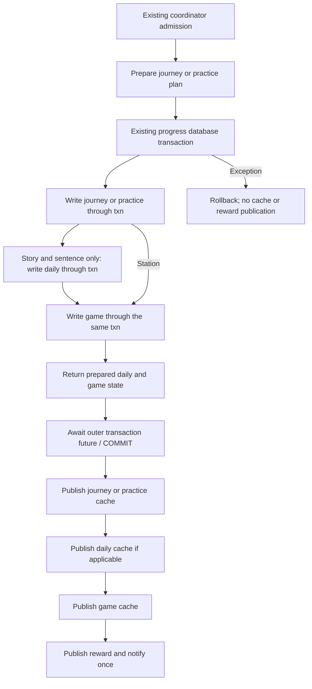

# Step 03 — Completion action atomicity (D2)

Date: 2026-09-27. Repository: FrenchApp. Reports 01 and 02 were read before editing. This report describes a narrowly scoped source repair, not a new global persistence audit.

## A. Scope and invariant

The following AppState actions now use one existing SQLite transaction each:

1. `recordStation`: canonical journey result plus station-specific new-star/first-pass game reward.
2. `completeStory`: story completion plus daily quiz accounting plus game/profile/quest/achievement/reward writes.
3. `recordSentenceAttempt`: sentence attempt plus daily quiz accounting plus game/profile/quest/achievement/reward writes.

Each transaction uses the same actual executor for every covered write. Any exception within its writes unwinds the transaction before cache publication. All caches are published synchronously only after the outer transaction future completes successfully, followed by reward publication and listener notification.

The station screen's later, separately admitted `recordActivity` remains separate and unchanged. No screen, coordinator, schema, backup, SRS, scoring formula, reward amount, content, dependency, editorial artifact, or APK was changed. Step 02's standalone persist-before-publish guarantee is preserved.

## B. Pre-edit checkpoint

Before test or production edits, exact original bytes were copied to `.checkpoints/chatgpt/step03_before/`, preserving relative source paths. `SHA256SUMS.txt` records SHA-256, byte size and original path. `initial_state.json` records initial short/full-untracked Git status, branch/HEAD command results, index hash, and SHA-256 for 669 original files outside `.git`, `build`, `.dart_tool`, `.gradle`, and `__pycache__`.

| Original path and corresponding checkpoint relative path | Pre-edit bytes | Pre-edit SHA-256 |
|---|---:|---|
| `lib/app/app_state.dart` | 19117 | `76718ac3dcbdd647fdcc92811da94c6168a42c996275d600211201ed643a36c6` |
| `lib/data/repositories.dart` | 45448 | `83d387b241a10cadc4c9d144a85c52f3442e28432e7ebcaafae8c4e4677a6261` |
| `test/progress_consistency_test.dart` | 87908 | `da77dbb6ede2d60298b91fbaedc8e63266b364245413c811e92d13a39f481c11` |

`git branch --show-current` exited 0 with `master`; `git rev-parse --verify HEAD` exited 128 with `fatal: Needed a single revision`. No authoritative HEAD exists. Initial index SHA-256: `6a21249c9265d474b15a4e37ac924abac5bd443f7b781832f434b38059018bee`.

The initial status includes 17 pre-existing tracked/index entries (12 `AM`, 3 `A `, 2 `AD`) and many untracked paths. Exact outputs remain in the checkpoint JSON. All three modified source/test files were already untracked; their checkpoint byte comparison, not Git diff alone, is the repair baseline. Git status succeeded despite the existing environment warning about permission to read the user-level `.config/git/ignore`.

No original file was moved. No staging, reset, cleanup or commit was performed. Production hashes were explicitly checked against this checkpoint after the definitive red run and before applying the source repair.

## C. Pre-fix red evidence

The five required tests were written against the existing public AppState APIs and executed before production edits. They use real SQLite `BEFORE INSERT ON daily_stats` or `BEFORE UPDATE ON game_profile` triggers containing `SELECT RAISE(ABORT, '<marker>')`. No repository mock manufactures the SQL failure.

Definitive command:

```text
flutter test test/progress_consistency_test.dart --no-pub --plain-name 'D2 '
```

Result: **exit 1, 0 passed / 5 failed, 54.732 seconds wall time**. Every test compiled, called the production operation, caught a real `DatabaseException` containing its expected marker, recorded DB/cache state, and then failed the whole-action rollback assertion. The failure was `expect(afterFailure, before, reason: 'the entire completion action rolls back')`, not a compiler or harness error.

Common initial state: empty journey/sentence rows, empty daily table, all game-profile counters/XP/coins zero, three seeded quests at progress 0/unclaimed, no achievements, reward serial/XP/coins zero and empty reward event lists. Story scenarios first persist node A, incomplete, paired best `0/0`; no first-completion reward exists.

| Exact test name | Injected SQL failure / exception marker | Durable state left by old implementation | Relevant cache after failure | Daily / game / publication consequence |
|---|---|---|---|---|
| `D2 A station reward failure rolls back journey and preserves retry` | `game_profile` UPDATE; `D2_station_game` | `journey_progress`: station `d2-station`, 3 stars, best `8/8` survived | Journey reports the same 3-star `8/8` result | Daily stays absent/zero. Game profile and quests stay initial; passed stations 0, XP/coins 0. No reward publication or notification |
| `D2 B story daily failure rolls back completion and preserves retry` | `daily_stats` INSERT OR REPLACE; `D2_story_daily` | Story changed from A/incomplete/`0/0` to B/complete/`8/8` | Practice exposes completed B/`8/8` | Daily stays absent/zero; game stays initial; no reward/notification. First-completion eligibility has already been consumed by durable practice state |
| `D2 C story game failure rolls back completion and daily activity` | `game_profile` UPDATE; `D2_story_game` | Story B/complete/`8/8` and daily quiz total/correct `8/8` both survived | Practice completed; daily cache `8/8` | Game stays initial, including quest claim rollback; expected 236 XP/26 coins absent. Reward serial 0; no notification |
| `D2 D sentence daily failure preserves first solve and attempt count` | `daily_stats` INSERT OR REPLACE; `D2_sentence_daily` | Sentence `d2-sentence`: attempts 1, solved 1, best score 100 survived | Practice exposes `[1, true, 100]` | Daily absent/zero, game initial, reward serial 0; first-solve eligibility consumed by durable practice state |
| `D2 E sentence game failure rolls back attempt and daily activity` | `game_profile` UPDATE; `D2_sentence_game` | Sentence attempt/solve/best plus daily quiz `1/1` survived | Practice `[1, true, 100]`; daily `1/1` | Game initial, including attempted `combo_10` achievement rollback; expected 27 XP/4 coins absent. No reward/notification |

All five exceptions were `SqfliteFfiException`/`DatabaseException`, SQLite extended constraint code **1811**, with the exact marker above and the failed statement in the exception. The persisted profile's reward/progress counters remained zero in every case, quests remained unclaimed at zero, achievements remained empty, and published reward state remained `[serial=0, xp=0, coins=0, completedQuests=[], unlockedAchievements=[], levelUp=false]`. The defect was durable state across *earlier* commits, not a cache-before-its-own-write D1 regression.

The pre-fix log captures raw rows (including timestamps), every relevant cache, exception and notification list in `FA006B_RESULT` records with scenario IDs `D2_station_game`, `D2_story_daily`, `D2_story_game`, `D2_sentence_daily`, `D2_sentence_game`. The raw log is `%TEMP%/frenchapp-step03-red-five.log`.

### Inconclusive optional experiment, disclosed separately

An earlier run of the same command temporarily included three additional deferred-foreign-key COMMIT-failure cases. The five required statement-failure tests reached their expected assertions. The station COMMIT case then timed out at the test runner's 30-second limit, followed by a `Database has been closed` error while querying `journey_progress`; no usable post-failure snapshot was obtained. The log reports **six failures: five expected D2 assertions plus one timeout**, then starts the story COMMIT case. The run was interrupted with Ctrl+C (execution exit 1); the story/sentence optional cases have no completed result. Overall wall duration was not captured. Log: `%TEMP%/frenchapp-step03-red.log`.

Those optional cases were removed before the definitive five-test red run. Their result is **inconclusive**, not D2 evidence or a diagnosed production/library defect. No driver change or workaround was made. The final tests instead observe successful commit-to-publication ordering through the existing probe hook. Real commit-time fault injection remains a validation limitation; statement rollback and the source's outer-future publication boundary are established separately.

## D. Transaction design

The three actions still enter through one `_enqueueProgressWrite` admission. Preparation runs synchronously within that existing serialized operation and reads the currently published store state. It does not change a map, counter, reward, or listener state.

`game.transaction` is the existing thin wrapper over its progress `Database.transaction`. Within the callback, the same `txn` is passed to the journey/practice writer, `DailyStatsStore.writeAdd` where applicable, and `GameStore.writeRecord`. None of these transaction writers publishes a cache or starts another transaction. The existing game writer owns quest seeding/updating, achievements, profile changes and its final prepared snapshot; all of that work uses the supplied executor.



After the `await game.transaction(...)` returns, publication consists only of synchronous setters; there are no post-commit reads or awaited operations before listeners can run. An exception escaping the transaction future skips the entire publication block. SQLite handles durable rollback; Dart does not optimistically mutate and then undo its caches.

### Exact action boundaries and notification order

| Action | Preparation | One transaction | After its successful return |
|---|---|---|---|
| Station | Store-owned canonical old/best-next plan | Journey replace, game writes for clamped new-star delta and first pass | Journey cache → game cache → `_publishReward(..., notify: false)` → `_notify()` |
| Story | Old/next story plus first-completion flag | Story replace → daily quiz total/correct → game including unchanged 40 XP/8 coin first bonus | Story cache → daily cache → game cache → `_publishReward`, which notifies |
| Sentence | Old/next sentence plus first-solve flag | Sentence replace → daily 1 answer/correct indicator → game including combo and unchanged 15 XP/3 coin first bonus | Sentence cache → daily cache → game cache → `_publishReward`, which notifies |

Each old AppState method already notified once at its successful end; store publication itself did not notify. **Notification count remains one**, and failures notify zero times. The change is that every store now waits for the same successful commit before publication. The new tests capture every listener invocation and require the sole notification to equal the final cache/reward state.

If a station has no new-star/pass reward, journey persistence still occurs inside the transaction. `GameStore.writeRecord` retains its existing no-op branch, returns a snapshot and `GameReward.none`, and does not fabricate XP, coins or a reward serial increment. The reopened identical-replay test checks this behavior.

Daily and game timestamps are deliberately still captured separately, at their existing respective write stages. The daily timestamp is returned with its prepared row for correct cache publication. No shared-clock/midnight policy change was introduced.

## E. Exact implementation changes

Line references are to the post-fix source.

| File / symbol | Change and reason |
|---|---|
| `lib/app/app_state.dart:371`, `recordStation` | Replaces standalone journey commit plus standalone game commit with one `game.transaction`, using store-owned previous/next plan for unchanged reward calculation; publishes both caches after return |
| `app_state.dart:412`, `completeStory` | Prepares completion, passes `txn` to practice/daily/game writers, returns prepared daily time/row and game update, publishes all caches before reward notification |
| `app_state.dart:445`, `recordSentenceAttempt` | Same composition for sentence/daily/game, preserving correct indicator, combo and first-solve reward inputs |
| `lib/data/repositories.dart:832`, `JourneyRecordPlan` | Small immutable carrier containing nullable previous and prepared next canonical `StationResult` |
| `repositories.dart:900`, `JourneyStore.record` | Existing standalone API now delegates prepare → write on `_db` → publish → return `plan.next`, retaining its existing coordinator scope and D1 behavior |
| `repositories.dart:914`, `prepareRecord` | Extracts existing canonicalization, cache lookup and `StationResult.bestOf` without changing comparison or alias logic |
| `repositories.dart:934`, `writeRecord` | Executes the existing journey row replace using supplied `DatabaseExecutor`; same fields and timestamp behavior |
| `repositories.dart:951`, `publishRecord` | Assigns prepared next result to its canonical cache key; caller must have awaited persistence/outer transaction |
| `repositories.dart:1283`, `StoryCompletionPlan` | Immutable previous story, prepared next story and first-completion result |
| `repositories.dart:1291`, `SentenceRecordPlan` | Immutable previous sentence, prepared next sentence and first-solve result |
| `repositories.dart:1343`, `saveStoryNode` | Only changes its helper invocation to `writeStory(_db, next)` to reuse the executor-capable writer; old preparation and post-write cache assignment unchanged |
| `repositories.dart:1364`, `completeStory` | Standalone wrapper prepares, writes on `_db`, publishes and returns the same first-completion boolean |
| `repositories.dart:1378`, `prepareStoryCompletion` | Extracts existing incomplete/first rule, strict paired ratio comparison and next node/completion state without publishing |
| `repositories.dart:1400`, `writeStory` | Former private `_writeStory` now accepts an executor; identical story fields/replace policy/timestamp, usable by standalone and enclosing transaction paths |
| `repositories.dart:1417`, `recordSentence` | Standalone wrapper prepares, writes on `_db`, publishes and returns unchanged first-solve boolean |
| `repositories.dart:1430`, `prepareSentenceRecord` | Extracts existing attempt increment, solved OR, max best score and first-solve computation unchanged |
| `repositories.dart:1446`, `writeSentence` | Existing sentence replace statement now accepts supplied executor; no cache publication |
| `repositories.dart:1462–1463`, `publishStory` / `publishSentence` | Synchronous cache assignment from prepared immutable values after successful persistence |

The transaction-capable helpers are public across Dart files because AppState composes them, as it already does with the canonical card/daily/game helpers. Their documented precondition is coordinator admission and publication only after persistence. They do not add a second admission mechanism. No best-result or practice-scoring logic was duplicated in AppState.

`FlagStore.toggle` is untouched. Standalone JourneyStore/PracticeStore wrappers retain Step 02's write-before-publish ordering and existing return types. `ProgressCoordinator`, `DailyStatsStore`, `GameStore` and `test/helpers/progress_probe.dart` are unchanged. Source-only textual diff: AppState **52 additions / 27 deletions**, repositories **97 additions / 19 deletions**, restricted to the symbols above and their adjacent documentation.

## F. Regression tests

Five new D2 tests, exactly named in section C, share the new local helpers at `test/progress_consistency_test.dart:324–478`:

- `completionCaches`: snapshots journey result, every cached story/sentence, daily counters, game profile, quests, achievements and full published reward values/serial.
- `completionSnapshot`: adds raw rows from `journey_progress`, `story_progress`, `sentence_progress`, `daily_stats`, `game_profile`, `daily_quests`, `achievements`. Timestamps are included, so rollback assertions require original rows, not merely equivalent score totals.
- `checkCompletionFailure`: calls the real AppState method, verifies the specific SQLite exception, compares all durable/cache state to the original snapshot, requires no listener notification, removes the trigger, retries, observes commit/publication order, closes/reopens, and verifies durable/cache alignment plus replay semantics.

The source adds 155 test lines and deletes no pre-existing test lines. No new test framework, imports or helper-file changes were needed. Original test bytes outside the inserted block were preserved. The temporary optional COMMIT tests discussed in section C are not part of the final file.

### Post-fix assertions shared by all five tests

1. Failed action leaves every snapshotted table, cache and published reward unchanged, with zero notifications.
2. Retry executes exactly one observed transaction commit. At `ProbeDatabase.onTransactionCommitted`, SQLite has committed but the outer transaction future has not yet returned: **all caches still equal their pre-action values and no listener has fired**. A publish inside the callback would fail this assertion.
3. Once the action returns, the sole listener snapshot contains every final cache plus reward, and reward serial is 1.
4. Closing and reopening the production app preserves every raw progress row and reconstructs matching caches. Transient reward publication is intentionally excluded from the reopen cache comparison.
5. A subsequent successful replay preserves first-time reward semantics, without an accidental retry of partially committed earlier state.

| Action | Successful retry | Reopened replay |
|---|---|---|
| Station 3 stars, `8/8` | One result, one passed station, 60 XP, 24 coins, no quiz daily activity | Same result, no additional XP/coins/pass count; no published reward; one journey row |
| Story `8/8` at node B | Complete, paired best `8/8`, daily `8/8`; 236 XP = 96 normal + 40 first + 100 quiz quest; 26 coins; quest claimed once | Daily `16/16`; XP 332 and coins 34 (only ordinary second-play reward), no repeated first-completion or quest bonus |
| Correct sentence, score 100, combo 10 | Attempts **1**, solved true, best 100, daily `1/1`, 27 XP/4 coins, `combo_10` achievement | Attempts 2, daily `2/2`, XP 39/coins 5; no repeated first-solve bonus |

Late story failure occurs after a quiz-quest update/claim would have occurred. Late sentence failure occurs after quest progress and the `combo_10` achievement insertion. The full rollback comparison therefore exercises nontrivial quest/achievement rollback as well as profile and earlier practice/daily writes.

The existing D1 tests remain intact, including early journey/practice statement failures and retry bonuses. Existing standalone practice return/reload tests and journey alias/best-result tests remain part of validation. No existing test expectation was weakened.

## G. Post-fix validation

All commands use existing dependencies. No `pub get`, package upgrade, APK build or corpus rebuild was run. Existing external Flutter SDK cache access used the same approved execution approach as previous steps.

| Exact command | Exit | Result / count | Wall seconds | Rerun / warnings |
|---|---:|---|---:|---|
| `flutter test test/progress_consistency_test.dart --no-pub --plain-name 'D2 '` — initial optional experiment, pre-fix | 1, interrupted | 5 required assertion failures + 1 optional-case timeout; remaining optional cases incomplete | Not captured | Stopped and rerun as disclosed in C |
| Same command — definitive pre-fix | 1 | 5 expected assertion failures, 0 passed | 54.732 | Completed red evidence; sqflite factory warning |
| Same command — post-fix | 0 | 5 passed | 6.277 | First post-fix attempt passed; sqflite factory warning |
| `flutter test test/progress_consistency_test.dart --no-pub` | 0 | 59 passed | 38.900 | First attempt passed; sqflite factory warning |
| `flutter test test/practice_engine_test.dart --no-pub` | 0 | 6 passed | 5.940 | No rerun/warning |
| `flutter test test/journey_alias_test.dart --no-pub` | 0 | 5 passed | 5.397 | No rerun/warning |
| `flutter test test/journey_revision_compatibility_test.dart --no-pub` | 0 | 5 passed | 27.367 | No rerun/warning |
| `flutter test test/game_progression_test.dart --no-pub` | 0 | 3 passed | 5.038 | No rerun/warning |
| `flutter test test/critical_regressions_test.dart --no-pub` | 0 | 4 passed | 5.464 | No rerun/warning; includes paired journey best-result contract |
| `flutter analyze --fatal-infos --no-pub` | 0 | No issues found; analyzer reported 130.7 s | 133.751 | First attempt passed; no warning |
| `flutter test --no-pub` | 0 | 188 passed | 374.729 | First attempt passed; sqflite factory warning |
| `python -B content/tools/14_validate_db.py` | 0 | Structural and learning-safety checks passed | 0.732 | First attempt passed; no warning |
| `python -B content/tools/journey_revision_audit.py --db assets/db/content.db --json` | 0 | All 6 levels match recorded revisions | 0.204 | First attempt passed; no warning |

**Skipped count: 0 reported** in every completed Flutter test command. Test counts are runner-reported. All post-fix test/analyzer/validator commands passed on their first execution; there were no failed post-fix validation attempts. The optional pre-fix timeout and its rerun are explicitly disclosed above. The 188 full-suite tests include the five new tests; repeated targeted execution does not increase the unique test count.

The warning is the existing fixture-cleanup sqflite message about changing the default database factory, bracketed by two `*** sqflite warning ***` lines. It occurs in the definitive red, targeted D2, consistency and full-suite logs, not in the other completed validation logs. No warning was suppressed.

The content validator reports 15,423 words, 17,858 examples, 2,698 verbs, 121,354 conjugations, 19 lessons, 10,259 `needs_review` entries and 18,075 aliases; `needs_review` is a reported content count, not a failed check. The journey audit reports matching A1 `baae3aab002a`, A2 `2f642eb6a31b`, B1 `edb71326d5a4`, B2 `34914142868b`, C1 `c282dfc81ced`, C2 `af2f9bd1240a`, and JSON `exit_code=0`.

Raw logs are in `%TEMP%` with prefix `frenchapp-step03-` and suffixes `red.log`, `red-five.log`, `green-five.log`, `consistency.log`, `practice_engine_test.log`, `journey_alias_test.log`, `journey_revision_compatibility_test.log`, `game_progression_test.log`, `critical_regressions_test.log`, `analyze.log`, `full-test.log`, `validate-db.log`, and `journey-audit.log`. They are transient supporting evidence; this report contains the permanent command results.

## H. Atomicity proof table

| Action | Writes inside same transaction | Published after commit | Injected failure points tested | Retry result |
|---|---|---|---|---|
| Station result/reward | Journey canonical row, station-related profile/pass reward and any game quest/achievement writes, all through `txn` | Journey and GameStore caches, then reward and one notification | Real profile UPDATE abort after journey statement; existing D1 early journey INSERT abort | True first success gets 3 stars/60 XP/24 coins/pass=1; reopen/replay no duplicate reward |
| Story completion/stats/reward | Story row, daily row, game quest/profile/achievement operations through `txn` | Practice story, daily and game caches, then reward and one notification | Real daily INSERT abort; profile UPDATE abort after practice/daily and quest claim; existing D1 early story INSERT abort | First completion/normal quiz/quest reward granted once; no duplicated failed activity; reopen aligns |
| Sentence attempt/stats/reward | Sentence row, daily row, game quest/profile/achievement operations through `txn` | Practice sentence, daily and game caches, then reward and one notification | Real daily INSERT abort; profile UPDATE abort after practice/daily, quest progress and achievement insertion; existing D1 early sentence INSERT abort | Attempts=1, solved/best preserved, first-solve bonus once, one activity; reopen aligns |

Source inspection establishes use of the same executor throughout and publication after the awaited outer transaction. The five new tests establish the specified real-SQL failure boundaries, rollback, retry and successful-commit publication ordering. They do not simulate every SQLite/OS failure, process crash or device platform. The optional commit-time fault experiment was inconclusive and is not presented as coverage.

## I. Integrity preservation

### Protected files

| Path | Bytes | SHA-256 before = after |
|---|---:|---|
| `assets/db/content.db` | 24387584 | `6cb13e39aa05fc372033b204a1b68d41776018d519b6813ecdbf04b6581c7417` |
| `assets/db/content.version` | 74 | `3fc22e0ffec33e0a297546256fa7d2eed4815afd39da4e80f888cb57ecfaad9a` |
| `lib/data/content_version.dart` | 213 | `97caaaa95d35e3c3f8484451347d12fe68bf46bd4083bd8aa6aff6c6e8a3d8d6` |
| `pubspec.lock` | 20279 | `b3819b55fa193d12665d185e6b00f5bc717b81e4e5fd7ac9ca9f7044a0c90fbf` |
| `codex_reports/00_REPOSITORY_DEEP_ANALYSIS.md` | 127410 | `7132f9501d6e1a1ab87cde206c3a89e28df1fac9fc27b8720648a0f3355b9b7b` |
| `codex_reports/01_CRITICAL_RUNTIME_INTEGRITY_AUDIT.md` | 83268 | `fd0767a078866173ad64d63928dda6610249c7c3879994915828dfd1e8a1019f` |
| `codex_reports/02_PERSISTENCE_CACHE_COMMIT_FIX.md` | 21232 | `04f9e38141648a6e13f48071c444c76bcedd03aa9001a6ca80c0e7fa5ef5f8b8` |

Index SHA-256 before = after: `6a21249c9265d474b15a4e37ac924abac5bd443f7b781832f434b38059018bee`.

### Intentional source/test byte changes

| Path | Before SHA-256 | After SHA-256 | After bytes |
|---|---|---|---:|
| `lib/app/app_state.dart` | `76718ac3dcbdd647fdcc92811da94c6168a42c996275d600211201ed643a36c6` | `5fab56fad6fe1fe07806551e1ad63077e27aad95bfbbf4c6a2b329bd14aa01e6` | 20286 |
| `lib/data/repositories.dart` | `83d387b241a10cadc4c9d144a85c52f3442e28432e7ebcaafae8c4e4677a6261` | `6906193df69aaea8b4a22694d80010aa5b008f646508877c23ff27b247ad91ff` | 48118 |
| `test/progress_consistency_test.dart` | `da77dbb6ede2d60298b91fbaedc8e63266b364245413c811e92d13a39f481c11` | `882e4358ec5c740ef95b639c5232d3d42676dd464ac446938e21dda1213ac58b` | 95422 |

Final comparison after validation:

| Check | Result |
|---|---|
| Original 669-file inventory | Exactly three intended source/test changes; the other 666 original files match their initial SHA-256 |
| Missing original files | None |
| New permanent files outside generated-cache exclusions | Exactly five Step 03 checkpoint files and this report, listed in K |
| Unexpected source/content/documentation changes | None |
| `git status --short` | Exit 0; captured stdout equals initial stdout, including all pre-existing entries. Existing untracked directory entries conceal new nested files |
| Full-untracked porcelain | Exit 0; six additional `??` entries (five checkpoint files and this report), no removed/otherwise changed entries |
| Branch / HEAD | Still `master` (exit 0); HEAD verification still exit 128, `fatal: Needed a single revision` |
| Git index | Byte-identical hash; staging state preserved |
| Checkpoint originals | All three rehashed copies match the pre-edit manifest and initial inventory |
| Existing tests | Removing only the inserted D2 block reproduces the checkpoint test file byte-for-byte |

`ProgressCoordinator`, `test/helpers/progress_probe.dart`, station and quiz screens, backup code, bundled content, lockfile, earlier reports, previous checkpoints and delivery/editorial files remain unchanged. The final check uses broad byte hashes because Git alone cannot detect changes inside pre-existing untracked files.

Flutter-generated `build`/`.dart_tool` caches are outside the authored-file inventory and were not cleaned or checkpointed. Test logs and SQLite fixtures use permitted OS temporary storage. No dependency resolution, schema/content rebuild, APK replacement or Git history change was performed.

## J. Explicit remaining findings

These remain unresolved and were not repaired opportunistically:

- **D3:** free quiz detached card/activity persistence.
- **D4:** persistence-error UI latching in the audited screens.
- Caller-prepared full-card stale overwrite risk in quiz/song paths.
- Station completion's later separate `StationQuizScreen.recordActivity` sequencing question.
- Practice midnight timing risk; daily and game time captures remain independent.
- Non-swipe stale-widget coverage gaps and stale settings-screen questions.
- Backup design and coordinator design remain unchanged.
- Repository's unborn `master`/missing authoritative HEAD; no commit was made.

The inconclusive optional COMMIT experiment is an additional validation limit, not a newly established correctness defect. No global persistence-correctness claim follows from this scoped repair.

## K. Intentional file changes

| Path | Purpose |
|---|---|
| `lib/app/app_state.dart` | Compose exactly the three scoped completion transactions and publish after commit |
| `lib/data/repositories.dart` | Minimal immutable plans plus prepare/write/publish support; standalone D1 semantics retained |
| `test/progress_consistency_test.dart` | Five D2 SQLite failure/retry/reopen/notification regressions and local snapshot helpers |
| `.checkpoints/chatgpt/step03_before/lib/app/app_state.dart` | Exact pre-edit AppState bytes |
| `.checkpoints/chatgpt/step03_before/lib/data/repositories.dart` | Exact pre-edit repository bytes |
| `.checkpoints/chatgpt/step03_before/test/progress_consistency_test.dart` | Exact pre-edit test bytes |
| `.checkpoints/chatgpt/step03_before/SHA256SUMS.txt` | Original path/hash/size manifest |
| `.checkpoints/chatgpt/step03_before/initial_state.json` | Initial Git/index and broad protected-file inventory |
| `codex_reports/03_COMPLETION_ATOMICITY_FIX.md` | This scoped repair report |

Reports 00–02 are retained at their existing paths without edits. Temporary test logs/databases and Flutter caches are not intentional authored repository changes.
