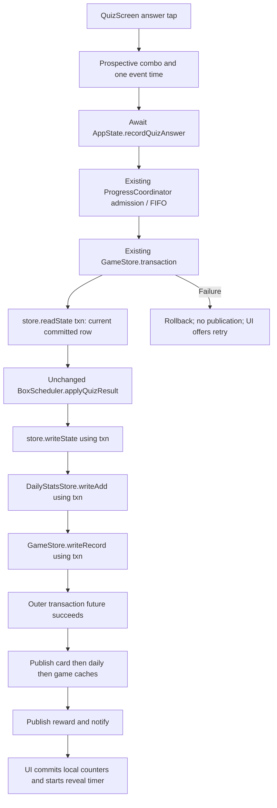

# Step 04 — Atomic free-quiz persistence and transaction-time card reads

Date: 2026-09-27. Repository: FrenchApp. Reports 01–03 were read before edits. Scope is free quiz D3-A/D3-B only; prior store and completion-action guarantees are retained.

## A. Scope and final invariant

`QuizScreen` now submits one semantic answer to `AppState.recordQuizAnswer`. Inside the existing coordinator admission and one SQLite transaction, that API reads the current committed card, applies the unchanged quiz scheduler, writes the card, and persists quiz statistics and game/reward changes using the same executor. Card, daily and game caches are published only after the outer transaction future succeeds, followed by reward notification.

The screen awaits the operation. While pending, additional taps are ignored and no reveal/advance timer runs. Failure leaves the same question and previous score/combo values intact, clears the input latch and displays a retry error. Success updates local counters once and starts the existing reveal delay. Free quiz no longer prepares or submits a complete SRS replacement row in the widget.

Only `lib/app/app_state.dart`, `lib/features/quiz/quiz_screen.dart` and `test/progress_consistency_test.dart` changed. Existing repository transaction helpers were sufficient; `lib/data/repositories.dart` was not edited. No coordinator, scheduler, QuizEngine, rewards, schema, content, editorial pipeline, backup, APK or Git history changes were made.

## B. Pre-edit checkpoint

Before the first test/source edit, exact originals were copied under `.checkpoints/chatgpt/step04_before/`, preserving relative paths. `SHA256SUMS.txt` records original paths, sizes and hashes. `initial_state.json` records short and full-untracked Git status, branch/HEAD command outputs, index hash and a 675-file SHA-256 inventory outside `.git`, `build`, `.dart_tool`, `.gradle` and `__pycache__`.

| Original path / checkpoint relative path | Bytes | Pre-edit SHA-256 |
|---|---:|---|
| `lib/app/app_state.dart` | 20286 | `5fab56fad6fe1fe07806551e1ad63077e27aad95bfbbf4c6a2b329bd14aa01e6` |
| `lib/features/quiz/quiz_screen.dart` | 15368 | `ac6ecaff0569a06bc1364bc4d5c9862221e66d24d70d6de84520d68ca8cc00ab` |
| `test/progress_consistency_test.dart` | 95422 | `882e4358ec5c740ef95b639c5232d3d42676dd464ac446938e21dda1213ac58b` |

Initial branch: `master` (query exit 0). HEAD verification: exit 128, `fatal: Needed a single revision`. Index SHA-256: `6a21249c9265d474b15a4e37ac924abac5bd443f7b781832f434b38059018bee`. Existing status includes 17 tracked/index entries (12 `AM`, 3 `A `, 2 `AD`) and numerous untracked files; exact outputs remain in the checkpoint JSON. Git status succeeded despite the existing permission warning for the user-level `.config/git/ignore`.

The three modified files were already untracked, so checkpoint byte comparisons are the authoritative repair diff. No staging, commit, reset, checkout or cleanup occurred. AppState, QuizScreen and repositories were hash-verified unchanged before production edits after the first red run. The strengthened stale experiment also ran before production edits.

## C. Pre-fix D3 red evidence

Command:

```text
flutter test test/progress_consistency_test.dart --no-pub --plain-name 'D3 '
```

Pre-fix result: **exit 1, 0 passed / 3 failed, 61.022 seconds wall time**. Two tests drove the actual production QuizScreen; the third was the API-level stale schedule in D. All failures were reached assertions, not compilation/harness failures.

The widget fixture uses the existing synthetic-content setup and real progress SQLite database. `bootFreeQuiz` adds three distractor conjugations only to the temporary fixture, leaving the original shared fixture and bundled corpus unchanged. One eligible `probe:present:je` card produces a real QuizEngine question with correct option `teste`. Initial SRS state: box 2, learning, seen 4, right 3, lapses 1, unstarred, no dates. Daily/game counters and reward serial start at zero.

| Exact red-first widget test | Real SQL injection | Pre-fix durable/cache result | UI/error evidence |
|---|---|---|---|
| `D3 widget card failure preserves answer and permits one retry` | `BEFORE INSERT ON card_state`, `RAISE(ABORT,'D3_card')` | Card DB/cache remain unchanged. Independent quiz activity commits: daily total/correct 1/1, profile XP 12/coins 1/best combo 1/answers 1/correct 1, quiz quest progress 1, reward serial 1. Swipe/new-learned/verb activity remain zero | After queue drain and a 2-second pump, `Quiz bitti` and `1 / 1 doğru` are displayed; no retry error. `tester.takeException()` returns null |
| `D3 widget game failure preserves answer and permits one retry` | `BEFORE UPDATE ON game_profile`, `RAISE(ABORT,'D3_game')` | Card DB/cache advance to box 3, known, seen 5/right 4/lapses 1 with new last-seen/due dates. The later daily/game transaction rolls back: daily absent, profile/quests unchanged, reward serial 0 | Again displays completed quiz and score 1/1 despite failed activity; no retry error or captured framework exception |

Both tests first print the full before/after snapshot and UI facts, then fail `expect(failed, before, reason: 'one quiz answer must roll back all stores')`. The snapshots include conjugation DB/cache, daily DB/cache, profile DB/cache, quests, achievements and reward publication. Achievements remain empty in these initial one-answer scenarios.

The injected failures are real SQLite triggers. The pre-fix widget discards both futures, so there is no awaited exception to inspect at its UI boundary. No framework exception was observed either: the coordinator's error-tail continuation handles queue progression, not user-facing recovery. This establishes Test C as well as the two split-persistence cases. It does not interpret a silently handled failed future as success.

Evidence is retained in `%TEMP%/frenchapp-step04-red.log`, in `FA006B_RESULT` records `D3_widget_card` and `D3_widget_game`. The same two tests pass after the repair without weakening their rollback/UI assertions, then continue through gated duplicate-tap and successful retry checks.

## D. Pre-fix stale full-row experiment — reproduced

**Evidence level: API-level, not a widget-driven race.** The exact old free-quiz sequence was reproduced using the real store and AppState APIs: read cached card → `applyQuizResult` → `store.save(preparedRow)` → `recordActivity`. A canonical same-card `recordAnswer` was already accepted, gated before its transaction. The old quiz save and activity were admitted behind it while the cache still held S0.

The initial red run used canonical `know`. Final DB/cache remained at box 3, seen 5/right 4, rather than the cumulative box 4, seen 6/right 5, although activity/rewards represented both answers. A strengthened run used canonical `dontKnow` to expose an overwritten lapse and box explicitly:

```text
flutter test test/progress_consistency_test.dart --no-pub --plain-name 'D3 pre-fix'
```

Result: **exit 1, 0 passed / 1 expected assertion failure, 17.504 seconds**. Exact test name: `D3 pre-fix API stale full-row schedule retains both accepted answers`.

| State in strengthened schedule | Box / status | Seen / right / lapses | Last seen / due |
|---|---|---|---|
| Initial committed S0 | 2 / learning | 4 / 3 / 1 | null / null |
| Canonical committed S1 after `dontKnow` | 0 / fresh | 5 / 3 / 2 | t / t |
| Widget-equivalent prepared correct quiz Q(S0) | 3 / known | 5 / 4 / 1 | t / t + 7 days |
| **Observed final DB and cache** | **3 / known** | **5 / 4 / 1** | **t / t + 7 days** |
| Required sequential Q(S1) | 1 / learning | 6 / 4 / 2 | t / t + 1 day |

The experiment deliberately uses the same captured time t for both operations to isolate state ordering. In the recorded strengthened run, t was `1790524537062` milliseconds since epoch; stale due was `1791129337062`, expected due `1790610937062`.

Daily state represented both accepted actions: one swipe, zero new learned, one correct quiz answer. Game state had 19 XP, 1 coin, one card, one verb, one quiz answer/correct result, best combo 1, quest progress 1 for cards/verbs/quiz, `first_card` achievement and reward serial 2. Those effects remained while the SRS lapse increment and cumulative answer count were lost.

Log: `%TEMP%/frenchapp-step04-red-stale.log`, scenario `D3_stale_API`, with S0, S1, Q(S0), expected Q(S1), final DB/cache and activity fields. The obsolete intentionally failing sequence was replaced in the final test file by new-API ordering tests. Its observed result remains documented here; it is not claimed to be a widget-driven schedule.

## E. New free-quiz transaction design

`AppState.recordQuizAnswer` (`lib/app/app_state.dart:337–365`) accepts `AnswerCardType`, `refId`, `correct`, `combo` and required event `DateTime now`. It returns the committed `SrsCard`, not a caller-prepared persistence input.



All card serialization stays in existing repository helpers. The transaction callback reads and writes through the actual supplied `txn`; it does not call standalone `save` or admit a separate activity operation. Its returned tuple contains prepared card, daily row and game snapshot/reward. All cache publication occurs after awaiting the outer transaction. No post-commit read or await intervenes before publication/notification.

Free-quiz accounting remains distinct from swipe accounting: quiz total +1, correct +1 or +0, existing combo input; no cards-swiped, new-learned, total-card or verb-activity increment. Correct answers use the existing `know` quiz effect; incorrect answers use existing `dontKnow`; archived cards remain unchanged in SRS through `applyQuizResult` while quiz activity still counts, matching the old behavior. Ordinary right/wrong rewards remain 12/2 XP and 1/0 coins, plus existing quest/achievement rules. No reward constants changed.

### Event-time choice

The widget captures one `DateTime.now()` at accepted tap. AppState converts it to local time once and supplies it to card scheduling/persistence, daily date and game/quest date. Previously card calculation and `recordActivity` captured adjacent independent times. This intentionally removes the free-quiz possibility of one answer being assigned different dates around midnight, consistent with the requested single event-time semantics. It does **not** change practice's separately captured times or define a wider midnight policy. No new clock/configuration framework was introduced.

## F. UI success/failure state machine

| State / transition | Local state and permitted actions |
|---|---|
| Ready | `_picked == null`, `_saving == false`; existing progress-generation readiness check must pass |
| Tap accepted | Compute prospective combo (`right ? oldCombo + 1 : 0`) and best combo; set picked/saving, clear prior error; counters remain unchanged |
| Awaiting persistence | Show `Kaydediliyor…`; option feedback remains neutral. Guard ignores extra taps. No reveal timer or question advancement |
| Persistence failure | Catch error; if mounted, clear picked/saving and show `Cevap kaydedilemedi. Tekrar deneyin.`. Score, combo, best combo, wrong-feedback tick and index remain unchanged. The same choices accept another tap |
| Persistence success | If mounted, clear saving, increment correct or wrong-feedback tick, publish prospective combo/best combo; retain picked to prevent another answer; show ordinary feedback |
| Reveal completed | Existing `MotionTokens.quizReveal` timer clears picked and advances index once |
| Disposed | Existing timer cancellation remains; async completion checks mounted before changing widget state. Already accepted persistence is not cancelled |

`_saving` and `_saveError` are the only new fields. `_picked` continues to prevent duplicate answers during successful feedback. `_timer?.cancel()` precedes scheduling the sole success timer. `_build` resets pending/error fields with existing quiz counters. Generation/restore handling outside the existing admission check was not redesigned.

## G. Exact implementation changes

| File / symbol | Change |
|---|---|
| `lib/app/app_state.dart:337`, `recordQuizAnswer` | New 30-line semantic API composing the existing transaction-time card/daily/game helpers, with post-commit publication and committed-card return |
| `lib/features/quiz/quiz_screen.dart:32–33` | Add pending flag and retry error text |
| `QuizScreen._build`, around 90 | Reset those fields on a new quiz |
| `QuizScreen._answer`, 95–149 | Async atomic call; prospective combo calculation; pending/duplicate guard; catch and retry state; post-success counter publication and timer |
| `QuizScreen.build`, around 293 and 333 | Saving/error text and neutral feedback while pending |
| QuizScreen imports | Remove direct scheduler import. Retain repositories import because the existing pool's `learningIds` extension requires it |
| `test/progress_consistency_test.dart:325–520` | Add synthetic free-quiz fixture helper and five tests; add QuizScreen import |

Textual diff: AppState +30/−0, QuizScreen +43/−24, tests +197/−0. Existing D1/D2 test expectations and production methods are not rewritten. Repository, coordinator, scheduler, QuizEngine, station/song/practice screens and probe helper remain unchanged.

## H. Regression tests

**Five new permanent tests** are added in the existing progress consistency file. The pre-fix stale API experiment was a separate temporary test used only for red evidence; it is not counted as an additional permanent test.

### Red-first widget failures and retry (two tests)

The two exact names in C drive production QuizScreen/QuizEngine and inject SQL failure at card INSERT or late profile UPDATE. After queue drain and more than the normal reveal duration, they require unchanged DB/cache/reward snapshot, no result screen, the same question and visible retry error.

On retry, the real transaction is gated before SQL. Correct/wrong/correct duplicate taps and a 2-second pump must leave progress unchanged and the question pending. After release there is exactly one observed transaction commit, one answer's SRS effect, one daily quiz activity, 12 XP/1 coin, best combo 1, no swipe/new-learned/verb activity and result `1 / 1 doğru`. A tap during successful feedback cannot enqueue another write. This also proves failed attempts did not consume local correct/combo counters. No framework exception remains after the handled failure/retry.

### New-API same-card ordering (two tests; not pre-fix API tests)

- `D3 atomic word quiz reads the preceding committed same-card answer`
- `D3 atomic conjugation quiz reads the preceding committed same-card answer`

Each seeds S0, admits/gates canonical `dontKnow`, then admits semantic `recordQuizAnswer(correct: true)` behind it. On release, final returned card, DB row and cache must equal Q(S1), not Q(S0): box 1, seen 6, right 4, lapses 2. Daily accounting represents one swipe plus one correct quiz answer. XP is 16 for the word schedule or 19 for conjugation; coins 1, reward serial 2, no new learned. Close/reopen must reconstruct the same card and statistics/profile state. These tests use the new API and therefore have no pre-fix compilation/run claim.

### API semantics and publication contract (one test)

`D3 API preserves quiz rules and publishes every cache only after commit` checks both word/conjugation stores with correct, incorrect and archived-card scenarios, including starred scheduling. It verifies preserved scheduler outputs and quiz-only accounting, best-combo/achievement behavior, matching daily/quest event dates and totals of 26 XP/2 coins for two correct plus one incorrect answer per type.

The existing probe's `onTransactionCommitted` hook runs after SQLite commit but before the outer transaction future returns. Every affected cache and reward must still equal its old value and no listener may have fired. The hook then rejects probe-backed DB reads; the API must still finish using prepared values. Its one listener notification sees all final caches/reward. This rejects publication from inside the transaction callback and post-commit reloads through the probe; source inspection confirms no other post-commit reads.

Limitations: the widget failure cases cover a one-question conjugation quiz; word ordering/semantics are exercised at the API level and the existing real-content quiz smoke test also runs. No new test simulates all OS/database commit-time failures or proves every stale-widget lifecycle. The shared GameStore transaction algorithms remain covered by existing consistency tests.

## I. Atomicity proof table

| Failure / schedule | Card DB/cache | Daily/game | UI | Retry/final result |
|---|---|---|---|---|
| Card INSERT abort, real quiz widget | Unchanged | Unchanged, including quests/achievements and reward publication | Same question, no local successful answer, retry message | One successful answer after trigger removal; duplicate pending taps ignored |
| Late profile UPDATE abort, real quiz widget | Earlier card statement rolls back; cache unchanged | Daily/quest/profile changes roll back; caches/reward unchanged | Same question and counters, no timer-driven completion | Exactly one retry commit, score 1/1, combo 1, one activity |
| Canonical same-card action queued before new quiz API, word and verb | Final DB/cache equal quiz applied to canonical committed state | Both accepted actions counted with their distinct semantics | API-level schedule, not widget-race evidence | No lost seen/lapse/box update; reopen matches |
| Successful transaction boundary observation | Old cache until outer future returns, then prepared card | All caches/reward published together after commit | One notification observes final state | No post-commit reads; no in-callback publication |
| Archived card answered through new API | SRS fields remain archived/unchanged | Quiz activity/reward still counted as before | API-level semantics check | No accidental swipe/new-learned/verb accounting |

## J. Validation results

All Flutter commands use `--no-pub` and the existing SDK/dependencies. No package resolution/upgrade, corpus rebuild or APK build was run. Existing external SDK cache access used the approved approach from earlier steps.

| Exact command | Exit | Result / count | Wall seconds | Notes |
|---|---:|---|---:|---|
| `flutter test test/progress_consistency_test.dart --no-pub --plain-name 'D3 '` — pre-fix | 1 | 3 expected assertion failures | 61.022 | Two real widgets and initial API stale schedule |
| `flutter test test/progress_consistency_test.dart --no-pub --plain-name 'D3 pre-fix'` | 1 | 1 expected assertion failure | 17.504 | Strengthened stale schedule with canonical `dontKnow` |
| `flutter test test/progress_consistency_test.dart --no-pub --plain-name 'D3 '` — first post-fix | 1 | Loader compilation failure; 0 tests executed | 4.283 | Removing repositories import also removed `learningIds` extension visibility; restored that existing import |
| `flutter test test/progress_consistency_test.dart --no-pub --plain-name 'D3 '` — corrected rerun | 0 | 5 passed | 7.044 | No assertion failures |
| `flutter test test/progress_consistency_test.dart --no-pub` | 0 | 64 passed | 41.160 | Includes existing D1/D2/restore/coordinator tests |
| `flutter test test/app_smoke_test.dart --no-pub --plain-name 'quiz gerçekten soru üretiyor ve cevap alıyor'` | 0 | 1 passed | 24.776 | Existing real-content free-quiz smoke test |
| `flutter test test/box_scheduler_test.dart --no-pub` | 0 | 20 passed | 5.482 | Scheduler contracts unchanged |
| `flutter test test/game_progression_test.dart --no-pub` | 0 | 3 passed | 6.625 | Existing rewards/game contracts |
| `flutter analyze --fatal-infos --no-pub` | 0 | No issues; analyzer reported 119.2 s | 122.160 | First attempt passed |
| `flutter test --no-pub` | 0 | 193 passed | 358.087 | First full-suite attempt passed |
| `python -B content/tools/14_validate_db.py` | 0 | Structural and learning-safety checks passed | 0.393 | First attempt passed |
| `python -B content/tools/journey_revision_audit.py --db assets/db/content.db --json` | 0 | All 6 levels match recorded revisions | 0.228 | First attempt passed |

**Skipped: 0 reported** in every completed test run. Counts are runner-reported. The 193 full-suite tests include the five new permanent tests. The sole unexpected post-fix validation failure was the disclosed import-related compilation failure; the corrected targeted rerun and all subsequent commands passed. Neither red-first assertion failures nor that compile failure are hidden as successful checkpoints.

The red, strengthened-red, corrected-targeted, consistency and full-suite logs contain the existing sqflite default-factory warning during fixture cleanup (one block bracketed by two warning markers). The real-content quiz smoke log contains one handled TTS `MissingPluginException` for `getLanguages` on `flutter_tts`; the full-suite log contains two such messages. They did not fail tests. Analysis, scheduler/game tests and Python validators reported no warnings. No warning was suppressed.

The DB validator reports 15,423 words, 17,858 examples, 2,698 verbs, 121,354 conjugations, 19 lessons, 10,259 `needs_review` entries and 18,075 aliases. `needs_review` is an informational content count, not a failed check. The journey audit reports matching A1 `baae3aab002a`, A2 `2f642eb6a31b`, B1 `edb71326d5a4`, B2 `34914142868b`, C1 `c282dfc81ced`, C2 `af2f9bd1240a`, and JSON `exit_code=0`.

Temporary raw logs use `%TEMP%/frenchapp-step04-` plus `red.log`, `red-stale.log`, `targeted.log`, `targeted-rerun.log`, `consistency.log`, `quiz-smoke.log`, `box_scheduler_test.log`, `game_progression_test.log`, `analyze.log`, `full-test.log`, `validate-db.log`, `journey-audit.log`. Permanent command results and evidence are recorded in this report.

## K. Integrity preservation

### Protected files

| Path | Bytes | SHA-256 before = after |
|---|---:|---|
| `assets/db/content.db` | 24387584 | `6cb13e39aa05fc372033b204a1b68d41776018d519b6813ecdbf04b6581c7417` |
| `assets/db/content.version` | 74 | `3fc22e0ffec33e0a297546256fa7d2eed4815afd39da4e80f888cb57ecfaad9a` |
| `lib/data/content_version.dart` | 213 | `97caaaa95d35e3c3f8484451347d12fe68bf46bd4083bd8aa6aff6c6e8a3d8d6` |
| `pubspec.lock` | 20279 | `b3819b55fa193d12665d185e6b00f5bc717b81e4e5fd7ac9ca9f7044a0c90fbf` |
| `codex_reports/00_REPOSITORY_DEEP_ANALYSIS.md` | 127410 | `7132f9501d6e1a1ab87cde206c3a89e28df1fac9fc27b8720648a0f3355b9b7b` |
| `codex_reports/01_CRITICAL_RUNTIME_INTEGRITY_AUDIT.md` | 83268 | `fd0767a078866173ad64d63928dda6610249c7c3879994915828dfd1e8a1019f` |
| `codex_reports/02_PERSISTENCE_CACHE_COMMIT_FIX.md` | 21232 | `04f9e38141648a6e13f48071c444c76bcedd03aa9001a6ca80c0e7fa5ef5f8b8` |
| `codex_reports/03_COMPLETION_ATOMICITY_FIX.md` | 30488 | `9856713e19a4063368ca096ca8c3c19a7d36b50460c8b68dfce0c8557f05b27c` |

Git index SHA-256 before = after: `6a21249c9265d474b15a4e37ac924abac5bd443f7b781832f434b38059018bee`.

### Intentional source/test changes

| Path | Before SHA-256 | After SHA-256 | After bytes |
|---|---|---|---:|
| `lib/app/app_state.dart` | `5fab56fad6fe1fe07806551e1ad63077e27aad95bfbbf4c6a2b329bd14aa01e6` | `e8f1be8ca503a50dd5ae392fc27d4fe58ca107aa779cd0be9dc283b8251346ef` | 21472 |
| `lib/features/quiz/quiz_screen.dart` | `ac6ecaff0569a06bc1364bc4d5c9862221e66d24d70d6de84520d68ca8cc00ab` | `884ba2e52590376507fb86c82cea2699b5b259b11295d86ddaf67b4185241a99` | 15994 |
| `test/progress_consistency_test.dart` | `882e4358ec5c740ef95b639c5232d3d42676dd464ac446938e21dda1213ac58b` | `c08912f31e295d76c6d1ffd88246f1442be33495049299330776381fe03e4781` | 105553 |

Final inventory/status comparison after validation:

| Check | Result |
|---|---|
| Original 675-file inventory | Exactly three intended source/test changes; the other 672 originals match their initial SHA-256 |
| Missing original files | None |
| New files outside generated-cache exclusions | Exactly five Step 04 checkpoint files plus this report, listed in M |
| Unexpected authored/content/editorial changes | None |
| Short Git status | Exit 0; captured stdout equals initial status, including all pre-existing entries. Existing untracked directory entries conceal new nested files |
| Full-untracked porcelain | Exit 0; six added `??` entries for the checkpoint/report files; no removed or otherwise changed entries |
| Branch / HEAD | Still `master` (exit 0); HEAD verification still exit 128, `fatal: Needed a single revision` |
| Git index | Byte-identical hash; staging state preserved |
| Checkpoint originals | All three exact copies rehashed to the initial manifest/inventory values |
| Existing AppState code | Removing only the new API reproduces the checkpoint AppState bytes exactly; prior swipe/D2 actions are untouched |
| Existing tests | Removing only the QuizScreen import and new D3 block reproduces the checkpoint test bytes exactly |

Repository stores, coordinator, scheduler, QuizEngine, probe helper, other feature screens, backup, reports 00–03, content/markers/lockfile, previous checkpoints and delivery/editorial artifacts remain unchanged. Verification uses broad byte hashes because existing untracked source cannot be protected by Git diff alone.

Generated Flutter `build`/`.dart_tool` caches are excluded from the authored inventory and were not cleaned or checkpointed. Temporary diagnostics and SQLite fixtures use permitted OS temporary storage. No dependency resolution, content generation, APK replacement or Git history/index alteration occurred.

## L. Remaining findings

- **Song vocabulary starring full-card stale-write risk remains unresolved.** Free quiz no longer submits a prepared full row; the generic store save API and song callers are unchanged. The pre-fix free-quiz API reproduction is not a song-widget reproduction.
- Station's later separate `recordActivity` admission/sequence remains unchanged.
- D4 persistence-error latching in sentence/song/arena/station screens remains unresolved. Only free-quiz failure handling was repaired.
- Practice midnight timing remains unresolved. The single event time introduced here is confined to the new free-quiz answer API.
- Stale non-swipe widget/settings coverage and settings generation questions remain unresolved. Existing free-quiz readiness and mounted checks remain; this step is not a comprehensive restore-lifecycle fix.
- Step 03's optional COMMIT-time fault-injection experiment remains inconclusive. This step verifies real statement rollback and successful outer-future publication ordering, not a new commit-time failure model.
- Git still has unborn `master` and no authoritative HEAD. No history/index change was made.

The repaired scope is free-quiz answer atomicity, retry behavior and transaction-time state selection. It is not global persistence correctness.

## M. Intentional file changes

| Path | Purpose |
|---|---|
| `lib/app/app_state.dart` | Dedicated atomic semantic quiz-answer API |
| `lib/features/quiz/quiz_screen.dart` | Await persistence, protect pending input, preserve counters on error and permit retry |
| `test/progress_consistency_test.dart` | Five new regression tests and fixture helper/import |
| `.checkpoints/chatgpt/step04_before/lib/app/app_state.dart` | Exact pre-edit AppState |
| `.checkpoints/chatgpt/step04_before/lib/features/quiz/quiz_screen.dart` | Exact pre-edit QuizScreen |
| `.checkpoints/chatgpt/step04_before/test/progress_consistency_test.dart` | Exact pre-edit tests |
| `.checkpoints/chatgpt/step04_before/SHA256SUMS.txt` | Pre-edit path/hash/size manifest |
| `.checkpoints/chatgpt/step04_before/initial_state.json` | Initial Git/index and broad hash inventory |
| `codex_reports/04_FREE_QUIZ_ATOMICITY_FIX.md` | This report |

Previous workflow reports remain byte-identical at their original paths. Temporary logs and SQLite fixtures use OS temp storage; generated Flutter caches are not authored changes.
