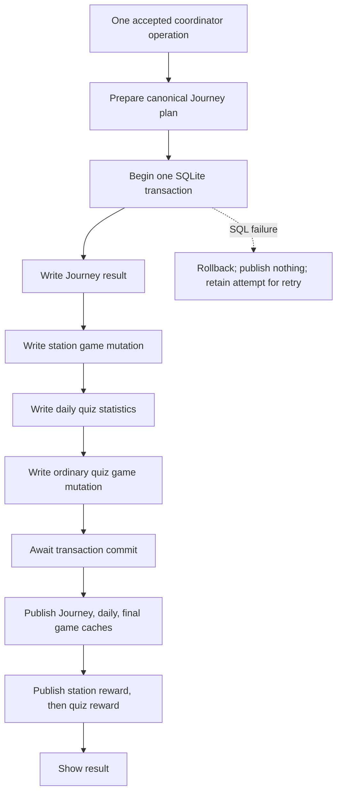

# Step 09 — Station quiz finalization atomicity

Date: 2026-09-27. Scope: station finalization and its persistence-only retry UI. Reports 03 and 08 were read before editing. No API/content migration or unrelated screen repair is included.

## A. Executive result

**The pre-fix partial completion was reproduced through real SQLite and the actual StationQuizScreen.** Failing the second operation left the Journey result, first-pass count and station reward committed, while daily quiz statistics and ordinary quiz rewards remained absent. The screen did not display results or offer retry.

`AppState.completeStationQuiz` now performs the whole completion under one ProgressCoordinator admission and one SQLite transaction. It publishes Journey, daily and final game caches only after the transaction future succeeds, then publishes the two existing reward events in order. The station screen retains its computed attempt on failure and retries persistence without answering or scoring the final question again.

Nine new tests pass. The current full Flutter baseline is **207 passed**, including the existing full-app station completion smoke test. This is scoped rollback/retry evidence, not proof of every possible device, crash or storage failure.

## B. Branch/base state

Before edits, `main` had a valid HEAD and clean short/full-untracked porcelain status. `git fetch origin` succeeded and local `main` equalled `origin/main`:

`16949a3dd067bfb84083c51e5a97a2e7b8294410`

The new branch was created from `origin/main` with:

```text
git switch -c step09-station-finalization origin/main
```

The stable tag `baseline-pre-api-migration-2026-09-27` remains unchanged:

- Annotated tag object: `edb0da305152f116e67e99314f18bd1efed9acf1`
- Peeled commit: `583bb7631e7dacd994b874c3224eb518dd7a391c`

All 209 pre-existing tracked files were SHA-256 inventoried into OS temporary storage before edits. Git history is the rollback authority; no new `.checkpoints/` directory was created. Existing ignored local material was not reset or cleaned. Initial non-escalated Git reads emitted a user-level ignore-file permission warning; authorized Git operations succeeded with normal access.

## C. Existing success semantics

Source at the base commit: `lib/features/journey/station_quiz_screen.dart`, `_answer` approximately lines 85–146; `lib/app/app_state.dart`, `recordActivity` and `recordStation` approximately lines 366–427; `lib/data/repositories.dart`, `GameStore.writeRecord` approximately lines 1126–1266.

1. A tap checks `progressReady` and rejects an already-picked question. It immediately selects the option and updates local `_correct`, `_combo`, `_bestCombo` or `_wrongTick`. Wrong answers reset the current combo. Haptics run at selection.
2. A detached delayed callback waits `MotionTokens.quizReveal` (900 ms). Non-final answers advance the question. At the final answer, it computes stars using the unchanged `JourneyStation.starsFor` and station pass ratio.
3. `recordStation(stationId, stars, correct, total)` gets the canonical Journey best-result plan. Its own transaction writes Journey and the station game mutation. New stars are `clamp(nextStars - previousStars, 0, 3)`; first pass means previously not passed and next result passed.
4. Each new star earns 20 XP and 8 coins. First pass increments `stationsPassed`; it is not an additional flat XP award. This operation may unlock achievements/levels, and publishes a reward and notification.
5. After a second readiness check, `recordActivity(quizTotal: questionCount, quizCorrect: _correct, combo: _bestCombo)` separately admits and commits daily/game quiz activity. Each correct answer earns 12 XP and 1 coin; each incorrect answer earns 2 XP. Quiz quest progress increases by total answers. Crossing its target of 8 claims 100 XP/10 coins once. The game mutation maintains total answers/correct, best combo, quests, achievements and player-level reward flags.
6. Only after both operations succeed does the widget set `_attemptStars`, `_saved`, clear `_picked`, and show the result/replay/map controls. Neither operation changes SRS cards, normal swipe counts or new-learned counts.

`JourneyStation.starsFor` still returns zero below the pass ratio (0.7 normally, 0.8 for bosses), three for a perfect attempt, two for a ratio at least 0.85, otherwise one. Journey best-result/alias logic remains owned by `JourneyStore.prepareRecord` and `StationResult.bestOf`.

### Recorded pre-fix normal snapshot

Fresh profile; station `d2-station`; 8/8 correct, 3 stars, combo 8:

| State | After normal old sequence |
|---|---|
| Journey | One result; 3 stars; paired best score 8/8 |
| Profile | XP 256; coins 42; passed stations 1; answers 8; correct 8; best combo 8 |
| Daily | quiz total/correct 8/8; swipes/new learned 0/0 |
| Quests | quiz progress 8, claimed; cards/verbs progress 0, unclaimed |
| Achievements | None for this fixture |
| First reward | Serial 1; 60 XP/24 coins; no quest/achievement/level-up flag |
| Second reward | Serial 2; 196 XP/18 coins; quiz quest title; level-up true |

The second reward consists of normal 96 XP/8 coins plus the quest's 100 XP/10 coins. The old first notification exposed the intermediate profile (60 XP/24 coins) and zero daily quiz activity. The second exposed the complete state. These snapshots were captured before production edits, not inferred from the repaired implementation.

## D. Pre-fix failure evidence

Tests used `sqflite_common_ffi`, real temporary SQLite databases, real AppState/store calls and real trigger aborts. No mocked repository exception substitutes for SQL behavior. The pre-fix helper used exactly the screen's sequence:

```dart
await app.recordStation(stationId: 'd2-station', stars: 3, correct: 8, total: 8);
await app.recordActivity(quizTotal: 8, quizCorrect: 8, combo: 8);
```

Failure triggers:

```sql
CREATE TRIGGER step09_fail BEFORE INSERT ON daily_stats
BEGIN SELECT RAISE(ABORT,'Step09_daily'); END;

CREATE TRIGGER step09_fail BEFORE UPDATE ON game_profile
WHEN NEW.total_answers > OLD.total_answers
BEGIN SELECT RAISE(ABORT,'Step09_late_game'); END;
```

Each test creates only its own trigger. The late-game condition permits the preceding station profile update, and fails specifically when quiz activity updates the profile. Both raised `SqfliteFfiException`/`DatabaseException`, SQLite error **1811**, with the corresponding marker.

| Pre-fix test | Committed DB and matching cache after failure | Missing effects |
|---|---|---|
| `Step09 daily failure rolls back entire station finalization` | Journey 3 stars, 8/8; XP 60, coins 24, pass count 1; reward serial 1 | No daily row; answers/correct/best combo remain 0; no quiz quest claim or ordinary reward |
| `Step09 late_game failure rolls back entire station finalization` | Same partial state | The second transaction rolls back its daily row and quest changes too; station commit survives |
| `Step09 station final save failure offers persistence-only retry` | Actual one-question verb station has 3 stars, 1/1; XP 60, coins 24, pass count 1; serial 1 | Daily/game quiz totals remain 0; no result screen or retry control |

The first two tests deliberately asserted `after == before` for the whole action and failed because Journey/profile/reward state differed. This is a durable split, not a cache-first publication defect: caches faithfully reflected the partial commits.

### Actual widget versus source evidence

The widget test loaded the production `StationQuizScreen`, selected its actual correct verb form, injected `Step09_widget` on daily INSERT, and waited beyond the reveal interval while draining admitted work. It observed `result=false`, `retry=false`, the partial DB/cache state above, and an unhandled persistence exception reported by the Flutter test framework. Framework error output is not learner-facing error handling.

Source establishes that `_picked` remains selected because only the success tail clears it; further option taps return immediately. There was no catch or retry control. Route leave/re-entry was not separately driven in the red experiment. Source shows a new screen starts another quiz rather than resuming the failed save, while the already-published Journey result is available to the map. Thus re-entry could start another attempt, but does not retroactively supply the lost activity for the failed finalization.

The first widget attempt timed out in the test helper's immediate `pumpAndSettle` while real SQLite question loading was still pending. That is **harness failure, not defect evidence**. The helper usage was corrected to mount a placeholder, then the station screen and explicitly pump/drain real I/O. The second pre-fix widget run reached and reproduced the real SQL/UI failure. Production was edited only after this evidence.

## E. New atomic design

`lib/app/app_state.dart:430`, `completeStationQuiz`, accepts semantic station ID/stars/correct/total/combo and optional event time. It does not receive pre-built database rows.



Every write receives the **same actual transaction executor**. The second `GameStore.writeRecord` reads the first game mutation's uncommitted writes inside that transaction, preserving sequential quest/achievement/level behavior. Only its final snapshot is published to the game cache. Both prepared reward values are retained.

The transaction returns `(daily, stationUpdate, quizUpdate)`. Only after the outer future resolves does AppState call `journey.publishRecord`, `stats.publish`, `game.publish`, and then the two `_publishReward` calls. No post-commit database reload is used. Exceptions skip every publication statement.

Existing `recordStation` is unchanged, including its standalone transaction. `JourneyStore.record` and all Step02/03 publication guarantees remain intact. The only repository-layer change is optional `{DateTime? now}` on `JourneyStore.writeRecord` (`lib/data/repositories.dart:946`), defaulting to its previous wall-clock behavior for existing callers.

The screen captures one finalization timestamp when it prepares the attempt after reveal; retries retain it. Direct API calls default to capturing one time before admission. Journey timestamp, daily day, both game/quest dates and achievement timestamps use that same event time. This deliberately eliminates the station action's former independently sampled dates. It is not a general clock/midnight refactor, nor a separate midnight-transition test.

## F. Reward compatibility

Two game writes were retained inside one transaction rather than collapsed into a single formula. This preserves reward amounts, first-pass/new-star semantics, quest claims, achievements, best combo and level-up attribution to each reward event.

The normal fixture still emits exactly `[serial 1, XP 60, coins 24]` then `[serial 2, XP 196, coins 18]`, including identical quest/achievement/level-up metadata. A replay emits no new station reward; its ordinary quiz reward remains valid. Notification count/order remains two for a successful action, including the old no-new-station-reward case where the first notification does not increment reward serial.

**Intentional observation change:** both notifications now expose all final committed caches. No observer sees a completed station with missing daily/ordinary quiz activity. A test compares every notification's non-reward caches with the final caches.

`GameHud` (`lib/features/game/game_hud.dart:17–27,121`) reads `lastReward`/`rewardSerial` during build. Logical events and serial increments are preserved, but both notifications now occur synchronously after one commit; Flutter can coalesce rebuilds and display the final reward. Separate animation frames for both events were never an explicit event-queue contract and are not claimed or added here. No HUD refactor was made.

## G. UI retry state machine

`lib/features/journey/station_quiz_screen.dart:41–43,124–163,298–307` adds an immutable record `_finalAttempt`, `_saving`, `_saveFailed`, and `_saveFinalAttempt`.

| State | Behavior |
|---|---|
| Answer selected | Existing local score/combo/haptics occur once; existing reveal delay remains |
| Final attempt prepared | Retain stars, correct, total, best combo and event time |
| Saving | Await one `completeStationQuiz`; show progress; `_picked` blocks answer taps and `_saving` blocks duplicate finalization |
| Save failed | Keep question feedback and the computed attempt; no result UI; show `Sonuç kaydedilemedi. Tekrar deneyin.` and persistence-only retry button |
| Retry | Reuse exactly the same attempt; do not score, change combo, replay haptics or schedule a second reveal timer |
| Saved | Set result once, clear selected option and show existing result/map/replay controls |

The retry control has key `station_save_retry`. Existing `ProgressSession` readiness/generation checks remain at answer acceptance, after reveal, before save/retry and after successful persistence. A stale route cannot use retry to adopt restored progress; it receives the existing reopen-session indication. Accepted work can still drain after widget disposal/close according to coordinator policy; mounted guards prevent subsequent widget mutation.

## H. Regression tests

All additions are in `test/progress_consistency_test.dart:686–925`; existing `test/helpers/progress_probe.dart` is unchanged. Nine new tests:

| Exact test name | Evidence |
|---|---|
| `Step09 normal success preserves station and quiz reward events` | Pre-fix golden snapshot; post-fix totals, ordered reward events and fully published caches at both notifications |
| `Step09 daily failure rolls back entire station finalization` | Red-first real daily INSERT failure; exact DB/cache/reward equality after repair; retry, one commit, reopen and replay |
| `Step09 late_game failure rolls back entire station finalization` | Red-first second game-profile UPDATE failure; same complete rollback/retry contract |
| `Step09 journey failure rolls back entire station finalization` | Earliest Journey INSERT failure; complete rollback and retry |
| `Step09 station_game failure rolls back entire station finalization` | First game-profile UPDATE failure after Journey write; complete rollback and retry |
| `Step09 station final save failure offers persistence-only retry` | Actual production widget, real SQLite failure, unchanged progress, error/retry, option tap ignored, duplicate retry taps gated, one successful save and one result |
| `Step09 accepted finalization drains atomically before close` | Gate before SQL; orderly close waits; later action rejected before writing; accepted whole action survives reopen |
| `Step09 success parity includes replays improvements and achievements` | Compare real legacy two-API sequence with new API on separate DBs across failed attempt, first pass, improvement, replay and achievement thresholds |
| `Step09 late failure rolls back both game operations achievements and claims` | Seed four prior passes; fifth-pass achievement from first game operation and combo-10 achievement/quiz claim from second all roll back on late profile failure; successful retry produces each once |

Failure snapshots include all rows (and timestamps) from `journey_progress`, `story_progress`, `sentence_progress`, `daily_stats`, `game_profile`, `daily_quests`, `achievements`, plus Journey/practice/daily/game caches and complete reward publication metadata. A successful retry's `ProbeDatabase.onTransactionCommitted` callback sees all caches still unchanged before the outer future returns; query rejection then verifies publication does not require a post-commit reload. Four boundary tests require exactly one observed commit, reopen every durable table, compare reloaded caches and check identical replay behavior.

The widget retry test starts with one correct answer. After failure it checks no result even beyond reveal, the retry message/control and a full unchanged snapshot. Re-tapping the selected answer cannot alter state. Retry is gated before SQL and tapped twice in the same frame; only one transaction commits. Result is `1 / 1 doğru`, answers/correct/best combo are 1, pass count 1, XP 72, coins 25, daily total 1, reward serial 2. No framework exception remains.

## I. Success parity

The pre-fix recorded 8/8 golden result is reproduced exactly. The broader parity test runs the unchanged old APIs and the new API on independent real databases for eight successive attempts. It compares Journey best results, all profile fields, daily statistics, quest progress/claim, achievements, and complete ordered reward event metadata after every attempt.

Raw DB row comparison excludes only independently sampled `updated_at`/`unlocked_at` timestamps, because separate legacy executions cannot share those wall-clock instants. The new Journey timestamp is independently checked against the explicit supplied event time. Identity, score, totals, claims and achievement IDs are not excluded.

After a successful 8/8 first completion, an identical replay yields XP 352, coins 50, pass count still 1, quiz total 16, one Journey row and only the ordinary new quiz reward. The first-pass/new-star reward and claimed quest are not granted again. Alias/revision suites also pass; their underlying canonicalization/best-selection logic was not duplicated or changed.

## J. Restore/close sequencing

The new operation has no await/admission gap between station persistence and quiz activity. The focused lifecycle test gates it before its SQLite transaction, then calls `app.close()`. Close remains pending, a later completion rejects with `ProgressUnavailable`, and DB/caches remain at the initial snapshot while gated. After release, the accepted operation commits completely before close finishes. Reopening reconstructs Journey 3 stars, XP 256, coins 42, pass count 1 and daily quiz total 8.

This directly tests orderly close. Existing coordinator restore tests pass in the 78-test suite, and source shows restore uses the same queue barrier, but this step does **not** claim a new station-specific restore-import interleaving test. No coordinator behavior was changed. Process kill, ambiguous COMMIT failure and physical device power loss are outside this evidence.

| Boundary | After failed action | Successful retry |
|---|---|---|
| Journey INSERT | All inspected DB/cache/reward state unchanged | One complete first completion |
| Station game UPDATE | Journey and station game roll back together; no publication | One complete first completion |
| Daily INSERT | Earlier Journey/station reward roll back too | One complete first completion |
| Ordinary game UPDATE | Journey, both game operations, daily/quests/achievements all roll back | One complete first completion |
| Orderly close while accepted/gated | No partial commit; later admission rejected | Accepted action drains atomically; reopen aligned |

## K. Validation results

All commands use existing dependencies. No `pub get`, upgrades, corpus rebuild or APK build was run. Logs and synthetic DBs are temporary, not staged.

| Command / attempt | Exit | Runner result / notes |
|---|---:|---|
| `flutter test test/progress_consistency_test.dart --no-pub --plain-name Step09` — pre-fix | 1 | 1 passed, 3 failed: two intended partial-commit assertions; one widget startup harness timeout, not SQL evidence |
| `flutter test test/progress_consistency_test.dart --no-pub --plain-name 'Step09 station final'` — corrected pre-fix harness | 1 | 0 passed, 1 failed; actual widget reached real SQL 1811 error and recorded partial state/no retry/no result |
| `flutter test test/progress_consistency_test.dart --no-pub --plain-name Step09` — first post-fix | 1 | 5 passed, 1 failed: new parity assertion used wrong achievement IDs `combo10`/`station5`; actual existing IDs are `combo_10`/`station_5`. Test corrected; no production repair needed |
| Same focused command — final | 0 | **9 passed** after correcting IDs and adding early-write/achievement rollback cases |
| `flutter test test/progress_consistency_test.dart --no-pub` | 0 | **78 passed**, 19.52 s wall time |
| `flutter test test/journey_alias_test.dart --no-pub` | 0 | **5 passed**, 4.28 s |
| `flutter test test/journey_revision_compatibility_test.dart --no-pub` | 0 | **5 passed**, 11.45 s |
| `flutter test test/game_progression_test.dart --no-pub` | 0 | **3 passed**, 3.61 s |
| `flutter analyze --fatal-infos --no-pub` | 0 | No issues; analyzer 103.3 s, wall 106.42 s |
| `flutter test --no-pub` | 0 | **207 passed**, 328.01 s wall time |
| `python -B content/tools/14_validate_db.py` | 0 | Structural/learning-safety checks passed, 0.36 s |
| `python -B content/tools/journey_revision_audit.py --db assets/db/content.db --json` | 0 | All six level revisions match, 0.16 s |

No skipped tests were reported. The consistency/full runs print the existing sqflite warning about changing the default factory for test isolation; this is not a test failure. No analyzer or content-validator warning was reported. The content validator reports 15,423 words, 17,858 examples, 2,698 verbs, 121,354 conjugations, 19 lessons, 10,259 needs-review records and 18,075 aliases; the needs-review count is existing content metadata, not a failed audit.

Full-suite coverage includes `test/app_smoke_test.dart`'s existing `durak quizi çözülüp ilerleme kaydediliyor`, which drives the app route through station answers to a saved result. The dedicated fault/retry test is a real widget/SQLite test; no media/network dependency was added.

Raw logs: `%TEMP%/frenchapp-step09-b8oqx99h/` (`red.log`, `red-widget.log`, `green1.log`, `green2.log`, `validation-0.log` through `validation-7.log`, `validation.json`). They are supporting transient evidence; command results and essential observations are preserved here. Tests were not rerun simply to inflate coverage. Final diff hygiene restored original line-ending bytes for unchanged lines and asserted identical normalized source text; no semantic changes followed the green validation.

## L. Repository integrity

The 209-file initial SHA-256 inventory was rechecked. Exactly four pre-existing files differ, all intentional implementation/tests listed below. Reports 00–08, content, markers, dependency lock, coordinator, scheduling/scoring code and every other pre-existing tracked file remain byte-identical. This report is the sole new permanent file. No temporary DB/log/checkpoint/raw artifact is staged.

Protected hashes (before = after):

| Path | SHA-256 |
|---|---|
| `assets/db/content.db` | `6cb13e39aa05fc372033b204a1b68d41776018d519b6813ecdbf04b6581c7417` |
| `assets/db/content.version` | `3fc22e0ffec33e0a297546256fa7d2eed4815afd39da4e80f888cb57ecfaad9a` |
| `lib/data/content_version.dart` | `97caaaa95d35e3c3f8484451347d12fe68bf46bd4083bd8aa6aff6c6e8a3d8d6` |
| `pubspec.lock` | `b3819b55fa193d12665d185e6b00f5bc717b81e4e5fd7ac9ca9f7044a0c90fbf` |
| `codex_reports/00_REPOSITORY_DEEP_ANALYSIS.md` | `7132f9501d6e1a1ab87cde206c3a89e28df1fac9fc27b8720648a0f3355b9b7b` |
| `codex_reports/01_CRITICAL_RUNTIME_INTEGRITY_AUDIT.md` | `fd0767a078866173ad64d63928dda6610249c7c3879994915828dfd1e8a1019f` |
| `codex_reports/02_PERSISTENCE_CACHE_COMMIT_FIX.md` | `04f9e38141648a6e13f48071c444c76bcedd03aa9001a6ca80c0e7fa5ef5f8b8` |
| `codex_reports/03_COMPLETION_ATOMICITY_FIX.md` | `9856713e19a4063368ca096ca8c3c19a7d36b50460c8b68dfce0c8557f05b27c` |
| `codex_reports/04_FREE_QUIZ_ATOMICITY_FIX.md` | `e5c8a5c93d5fbd2e1fc0304e9f446655fd79d4e511a71f7992cea96a6ad88afc` |
| `codex_reports/05_SONG_STAR_STALE_WRITE_AUDIT_FIX.md` | `d90ed3c0058def66ccb5845d5c9e29de2be9f8a7e6c23472d551d366f3f96a6f` |
| `codex_reports/06_GIT_BASELINE_PUBLICATION.md` | `8735e4c90f04e20981733ec3798e18abd317f2926347904ecdff4cc8ab0afebd` |
| `codex_reports/07_API_FEASIBILITY_BENCHMARK.md` | `316a7c84a90694f727c3bbd88284376ab106fe633878dc22ed134268ff42c02e` |
| `codex_reports/08_CONTENT_ARCHITECTURE_DECISION.md` | `4562be83f71eef5cda2327b8a009a88493f4d968dd4e95f99bd402aa656dca96` |

Local and remote `main` remain at the base SHA in section B. The stable tag is neither recreated nor moved. The index changes only through the explicitly authorized branch commits. Ignored local recovery/build/editorial material remains outside the publication set.

## M. Intentional file changes

| File | Change |
|---|---|
| `lib/app/app_state.dart` | Add `completeStationQuiz`; one admission, one transaction, final-cache publication followed by both reward events; existing APIs retained |
| `lib/data/repositories.dart` | Optional event time for Journey transaction writer only; default old behavior preserved |
| `lib/features/journey/station_quiz_screen.dart` | Replace two persistence calls with one atomic action; retain attempt and add persistence-only retry/pending/error state |
| `test/progress_consistency_test.dart` | Add two imports and nine tests/helpers; no existing test removed or weakened |
| `codex_reports/09_STATION_FINALIZATION_ATOMICITY.md` | This evidence report, in a separate documentation-only commit |

Implementation diff: four files, 333 insertions, 15 deletions. No helper framework, source schema, constants, content, lockfile or unrelated feature screen changed. Original line endings of unchanged code were preserved to avoid unrelated diff churn.

## N. Git publication

Repository: `ArdaHFO/FrenchApp`; remote `https://github.com/ArdaHFO/FrenchApp.git`.

- Base: `16949a3dd067bfb84083c51e5a97a2e7b8294410`
- Branch: `step09-station-finalization`
- Implementation commit: **`2bb997c7ab36b95d098e88d131165d22b42903b9`**
- Implementation message: `fix: make station quiz finalization atomic`
- Separate report-only commit message: `docs: record station finalization repair`

The report commit SHA is the introducing commit of this file and is supplied literally in the final publication handoff. It cannot be embedded as its own literal SHA inside the same Git commit without changing that SHA. Its exact reproducible identifier is:

```text
git log -1 --format=%H -- codex_reports/09_STATION_FINALIZATION_ATOMICITY.md
```

Publication uses `git push -u origin step09-station-finalization`, never a push/merge to `main`. Final verification compares remote branch SHA with local HEAD, confirms exactly the implementation and report commits above `origin/main`, checks clean full-untracked porcelain, unchanged local/remote main and unchanged annotated/peeled tag. No amend, force-push, history rewrite or tag movement is part of this step. Main remains pending technical-lead review and explicit merge authorization.

## O. Remaining runtime debt

Unresolved and unchanged:

- SentencePracticeScreen D4 persistence-error latching.
- SongQuizScreen D4 persistence-error latching.
- ReflexiveArenaScreen D4 persistence-error latching.
- Practice midnight timing.
- Broader stale non-swipe widget/settings questions and coverage gaps.
- Step03's optional COMMIT-time fault-injection limitation; no process-crash/power-loss guarantee is established here.

Additional source observation retained without redesign: the existing station result's full replay button resets score/index but not the combo/best-combo fields. This task preserves its existing input semantics; it does not evaluate or change replay combo policy. The new persistence retry does not invoke that replay path at all.

Station split-finalization and station-specific SQL-error retry are addressed by this branch. Generic future misuse of full-row save APIs, unrelated UI behavior, physical-device presentation and all proposed WiktApi/provider work remain outside this repair. No global persistence-correctness claim or API migration is made.
